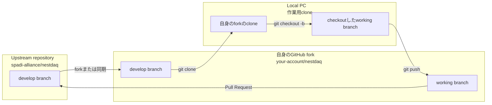

# コントリビューションガイドライン

[English](CONTRIBUTING.md) | [日本語](CONTRIBUTING.ja.md)

このドキュメントでは、NestDAQへのコントリビューションにおける推奨事項と禁止事項を説明します。

## フォークを使用した開発手順

- `main`ブランチには、NestDAQの最新リリース版が含まれます。
- `develop`ブランチには、NestDAQの最新開発版が含まれます。
- 開発を始める前に、upstreamの`spadi-alliance/nestdaq`リポジトリを自身のGitHub accountへforkしてください。
- 自身のforkをupstreamの`develop`ブランチと同期し、fork内の`develop`を基点として作業ブランチを作成してください。
- 自身のfork内では作業ブランチを自由に作成できます。upstreamリポジトリには作業ブランチを作成しないでください。
- upstreamの`main`および`develop`ブランチは保護されており、直接pushできません。
- 自身のfork内の作業ブランチから、upstreamの`develop`ブランチを対象としてPull RequestまたはDraft Pull Requestを作成してください。
- 変更が最終レビューの準備段階にない場合でも、早期のフィードバックが有用であればDraft Pull Requestを使用してください。

upstream repositoryはNestDAQの基準となるrepositoryです。forkは自身のGitHub accountに
置くcopyであり、自身がpushするbranchを保持します。local PC上のcloneは、branchを
checkoutしてfileの編集、build、checkを行う作業用copyです。

## コミットとPull Request

- 関連のない複数の変更を1つの巨大なコミットにまとめることは避けてください。
- 個別にレビューできる変更は、意図ごとにコミットを分けてください。
- Pull Requestは、慎重にレビューできる規模に保ってください。
- 関連のない変更が多数蓄積するまで待たず、こまめにPull Requestを作成してください。

## フォーマット

- Pull Requestを作成する前、またはDraft Pull Requestをレビュー可能な状態に変更する前に、フォーマッターを適用してください。
- C/C++ファイルには`astyle`を適用してください。
- 変更で触れたファイルだけをフォーマットしてください。
- 関係のないファイルを再フォーマットしないでください。

## 静的解析

- Pull Requestを作成する前に`clang-tidy`を実行してください。
- リポジトリ内の .clang-tidy 設定を使用してください。
- Pull Request自体がclang-tidyの方針に関するものでない限り、プロジェクトのコードに追加のチェックを有効にしないでください。
- CMakeを介して`clang-tidy`を実行するには、`-DNESTDAQ_ENABLE_CLANG_TIDY=ON`を指定して構成してください。

## コードスタイルと命名規則

### C++

- 4個の空白でインデントしてください。

### 命名規則

- `PascalCase`と`UpperCamelCase`は同じ命名形式を意味します。
- `class`名およびtype名: `PascalCase` / `UpperCamelCase`。
- `namespace`名: `snake_case`。
- functionおよびmember function: lower camel case / `camelCase`を優先します。既存スタイルとの一貫性を保つ場合は、`PascalCase` / `UpperCamelCase`も許容します。
- variable: `snake_case`を優先します。既存スタイルとの一貫性を保つ場合は、lower camel case / `camelCase`も許容します。
- `using` aliasは命名規則の対象外です。局所的な可読性、外部libraryの規約、または一般的な短縮形に従って構いません。
- `public struct`のdata field: `snake_case`。
- `private`および`protected`の`class` data member: `fPascalCase`。
- `static` data member: `fg`で開始します(例: `fgPascalCase`)。
- `static` variable: `g`で開始します(例: `gPascalCase`)。
- constant: `k`で開始する`kPascalCase`、または`SCREAMING_SNAKE_CASE`を使用します。
- macro名: `SCREAMING_SNAKE_CASE`。
- enum constant: `kPascalCase`、`PascalCase` / `UpperCamelCase`、または`SCREAMING_SNAKE_CASE`。
- NestDAQ codeのbase `namespace`: `nestdaq`。

### ファイル名

- 推奨するファイル拡張子: `.cpp`, `.hpp`。
- 許容するファイル拡張子: `.cxx`, `.h`, `.hh`, `.hxx`。
