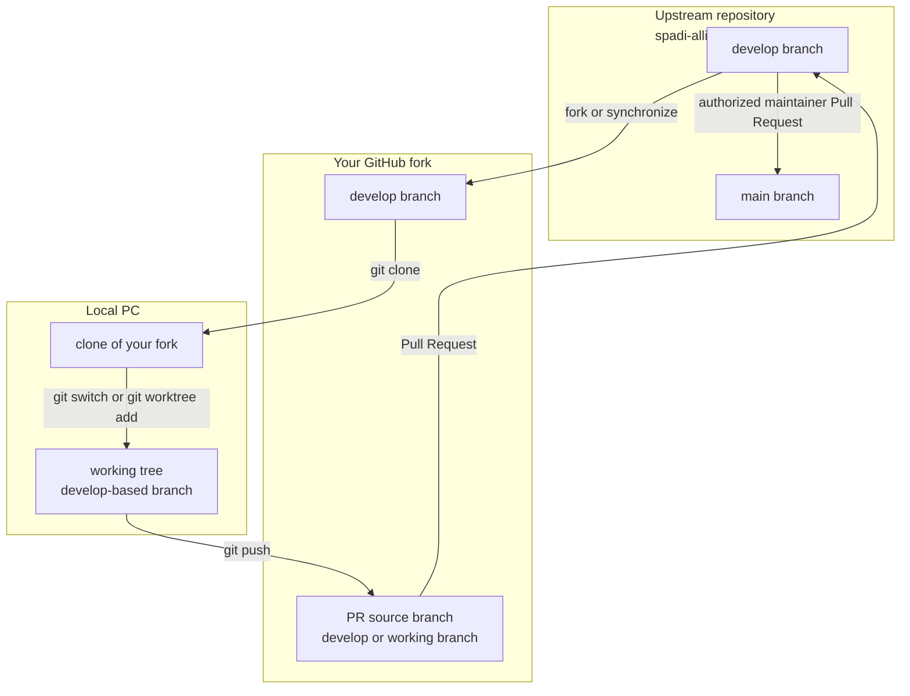

# Contribution Guidelines

[English](CONTRIBUTING.md) | [日本語](CONTRIBUTING.ja.md)

This document describes recommended and prohibited practices for contributing
to NestDAQ.

## Forking workflow

- The `main` branch contains the latest released version of NestDAQ.
- The `develop` branch contains the latest development version.
- Before starting development, fork the upstream `spadi-alliance/nestdaq`
  repository to your own GitHub account.
- Synchronize your fork with the upstream `develop` branch, then prepare a
  local working tree from the fork's `develop` branch under the branch name you
  want to use. Use `git switch` in the existing working tree or
  `git worktree add` to create a separate working directory. The local branch
  may also be named `develop`.
- You may create working branches freely in your own fork. Do not create
  working branches in the upstream repository.
- The upstream `main` and `develop` branches are protected and do not accept
  direct pushes.
- Push the commits to your fork. The destination may be a working branch or the
  fork's `develop` branch.
- Open a Pull Request or Draft Pull Request from that branch in your fork to
  the upstream `develop` branch.
- Only authorized maintainers may merge changes into the upstream `main`
  branch. Pull Requests to upstream `main` must come from the upstream
  `develop` branch; Pull Requests from forks or other branches to upstream
  `main` are not accepted.
- Use Draft Pull Requests when the change is not ready for final review but
  early feedback is useful.

The upstream repository is the canonical NestDAQ repository. Your fork is your
personal GitHub copy and holds branches that you push. The local clone on your
PC contains the working tree or trees where you select a branch, edit files,
build, and run checks.



For example, clone your fork and use `git switch` to create an independently
named branch in the existing working tree:

```sh
git clone https://github.com/<your-account>/nestdaq.git
cd nestdaq

# Use an independently named working branch based on the fork's develop branch.
git switch -c <working-branch> origin/develop
```

Alternatively, create the branch in a separate working directory with
`git worktree add`:

```sh
git worktree add -b <working-branch> ../nestdaq-<working-branch> origin/develop
```

To work directly on the fork's `develop` branch instead, use:

```sh
git switch develop
git pull --ff-only origin develop
```

After editing and committing, push the selected branch to your fork. Use the
branch name selected above; `develop` is also valid.

```sh
git add <changed-files>
git commit -m "<commit-message>"
git push -u origin <branch-name>
```

## Commits and Pull Requests

- Avoid combining several unrelated changes into one large commit.
- Split commits by intent when separate changes can be reviewed independently.
- Keep Pull Requests small enough to review carefully.
- Prefer opening Pull Requests frequently instead of waiting until many unrelated
  changes have accumulated.

## Formatting

- Apply a formatter before opening a Pull Request or moving a Draft Pull
  Request to ready-for-review.
- For C/C++ files, apply `astyle`.
- Format only files touched by your change.
- Do not reformat unrelated files.

## Static analysis

- Run `clang-tidy` before opening a Pull Request.
- Use the repository-local `.clang-tidy` configuration.
- Do not enable extra checks for project code unless the Pull Request is about
  clang-tidy policy itself.
- To run `clang-tidy` through CMake, configure with
  `-DNESTDAQ_ENABLE_CLANG_TIDY=ON`.

## Code style and naming

### C++

- Indent with 4 spaces.

### Naming

- `PascalCase` and `UpperCamelCase` mean the same naming style.
- Class and type names: `PascalCase` / `UpperCamelCase`.
- Namespaces: `snake_case`.
- Functions and member functions: prefer lower camel case / `camelCase`;
  `PascalCase` / `UpperCamelCase` is allowed for existing-style consistency.
- Variables: prefer `snake_case`; lower camel case / `camelCase` is allowed for
  existing-style consistency.
- `using` alias names are outside the naming rule scope. They may follow local
  readability, external library conventions, or common short forms.
- Public `struct` data fields: `snake_case`.
- Private and protected class data members: `fPascalCase`.
- Static data members: start with `fg`, for example `fgPascalCase`.
- Static variables: start with `g`, for example `gPascalCase`.
- Constants: start with `k`, for example `kPascalCase`, or use
  `SCREAMING_SNAKE_CASE`.
- Macro names: `SCREAMING_SNAKE_CASE`.
- Enum constants: `kPascalCase`, `PascalCase` / `UpperCamelCase`, or
  `SCREAMING_SNAKE_CASE`.
- Base namespace for NestDAQ code: `nestdaq`.

### File naming

- Preferred file extensions: `.cpp` and `.hpp`.
- Allowed file extensions: `.cxx`, `.h`, `.hh`, and `.hxx`.
