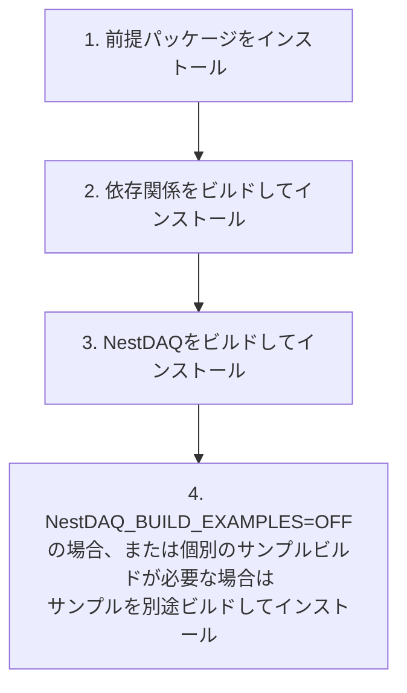

# インストール

[English](INSTALL.md) | [日本語](INSTALL.ja.md)

<a id="installation-flow"></a>
## インストールの流れ



NestDAQのメインビルドでは、`NestDAQ_BUILD_EXAMPLES=ON`の場合、デフォルトでサンプルも
ビルドしてインストールします。メインビルドでサンプルを無効にした場合、またはサンプル用に
別のビルドディレクトリやインストールプレフィックスが必要な場合にのみ、サンプルを個別にビルドしてください。

<a id="1-install-prerequisites"></a>
## 1. 前提パッケージのインストール

<a id="almalinux-9-and-10"></a>
### AlmaLinux 9および10

```bash
dnf -y update && \
dnf -y install \
    epel-release \
    dnf-plugins-core && \
dnf config-manager --set-enabled crb && \
dnf -y groupinstall "Development Tools" && \
dnf -y install \
    bash-completion \
    gcc \
    gcc-c++ \
    cmake \
    make \
    ninja-build \
    mold \
    git \
    unzip \
    rsync \
    autoconf \
    automake \
    libtool \
    libcurl-devel \
    openssl-devel \
    gnutls-devel \
    zlib-devel \
    bzip2-devel \
    libzstd-devel \
    libquadmath-devel \
    libstdc++-static \
    python3 \
    python3-devel \
    python3-pip

# 必要に応じてインストールするツール:
# - jq: コマンドラインツールのJSON出力を整形・確認します。
# - clang-tools-extra: clang-tidy、clang-format、および関連するClangツールを提供します。
# - doxygen: APIドキュメントを生成します。
# - graphviz: Doxygenの図に使用するdotコマンドを提供します。
# - astyle: 必要に応じてC/C++ソースを整形します。
# - tmux: 長時間実行するローカル検証セッションを維持します。
# dnf -y install jq clang-tools-extra doxygen graphviz astyle tmux

# AlmaLinux 9で必要な場合
# dnf -y install gcc-toolset-14
```

<a id="almalinux-8"></a>
### AlmaLinux 8

```bash
dnf -y update && \
dnf -y install \
    epel-release \
    dnf-plugins-core && \
dnf config-manager --set-enabled powertools && \
dnf -y groupinstall "Development Tools" && \
dnf -y install \
    bash-completion \
    gcc \
    gcc-c++ \
    gcc-toolset-14 \
    cmake \
    make \
    ninja-build \
    mold \
    git \
    unzip \
    rsync \
    autoconf \
    automake \
    libtool \
    libcurl-devel \
    openssl-devel \
    gnutls-devel \
    zlib-devel \
    bzip2-devel \
    libzstd-devel \
    libquadmath-devel \
    libstdc++-static \
    python3.11 \
    python3.11-devel \
    python3.11-pip
```

AlmaLinux 8では`crb`の代わりに`powertools`を使用します。`python3`、
`python3-devel`、`python3-pip`の代わりに、上記のPython 3.11パッケージを
使用してください。

<a id="debian-1213-and-ubuntu-220424042604"></a>
### Debian 12/13およびUbuntu 22.04/24.04/26.04

```bash
apt update && \
apt install -y \
    bash-completion \
    build-essential \
    ca-certificates \
    cmake \
    curl \
    make \
    ninja-build \
    mold \
    git \
    unzip \
    rsync \
    pkg-config \
    autoconf \
    automake \
    libtool \
    libc6-dev \
    libcurl4-openssl-dev \
    libssl-dev \
    libgnutls28-dev \
    zlib1g-dev \
    libz2-dev \
    libzstd-dev \
    python3 \
    python3-dev \
    python3-venv \
    python3-pip

# 必要に応じてインストールするツール:
# - jq: コマンドラインツールのJSON出力を整形・確認します。
# - clang-tools: clang-tidyおよび関連するLLVM/Clangツールを提供します。
# - clang-format: DebianおよびUbuntuではclang-toolsとは別パッケージとしてclang-formatを提供します。
# - doxygen: APIドキュメントを生成します。
# - graphviz: Doxygenの図に使用するdotコマンドを提供します。
# - astyle: 必要に応じてC/C++ソースを整形します。
# - tmux: 長時間実行するローカル検証セッションを維持します。
# apt install -y jq clang-tools clang-format doxygen graphviz astyle tmux
```

Ubuntu 22.04で依存関係をビルドする際に必要となるため、`pkg-config`を
Debian/Ubuntu共通の一覧に含めています。

<a id="2-build-and-install-external-dependencies"></a>
## 2. 外部依存関係のビルドとインストール

次のコマンドはZeroMQ、Boost、FairLogger、FairMQ、Catch2、nlohmann/json、
hiredis、redis++、Redis Stackをインストールします。

このガイドのデフォルト手順では、upstreamの`main`ブランチにある最新の安定リリース版を
ビルドします。`main`を明示的にcloneします。

```bash
# 最新の安定リリース版のsource codeをdownload
git clone --branch main https://github.com/spadi-alliance/nestdaq.git
```

NestDAQ開発者は、最初に`spadi-alliance/nestdaq`を自身のGitHub accountへforkします。
最新開発版をビルドする場合は、自身のforkをcloneし、upstream repositoryを追加して、
upstreamの`develop`ブランチをcheckoutします。

```bash
git clone https://github.com/<your-github-account>/nestdaq.git
git -C nestdaq remote add upstream https://github.com/spadi-alliance/nestdaq.git
git -C nestdaq fetch upstream
git -C nestdaq switch --create develop --track upstream/develop
```

source codeを変更する前に、自身のfork内で作業ブランチを作成してください。詳細は
[`CONTRIBUTING.ja.md`](CONTRIBUTING.ja.md)を参照してください。以下のコマンドは、
`nestdaq`でcheckoutされているbranchをビルドします。

```bash
# configure
cmake \
  -DCMAKE_INSTALL_PREFIX=./install \
  -DBUILD_PARALLEL_LEVEL=$(nproc) \
  -B ./build-external \
  -S nestdaq/cmake

# 外部依存関係をbuild・install
cmake --build ./build-external
```

Redis Stackは、NestDAQアプリケーションの稼働中に必要となる外部サービスであり、
直接のライブラリ依存関係ではありません。Redis Stackを用意する方法として、
次の選択肢をサポートしています。

- 上記の外部依存関係ビルドでRedis Stackをソースからビルドしてインストールします。
  `WITH_REDIS_STACK=ON`の場合のデフォルトです。
- `-DWITH_REDIS_STACK=OFF -DWITH_REDIS_SERVER_7=ON`を指定し、Redis 7.x
  サーバーとスタンドアロンRedisTimeSeriesをソースからビルドしてインストールします。
- [`share/redis-stack-container/README.ja.md`](share/redis-stack-container/README.ja.md)の
  ヘルパースクリプトを使用して、Redis Stackをコンテナで実行します。
- [`share/installers/README.ja.md`](share/installers/README.ja.md)のインストーラー
  ヘルパースクリプトを使用して、RedisとRedis Stackモジュールをホストパッケージとして
  インストールします。

Redis Stackをコンテナまたはホストパッケージで用意する場合は、外部依存関係の
構成コマンドに`-DWITH_REDIS_STACK=OFF`を追加してください。

`cmake/dependencies/`以下にあるRedis Stack用CMakeファイルとヘルパーシェル
スクリプトは、Redis 8以降を対象としています。Redis 7.xではRedisTimeSeries 1.xを
Redis 8の`redis/modules`ツリー経由ではなくスタンドアロンモジュールとしてビルドするため、
別のCMake経路を使用します。

- 上記のコマンド例では、CMakeの`ExternalProject`を使用して`git clone`、ビルド、インストールを行います。
  - この場合、cmake --buildに渡す`--parallel`(または`-j`)オプションでは内部のExternalProjectビルドを制御できません。そのため、初回構成時に`-DBUILD_PARALLEL_LEVEL=xxx`を使用して並列ビルド数を指定してください。
    - `nproc`コマンドは、システムで使用可能なCPUコア数を表示します。メモリー使用量が過大になる場合は、より小さい値を手動で指定してください。
- 依存関係のデフォルトバージョンを以下に示します。バージョンを上書きするには、CMakeに`-Dxxxx_VERSION=yyyy`を渡します。
- 外部依存関係の構成時にDoxygenが見つかった場合、ドキュメント表示用の追加ファイルとして`doxygen-awesome-css`を`./install/share/doxygen-awesome-css`以下にインストールします。
- Makeの代わりにNinjaを使用するには、CMakeオプションに`-G Ninja`を追加します。
- システムの`ld`の代わりに`mold`を使用する場合:
  - GCC 12.1以降: CMakeオプションに`-DCMAKE_EXE_LINKER_FLAGS="-fuse-ld=mold"`と`-DCMAKE_SHARED_LINKER_FLAGS="-fuse-ld=mold"`を追加します。
  - GCC 12.0以前: CMakeオプションに`-DCMAKE_EXE_LINKER_FLAGS="-B<path-to-mold>"`と`-DCMAKE_SHARED_LINKER_FLAGS="-B<path-to-mold>"`を追加します。

<a id="external-dependency-build-options"></a>
### 外部依存関係のビルドオプション

| オプション | デフォルト | 説明 |
| :-- | :-- | :-- |
| `BUILD_PARALLEL_LEVEL` | 未設定 | 内部の`ExternalProject`ビルドへ渡す並列数です。構成時に設定してください。`cmake --build --parallel`では内部ビルドを制御できません。 |
| `WITH_REDIS_STACK` | `ON` | Redis Stack serverとmoduleをビルドしてインストールします。コンテナなどでRedis Stackを別途用意する場合は`OFF`に設定します。 |
| `WITH_REDIS_SERVER_7` | `OFF` | Redis 7.xサーバーとスタンドアロンRedisTimeSeriesをビルドしてインストールします。このオプションは`WITH_REDIS_STACK`と同時に有効にできません。 |
| `REDIS_SERVER_7_SERIES` | `7.4` | `WITH_REDIS_SERVER_7=ON`の場合に使用するRedis 7.x系列です。`7.4`はRedis 7.4.9とRedisTimeSeries 1.12.14、`7.2`はRedis 7.2.14とRedisTimeSeries 1.10.24を選択します。 |
| `REDIS_BUILD_REDISBLOOM` | `ON` | `WITH_REDIS_STACK`が`ON`の場合にRedisBloomモジュールをビルドしてインストールします。 |
| `REDIS_BUILD_REDISEARCH` | `ON` | `WITH_REDIS_STACK`が`ON`の場合にRediSearchモジュールをビルドしてインストールします。コンパイラーがRediSearchをビルドできない場合は無効にしてください。 |
| `REDIS_BUILD_REDISJSON` | `ON` | `WITH_REDIS_STACK`が`ON`の場合にRedisJSONモジュールをビルドしてインストールします。 |
| `REDIS_BUILD_REDISTIMESERIES` | `ON` | `WITH_REDIS_STACK`が`ON`の場合にRedisTimeSeriesモジュールをビルドしてインストールします。 |
| `WITH_SPDLOG` | `ON` | spdlogをビルドしてインストールします。必要に応じて有効にできるNestDAQ spdlog OpenTelemetry sinkをサポートします。 |
| `WITH_OTEL_CPP` | `ON` | opentelemetry-cppと、gRPCなど選択した機能に応じた転送用依存関係をビルドしてインストールします。 |
| `<package>_VERSION` | パッケージ固有 | 以下に示す依存関係のバージョンを上書きします。例: `-DFairMQ_VERSION=...`。 |
| `Redis7_VERSION` | 系列固有 | `REDIS_SERVER_7_SERIES`で選択したRedis 7.xのバージョンを上書きします。 |
| `RedisTimeSeries7_VERSION` | 系列固有 | `REDIS_SERVER_7_SERIES`で選択したスタンドアロンRedisTimeSeriesのバージョンを上書きします。 |

デフォルトの`FairMQ_VERSION`はGNUコンパイラーのバージョンに依存します。
GCC 9.1以降ではデフォルトでFairMQ 1.10.0を使用し、それより古いGCCではFairMQ 1.9.2を
使用します。この選択を明示的に上書きするには`-DFairMQ_VERSION=...`を渡してください。

すべての`REDIS_BUILD_*`モジュールオプションを`OFF`にすると、依存関係ビルドでは
Redisサーバーツールだけをインストールします。Redis Stackには、RedisビルドのTLS、
アロケーター、一時的なRustツールチェーンパスなどの低レベルキャッシュ変数もあります。これらは
依存関係ビルドの保守用です。必要な場合はCMake cacheまたは
`cmake/dependencies/redis-stack.cmake`を確認してください。
Redis 7.xの保守用設定については`cmake/dependencies/redis-server-7.cmake`を
確認してください。

<a id="versions-of-installed-external-dependencies"></a>
### インストールされる外部依存関係のバージョン

| パッケージ                                                               | バージョン(デフォルト) | バージョン変更用CMakeオプション |
| :--                                                                      | :--                      | :--                              |
| [ZeroMQ(libzmq)](https://github.com/zeromq/libzmq)                       | 4.3.5                    | `ZeroMQ_VERSION`                 |
| [Boost](https://github.com/boostorg/boost)                               | 1.85.0                   | `Boost_VERSION`                  |
| [FairLogger](https://github.com/FairRootGroup/FairLogger)                | 2.3.0                    | `FairLogger_VERSION`             |
| [FairMQ](https://github.com/FairRootGroup/FairMQ)                        | GCC 9.1以降では1.10.0、それより古いGCCでは1.9.2 | `FairMQ_VERSION` |
| [Catch2](https://github.com/catchorg/Catch2)                             | 3.15.2                   | `Catch2_VERSION`                 |
| [nlohmann/json](https://github.com/nlohmann/json)                        | 3.12.0                   | `nlohmann_json_VERSION`          |
| [spdlog](https://github.com/gabime/spdlog)                               | 1.17.0                   | `spdlog_VERSION`                 |
| [hiredis](https://github.com/redis/hiredis)                              | 1.4.0                    | `hiredis_VERSION`                |
| [redis++](https://github.com/sewenew/redis-plus-plus)                    | 1.3.15                   | `redis_plus_plus_VERSION`        |
| [opentelemetry-cpp](https://github.com/open-telemetry/opentelemetry-cpp) | 1.28.0                   | `opentelemetry-cpp_VERSION`      |
| [doxygen-awesome-css](https://github.com/jothepro/doxygen-awesome-css)   | 2.4.2                    | `doxygen-awesome-css_VERSION`    |

<a id="redis-server-and-modules"></a>
##### Redis serverとmodule

Redis Stack(`redis-server`、`redis-cli`、Redis modulesなど)は外部依存関係
ビルドに含まれ、デフォルトではソースからビルドしてインストールします。
Redisモジュールは`REDIS_BUILD_REDISBLOOM`、`REDIS_BUILD_REDISEARCH`、
`REDIS_BUILD_REDISJSON`、`REDIS_BUILD_REDISTIMESERIES`を使用して個別に
無効化できます。NestDAQアプリケーションの稼働中にはRedisが必要ですが、直接の
ライブラリ依存関係ではありません。コンテナまたはホストパッケージ用インストーラースクリプトで
用意することもできます。パッケージインストーラーのデフォルトはRedis Stackモジュールを
含むRedis 8.2.7で、RedisInsightは含みません。RedisInsightが必要でリポジトリに
該当パッケージがある場合は、Redis Stackコンテナヘルパー、または
`REDIS_PACKAGE=redis-stack`と`REDIS_VERSION=latest`を使用してください。

RediSearchにはC++20をサポートするコンパイラーが必要です。AlmaLinux 8のGCC 8.5では、
RediSearchが`<ranges>`などのC++20機能を使用するため、
`REDIS_BUILD_REDISEARCH=ON`のビルドは失敗します。AlmaLinux 8でGCC 8.5を使用して
依存関係をビルドする場合、必要なC++20機能をサポートする新しいコンパイラーツールチェーンを
使用しない限り、`-DREDIS_BUILD_REDISEARCH=OFF`を渡してください。
デフォルトのRedisモジュールバージョンは、Redis 8.2.7ソースツリーが選択するモジュールの
リリースタグに従います。

| パッケージ                                                               | バージョン(デフォルト) | CMakeオプション |
| :--                                                                      | :--                      | :--             |
| [Redis](https://github.com/redis/redis)                                  | 8.2.7                    | `Redis_VERSION` |
| [RedisBloom](https://github.com/RedisBloom/RedisBloom)                   | 8.2.12                   | `RedisBloom_VERSION`, `REDIS_BUILD_REDISBLOOM` |
| [RediSearch](https://github.com/RediSearch/RediSearch)                   | 8.2.13                   | `RediSearch_VERSION`, `REDIS_BUILD_REDISEARCH` |
| [RedisJSON](https://github.com/RedisJSON/RedisJSON)                      | 8.2.9                    | `RedisJSON_VERSION`, `REDIS_BUILD_REDISJSON` |
| [RedisTimeSeries](https://github.com/RedisTimeSeries/RedisTimeSeries)    | 8.2.10                   | `RedisTimeSeries_VERSION`, `REDIS_BUILD_REDISTIMESERIES` |
| [Redis 7.x](https://github.com/redis/redis)                              | `REDIS_SERVER_7_SERIES=7.4`では7.4.9、`7.2`では7.2.14 | `Redis7_VERSION`, `REDIS_SERVER_7_SERIES` |
| [RedisTimeSeries standalone](https://github.com/RedisTimeSeries/RedisTimeSeries) | Redis 7.4では1.12.14、Redis 7.2では1.10.24 | `RedisTimeSeries7_VERSION`, `REDIS_SERVER_7_SERIES` |

<a id="3-build-and-install-nestdaq-library"></a>
## 3. NestDAQライブラリのビルドとインストール

```bash
cmake \
  -DCMAKE_PREFIX_PATH=./install \
  -DCMAKE_INSTALL_PREFIX=./install \
  -B ./build \
  -S nestdaq
cmake --build ./build --parallel $(nproc)
cmake --install ./build
```

- 上記の例では、NestDAQメインパッケージと外部依存関係の両方を同じディレクトリ
  (`./install`)にインストールします。外部依存関係を別の場所にインストールした
  場合は、`-DCMAKE_PREFIX_PATH=xxx`でそのディレクトリを指定してください。
- `doxygen-awesome-css`が利用できる場合、生成したドキュメントとともに
  `./install/share/doc/nestdaq/doxygen-awesome-css`へインストールします。
- `-DNestDAQ_BUILD_DOCS=ON`でDoxygenが利用できる場合、HTMLドキュメントを
  `./build/docs/html`に生成し、`./install/share/doc/nestdaq/html`へ
  インストールします。

<a id="verbose-cmake-builds"></a>
### CMakeビルドの詳細表示

内部で実行されるコンパイラーおよびリンカーコマンドを表示するには、`cmake --build`
コマンドに`--verbose`を追加します。インクルードパス、コンパイラーオプション、リンクフラグを
確認する場合に便利です。

```bash
cmake --build ./build-external --verbose
cmake --build ./build --parallel $(nproc) --verbose
cmake --build ./build-examples --parallel $(nproc) --verbose
```

環境変数を使用する形式もサポートしています。

```bash
VERBOSE=1 cmake --build ./build
```

<a id="nestdaq-build-options"></a>
### NestDAQのビルドオプション

| オプション | デフォルト | 説明 |
| :-- | :-- | :-- |
| `NESTDAQ_ENABLE_CLANG_TIDY` | `OFF` | NestDAQのビルド中に`clang-tidy`を実行します。AlmaLinuxでは`clang-tools-extra`が提供する`clang-tidy`コマンドが必要です。 |
| `NestDAQ_BUILD_DOCS` | `OFF` | Doxygenドキュメントをビルドしてインストールします。`doxygen`が必要です。Doxygenが見つからない場合はドキュメント生成を省略します。Graphvizの`dot`が利用可能な場合、Doxygenは図の生成に使用できます。 |
| `NestDAQ_BUILD_EXAMPLES` | `ON` | NestDAQのメインビルドとともに`Sampler`、`Sink`、`NullDevice`をビルドしてインストールします。これらを除外するには`OFF`に設定します。 |
| `NESTDAQ_DOXYGEN_AWESOME_DIR` | `CMAKE_PREFIX_PATH`またはインストールプレフィックスから検出 | 生成するドキュメントで使用する`doxygen-awesome-css`アセットを含むディレクトリです。 |
| `BUILD_TESTING` | `ON` | 有効な場合にNestDAQのテストをビルドします。 |

<a id="run-local-opentelemetry-collector-and-backend-containers"></a>
## ローカルのOpenTelemetry Collectorおよびバックエンドコンテナの実行

NestDAQはOpenTelemetryのログ、メトリクス、トレースをOpenTelemetry Collectorへ
エクスポートできます。リポジトリには、必要に応じて利用できるローカル検証用Compose構成を
[`share/otel-collector-compose/`](share/otel-collector-compose/README.ja.md)以下に
用意しています。OpenTelemetry Collector Contrib、OpenSearch、OpenSearch Dashboards
など、ローカル運用で使用するサービスをコンテナで実行します。これらのサービスとツールは
ビルド依存関係ではなく、そのまま本番環境へデプロイすることを意図していません。

NestDAQアプリケーションの稼働中に必要となる外部サービスは、コンテナまたは
ホストパッケージで用意できます。

| 外部サービス | ソースビルド | コンテナヘルパー | ホストパッケージインストーラー |
| :-- | :-- | :-- | :-- |
| Redis Stack | 外部依存関係ビルドの`WITH_REDIS_STACK=ON` | [`share/redis-stack-container/`](share/redis-stack-container/README.ja.md) | [`share/installers/`](share/installers/README.ja.md) |
| OpenTelemetry Collector Contrib | NestDAQではビルドしません | [`share/otel-collector-compose/`](share/otel-collector-compose/README.ja.md) | [`share/installers/`](share/installers/README.ja.md) |
| OpenSearch | NestDAQではビルドしません | [`share/otel-collector-compose/opensearch/`](share/otel-collector-compose/opensearch/README.ja.md) | [`share/installers/`](share/installers/README.ja.md) |
| OpenSearch Dashboards | NestDAQではビルドしません | [`share/otel-collector-compose/opensearch/`](share/otel-collector-compose/opensearch/README.ja.md) | [`share/installers/`](share/installers/README.ja.md) |

NestDAQをインストールした後、インストール済みの構成を作業ディレクトリへコピーし、
バックエンドスタックを1つ起動します。

```bash
cp -a <install-prefix>/share/otel-collector-compose ./otel-collector-compose
cd ./otel-collector-compose/opensearch
docker compose -f compose-opensearch.yaml up
```

Podmanでは、同じComposeファイルを`podman compose`で使用します。

利用可能なローカルバックエンド構成は次のとおりです。

- [`opensearch/`](share/otel-collector-compose/opensearch/README.ja.md):
  ログとトレースをOpenSearchへ保存し、OpenSearch Dashboardsで表示します。
- [`victoria/`](share/otel-collector-compose/victoria/README.ja.md):
  ログ、メトリクス、トレースをVictoriaLogs、VictoriaMetrics、VictoriaTracesへ保存し、
  Grafanaで表示します。
- [`clickhouse/`](share/otel-collector-compose/clickhouse/README.ja.md):
  ログ、メトリクス、トレースをClickStack/ClickHouseへ保存し、ClickStackユーザーインターフェース
  (UI)で表示します。

デフォルトでは、ComposeスタックはOpenTelemetry Protocol(OTLP)gRPCを
`localhost:4317`、OTLP HTTPを`localhost:4318`で公開します。ポート、ボリューム、
認証情報、SELinux、rootless Podmanに関する注意事項は、
[`share/otel-collector-compose/README.ja.md`](share/otel-collector-compose/README.ja.md)
およびバックエンド固有のREADMEを参照してください。

ホストパッケージとしてインストールし、systemdで管理する場合は、
[`share/installers/README.ja.md`](share/installers/README.ja.md)を使用してください。
これらのスクリプトはDebian/Ubuntuシステムでは`apt-get`、RHEL系システムでは
`dnf`または`yum`を使用し、`/usr`や`/etc`などのシステム管理領域へ
インストールします。

<a id="4-build-and-install-examples"></a>
## 4. サンプルのビルドとインストール

サンプルはデフォルトでNestDAQのメインビルドに含まれます。NestDAQをインストールした
後に、別のCMakeプロジェクトとしてビルドすることもできます。サンプルを個別にビルドする
場合は、NestDAQのインストールプレフィックスを使用し、`find_package(NestDAQ)`でサンプルを
構成します。

```bash
cmake \
  -DCMAKE_PREFIX_PATH=./install \
  -DCMAKE_INSTALL_PREFIX=./install \
  -B ./build-examples \
  -S nestdaq/examples
cmake --build ./build-examples --parallel $(nproc)
cmake --install ./build-examples
```

- `-DCMAKE_PREFIX_PATH=./install`はNestDAQをインストールしたディレクトリを指す
  必要があります。
- インストールしたサンプルバイナリーは`./install/bin`以下に配置されます。
