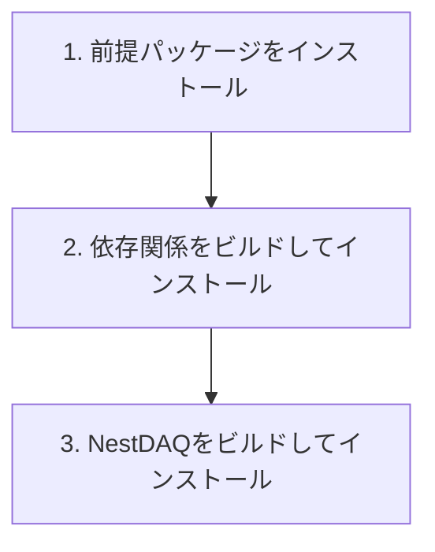

# インストール

[English](INSTALL.md) | [日本語](INSTALL.ja.md)

<a id="installation-flow"></a>
## インストールの流れ



NestDAQのメインビルドでは、`NestDAQ_BUILD_EXAMPLES=ON`の場合、デフォルトでサンプルもビルドしてインストールします。
Section 4では、NestDAQとFairMQが提供するサンプルを説明します。

<a id="1-install-prerequisites"></a>
## 1. 前提パッケージのインストール

ここでいう前提パッケージとは、NestDAQとその外部依存関係をビルドする前に必要なcompiler、build tool、開発用header、libraryを指します。
各Linux distributionが提供するpackage managerを使い、OS packageとしてインストールします。
AlmaLinuxでは`dnf`、DebianおよびUbuntuでは`apt`を使用します。
この節のcommandはこれらのOS packageをインストールするものであり、NestDAQ本体はインストールしません。
この文書のshell command例では、`#`で始まる行は読者向けのコメントであり、shellでは実行されません。

<a id="almalinux-9-and-10"></a>
### AlmaLinux 9および10

```bash
# package metadataを更新し、必要なrepositoryを有効化して、ビルドの前提パッケージをインストール
dnf -y update && \
dnf -y install \
    epel-release \
    dnf-plugins-core && \
dnf config-manager --set-enabled crb && \
dnf -y groupinstall "Development Tools" && \
dnf -y install \
    bash-completion \
    gcc \
    gcc-c++ \
    cmake \
    make \
    ninja-build \
    mold \
    git \
    unzip \
    rsync \
    autoconf \
    automake \
    libtool \
    libcurl-devel \
    openssl-devel \
    gnutls-devel \
    zlib-devel \
    bzip2-devel \
    libzstd-devel \
    libquadmath-devel \
    libstdc++-static \
    python3 \
    python3-devel \
    python3-pip

# 必要に応じてインストールするツール:
# - jq: コマンドラインツールのJSON出力を整形して確認します。
# - clang-tools-extra: clang-tidy、clang-format、および関連するClangツールを提供します。
# - doxygen: APIドキュメントを生成します。
# - graphviz: Doxygenの図に使用するdotコマンドを提供します。
# - astyle: 必要に応じてC/C++ソースを整形します。
# - tmux: 長時間実行するローカル検証セッションを維持します。
# dnf -y install jq clang-tools-extra doxygen graphviz astyle tmux

# AlmaLinux 9のsystem compilerでは不足する場合にGCC 14 toolsetをインストール
# dnf -y install gcc-toolset-14
```

<a id="almalinux-8"></a>
### AlmaLinux 8

```bash
# package metadataを更新し、PowerToolsを有効化して、ビルドの前提パッケージをインストール
dnf -y update && \
dnf -y install \
    epel-release \
    dnf-plugins-core && \
dnf config-manager --set-enabled powertools && \
dnf -y groupinstall "Development Tools" && \
dnf -y install \
    bash-completion \
    gcc \
    gcc-c++ \
    gcc-toolset-14 \
    cmake \
    make \
    ninja-build \
    mold \
    git \
    unzip \
    rsync \
    autoconf \
    automake \
    libtool \
    libcurl-devel \
    openssl-devel \
    gnutls-devel \
    zlib-devel \
    bzip2-devel \
    libzstd-devel \
    libquadmath-devel \
    libstdc++-static \
    python3.11 \
    python3.11-devel \
    python3.11-pip
```

AlmaLinux 8では`crb`の代わりに`powertools`を使用します。
`python3`、`python3-devel`、`python3-pip`の代わりに、上記のPython 3.11パッケージを使用してください。

<a id="debian-1213-and-ubuntu-220424042604"></a>
### Debian 12/13およびUbuntu 22.04/24.04/26.04

```bash
# package metadataを更新して、ビルドの前提パッケージをインストール
apt update && \
apt install -y \
    bash-completion \
    build-essential \
    ca-certificates \
    cmake \
    curl \
    make \
    ninja-build \
    mold \
    git \
    unzip \
    rsync \
    pkg-config \
    autoconf \
    automake \
    libtool \
    libc6-dev \
    libcurl4-openssl-dev \
    libssl-dev \
    libgnutls28-dev \
    zlib1g-dev \
    libz2-dev \
    libzstd-dev \
    python3 \
    python3-dev \
    python3-venv \
    python3-pip

# 必要に応じてインストールするツール:
# - jq: コマンドラインツールのJSON出力を整形して確認します。
# - clang-tools: clang-tidyおよび関連するLLVM/Clangツールを提供します。
# - clang-format: DebianおよびUbuntuではclang-toolsとは別パッケージとしてclang-formatを提供します。
# - doxygen: APIドキュメントを生成します。
# - graphviz: Doxygenの図に使用するdotコマンドを提供します。
# - astyle: 必要に応じてC/C++ソースを整形します。
# - tmux: 長時間実行するローカル検証セッションを維持します。
# apt install -y jq clang-tools clang-format doxygen graphviz astyle tmux
```

Ubuntu 22.04で依存関係をビルドする際に必要となるため、`pkg-config`をDebianおよびUbuntu共通の一覧に含めています。

<a id="2-build-and-install-external-dependencies"></a>
## 2. 外部依存関係のビルドとインストール

次の手順では、ZeroMQ、Boost、FairLogger、FairMQ、Catch2、nlohmann/json、hiredis、redis++、Redis Stackをインストールします。

<a id="21-clone-or-check-out-the-source"></a>
### 2.1 source codeのcloneとcheckout方法

このガイドで**upstream repository**とは、[github.com/spadi-alliance/nestdaq](https://github.com/spadi-alliance/nestdaq)を指します。

<a id="211-users-who-do-not-contribute-to-the-upstream-repository"></a>
#### 2.1.1 upstream repositoryの開発に貢献しない利用者

デフォルト手順では、その`main`ブランチにある最新の安定リリース版をビルドします。
これは、upstream repositoryの開発に貢献しない利用者が通常選択する方法です。
`main`はrepositoryのdefault branchであるため、通常のcloneでcheckoutされます。

```bash
# 最新の安定リリース版のsource codeをdownload
git clone https://github.com/spadi-alliance/nestdaq.git
```

特定のリリース版をビルドする場合は、repositoryのReleasesまたはTags pageにある必要なtagで`<release-tag>`を置き換えます。
NestDAQ versionを固定する場合や、ビルドの再現性が必要な場合はrelease tagを指定してください。

```bash
# 指定したrelease tagだけをclone
git clone --branch <release-tag> --depth 1 \
  https://github.com/spadi-alliance/nestdaq.git
```

または、既存のcloneをrelease tagへ切り替えます。
tagは開発用branchではないため、`git switch --detach`を使用してdetached HEAD状態でcheckoutします。

```bash
# tagを取得し、既存のcloneで指定したreleaseをcheckout
cd nestdaq
git fetch --tags
git switch --detach <release-tag>
```

<a id="212-contributors-to-the-upstream-repository"></a>
#### 2.1.2 upstream repositoryの開発に貢献する人

upstream repositoryの開発に貢献する人は、最初に`spadi-alliance/nestdaq`を自身のGitHub accountへforkします。
最新開発版をビルドする場合は、自身のforkをcloneし、upstream repositoryを変更の取得元として使用する`upstream` remoteに登録し、forkの`origin/develop`をtrackするlocal `develop`ブランチを作成します。
更新はupstreamからpullしますが、push先は自身のfork (`origin`)にあるbranchだけにします。

```bash
# forkをcloneし、upstream remoteとlocal development branchを設定
git clone https://github.com/<your-github-account>/nestdaq.git
cd nestdaq
git remote add upstream https://github.com/spadi-alliance/nestdaq.git
git fetch upstream
git switch --create develop --track origin/develop

# upstream/developに更新がある場合はそれを取り込み、local develop branchのcommitをその上にrebase
git pull --rebase upstream develop

# 更新後のlocal develop branchをforkのorigin/developへpush
git push origin develop
```

開発用branchをupstream repositoryへpushしないでください。

source codeを変更する前に、自身のfork内で作業ブランチを作成してください。
詳細は[`CONTRIBUTING.ja.md`](CONTRIBUTING.ja.md)を参照してください。

<a id="22-build-and-install-the-external-dependencies"></a>
### 2.2 外部依存関係のビルドとインストール方法

以下のコマンドは、`nestdaq`でcheckoutされているbranchをビルドします。

```bash
# ./build-externalにout-of-sourceの依存関係ビルドをconfigure
cmake \
  -DCMAKE_INSTALL_PREFIX=./install \
  -DBUILD_PARALLEL_LEVEL=$(nproc) \
  -B ./build-external \
  -S nestdaq/cmake

# 外部依存関係をbuildしてinstall
cmake --build ./build-external
```

- 上記のcommandでは、CMakeの`ExternalProject`を使用して各依存関係をclone、build、installします。
  `cmake --build`に渡す`--parallel`(または`-j`)optionでは、内部の`ExternalProject` buildを制御できません。
  初回configure時に`-DBUILD_PARALLEL_LEVEL=xxx`を使用して、内部ビルドの並列数を指定してください。
  `nproc`commandはsystemで使用可能なCPU core数を表示するため、メモリー使用量が過大になる場合は、より小さい値を指定してください。
- 依存関係のデフォルトバージョンを以下に示します。
  バージョンを上書きするには、CMakeに`-Dxxxx_VERSION=yyyy`を渡します。
- 外部依存関係の構成時にDoxygenが見つかった場合、ドキュメント表示用の追加ファイルとして`doxygen-awesome-css`を`./install/share/doxygen-awesome-css`以下にインストールします。
- Makeの代わりにNinjaを使用するには、CMakeオプションに`-G Ninja`を追加します。
- systemの`ld`の代わりに`mold`を使用する場合は、GCC versionに応じたlinker flagを追加します。
  - GCC 12.1以降: CMake optionに`-DCMAKE_EXE_LINKER_FLAGS="-fuse-ld=mold"`と`-DCMAKE_SHARED_LINKER_FLAGS="-fuse-ld=mold"`を追加します。
  - GCC 12.0以前: CMake optionに`-DCMAKE_EXE_LINKER_FLAGS="-B<path-to-mold>"`と`-DCMAKE_SHARED_LINKER_FLAGS="-B<path-to-mold>"`を追加します。

<a id="external-dependency-build-options"></a>
### 2.3 外部依存関係のビルドオプション

| オプション | デフォルト | 説明 |
| :-- | :-- | :-- |
| `BUILD_PARALLEL_LEVEL` | 未設定 | 内部の`ExternalProject`ビルドへ渡す並列数です。構成時に設定してください。`cmake --build --parallel`では内部ビルドを制御できません。 |
| `WITH_REDIS_STACK` | `ON` | Redis Stack serverとmoduleをビルドしてインストールします。コンテナなどでRedis Stackを別途用意する場合は`OFF`に設定します。 |
| `WITH_REDIS_SERVER_7` | `OFF` | Redis 7.xサーバーとスタンドアロンRedisTimeSeriesをビルドしてインストールします。このオプションは`WITH_REDIS_STACK`と同時に有効にできません。 |
| `REDIS_SERVER_7_SERIES` | `7.4` | `WITH_REDIS_SERVER_7=ON`の場合に使用するRedis 7.x系列です。`7.4`はRedis 7.4.9とRedisTimeSeries 1.12.14、`7.2`はRedis 7.2.14とRedisTimeSeries 1.10.24を選択します。 |
| `REDIS_BUILD_REDISBLOOM` | `ON` | `WITH_REDIS_STACK`が`ON`の場合にRedisBloomモジュールをビルドしてインストールします。 |
| `REDIS_BUILD_REDISEARCH` | `ON` | `WITH_REDIS_STACK`が`ON`の場合にRediSearchモジュールをビルドしてインストールします。コンパイラーがRediSearchをビルドできない場合は無効にしてください。 |
| `REDIS_BUILD_REDISJSON` | `ON` | `WITH_REDIS_STACK`が`ON`の場合にRedisJSONモジュールをビルドしてインストールします。 |
| `REDIS_BUILD_REDISTIMESERIES` | `ON` | `WITH_REDIS_STACK`が`ON`の場合にRedisTimeSeriesモジュールをビルドしてインストールします。 |
| `WITH_SPDLOG` | `ON` | C++用logging libraryであるspdlogをビルドしてインストールします。必要に応じて有効にできるNestDAQ spdlog OpenTelemetry sinkをサポートします。 |
| `WITH_OTEL_CPP` | `ON` | opentelemetry-cppと、gRPCなど選択した機能に応じた転送用依存関係をビルドしてインストールします。 |
| `<package>_VERSION` | パッケージ固有 | 以下に示す依存関係のバージョンを上書きします。例: `-DFairMQ_VERSION=...`。 |
| `Redis7_VERSION` | 系列固有 | `REDIS_SERVER_7_SERIES`で選択したRedis 7.xのバージョンを上書きします。 |
| `RedisTimeSeries7_VERSION` | 系列固有 | `REDIS_SERVER_7_SERIES`で選択したスタンドアロンRedisTimeSeriesのバージョンを上書きします。 |

デフォルトの`FairMQ_VERSION`はGNU compilerのversionに依存します。
GCC 9.1以降ではFairMQ 1.10.0を使用し、それより古いGCCではFairMQ 1.9.2を使用します。
この選択を上書きするには`-DFairMQ_VERSION=...`を渡してください。

すべての`REDIS_BUILD_*` module optionを`OFF`にすると、依存関係ビルドではRedis server toolだけをインストールします。
Redis Stackには、TLS、allocator、一時的なRust toolchain pathなどを設定する低levelのcache variableもあります。
これらのvariableは依存関係ビルドの保守用です。
必要な場合はCMake cacheまたは`cmake/dependencies/redis-stack.cmake`を確認してください。
Redis 7.xの保守用設定については`cmake/dependencies/redis-server-7.cmake`を確認してください。

<a id="versions-of-installed-external-dependencies"></a>
### 2.4 インストールされる外部依存関係のバージョン

| パッケージ                                                               | バージョン(デフォルト) | バージョン変更用CMakeオプション |
| :--                                                                      | :--                      | :--                              |
| [ZeroMQ(libzmq)](https://github.com/zeromq/libzmq)                       | 4.3.5                    | `ZeroMQ_VERSION`                 |
| [Boost](https://github.com/boostorg/boost)                               | 1.85.0                   | `Boost_VERSION`                  |
| [FairLogger](https://github.com/FairRootGroup/FairLogger)                | 2.3.0                    | `FairLogger_VERSION`             |
| [FairMQ](https://github.com/FairRootGroup/FairMQ)                        | GCC 9.1以降では1.10.0、それより古いGCCでは1.9.2 | `FairMQ_VERSION` |
| [Catch2](https://github.com/catchorg/Catch2)                             | 3.15.2                   | `Catch2_VERSION`                 |
| [nlohmann/json](https://github.com/nlohmann/json)                        | 3.12.0                   | `nlohmann_json_VERSION`          |
| [spdlog](https://github.com/gabime/spdlog)                               | 1.17.0                   | `spdlog_VERSION`                 |
| [hiredis](https://github.com/redis/hiredis)                              | 1.4.1                    | `hiredis_VERSION`                |
| [redis++](https://github.com/sewenew/redis-plus-plus)                    | 1.3.15                   | `redis_plus_plus_VERSION`        |
| [opentelemetry-cpp](https://github.com/open-telemetry/opentelemetry-cpp) | 1.28.0                   | `opentelemetry-cpp_VERSION`      |
| [doxygen-awesome-css](https://github.com/jothepro/doxygen-awesome-css)   | 2.4.2                    | `doxygen-awesome-css_VERSION`    |

<a id="redis-server-and-modules"></a>
#### 2.4.1 Redis serverとmodule

NestDAQアプリケーションの稼働中にはRedisが必要ですが、直接のライブラリ依存関係ではありません。
次のいずれかの方法でRedisを用意します。

- 外部依存関係ビルドでRedis Stackをソースからビルドしてインストールします。
  `WITH_REDIS_STACK=ON`の場合のデフォルトです。
  Redis moduleは`REDIS_BUILD_REDISBLOOM`、`REDIS_BUILD_REDISEARCH`、`REDIS_BUILD_REDISJSON`、`REDIS_BUILD_REDISTIMESERIES`を使用して個別に無効化できます。
- `-DWITH_REDIS_STACK=OFF -DWITH_REDIS_SERVER_7=ON`を指定し、Redis 7.xサーバーとstandalone RedisTimeSeriesをソースからビルドしてインストールします。
- [`share/redis-stack-container/README.ja.md`](share/redis-stack-container/README.ja.md)のhelper scriptを使用して、Redis Stackをコンテナで実行します。
- [`share/installers/README.ja.md`](share/installers/README.ja.md)のinstaller helper scriptを使用して、RedisとRedis Stack moduleをhost packageとしてインストールします。

Redis Stackをコンテナまたはhost packageで用意する場合は、外部依存関係のconfigure commandに`-DWITH_REDIS_STACK=OFF`を追加してください。
`cmake/dependencies/`以下にあるRedis Stack用CMake fileとhelper shell scriptは、Redis 8以降を対象としています。
Redis 7.xではRedisTimeSeries 1.xをRedis 8の`redis/modules`tree経由ではなくstandalone moduleとしてビルドするため、別のCMake経路を使用します。

package installerは、デフォルトでRedis Stack moduleを含むRedis 8.2.7をインストールしますが、RedisInsightは含みません。
RedisInsightが必要でrepositoryに該当packageがある場合は、Redis Stack container helper、または`REDIS_PACKAGE=redis-stack`と`REDIS_VERSION=latest`を使用してください。

RediSearchにはC++20をサポートするcompilerが必要です。
AlmaLinux 8のGCC 8.5では、RediSearchが`<ranges>`などのC++20機能を使用するため、`REDIS_BUILD_REDISEARCH=ON`のビルドは失敗します。
AlmaLinux 8でGCC 8.5を使用して依存関係をビルドする場合は、必要なC++20機能をサポートする新しいcompiler toolchainを使用しない限り、`-DREDIS_BUILD_REDISEARCH=OFF`を渡してください。
デフォルトのRedis module versionは、Redis 8.2.7 source treeが選択するmoduleのrelease tagに従います。

| パッケージ                                                               | バージョン(デフォルト) | CMakeオプション |
| :--                                                                      | :--                      | :--             |
| [Redis](https://github.com/redis/redis)                                  | 8.2.7                    | `Redis_VERSION` |
| [RedisBloom](https://github.com/RedisBloom/RedisBloom)                   | 8.2.12                   | `RedisBloom_VERSION`, `REDIS_BUILD_REDISBLOOM` |
| [RediSearch](https://github.com/RediSearch/RediSearch)                   | 8.2.13                   | `RediSearch_VERSION`, `REDIS_BUILD_REDISEARCH` |
| [RedisJSON](https://github.com/RedisJSON/RedisJSON)                      | 8.2.9                    | `RedisJSON_VERSION`, `REDIS_BUILD_REDISJSON` |
| [RedisTimeSeries](https://github.com/RedisTimeSeries/RedisTimeSeries)    | 8.2.10                   | `RedisTimeSeries_VERSION`, `REDIS_BUILD_REDISTIMESERIES` |
| [Redis 7.x](https://github.com/redis/redis)                              | `REDIS_SERVER_7_SERIES=7.4`では7.4.9、`7.2`では7.2.14 | `Redis7_VERSION`, `REDIS_SERVER_7_SERIES` |
| [RedisTimeSeries standalone](https://github.com/RedisTimeSeries/RedisTimeSeries) | Redis 7.4では1.12.14、Redis 7.2では1.10.24 | `RedisTimeSeries7_VERSION`, `REDIS_SERVER_7_SERIES` |

<a id="3-build-and-install-nestdaq-library"></a>
## 3. NestDAQライブラリのビルドとインストール

```bash
# NestDAQ libraryのビルドをconfigure
cmake \
  -DCMAKE_PREFIX_PATH=./install \
  -DCMAKE_INSTALL_PREFIX=./install \
  -B ./build \
  -S nestdaq

# libraryと同梱componentを並列ビルド
cmake --build ./build --parallel $(nproc)

# 完了したビルドをインストール
cmake --install ./build
```

- 上記の例では、NestDAQ main packageと外部依存関係の両方を`./install`にインストールします。
  外部依存関係を別の場所にインストールした場合は、`-DCMAKE_PREFIX_PATH=xxx`でそのディレクトリを指定してください。
- `doxygen-awesome-css`が利用できる場合は、生成したdocumentとともに`./install/share/doc/nestdaq/doxygen-awesome-css`へインストールします。
- `-DNestDAQ_BUILD_DOCS=ON`でDoxygenが利用できる場合は、HTML documentを`./build/docs/html`に生成し、`./install/share/doc/nestdaq/html`へインストールします。

<a id="verbose-cmake-builds"></a>
### CMakeビルドの詳細表示

compilerおよびlinker commandを表示するには、`cmake --build`に`--verbose`を追加します。
この出力からinclude path、compiler option、linker flagを確認できます。

```bash
# 外部依存関係ビルドのcommandを表示
cmake --build ./build-external --verbose

# NestDAQメインビルドのcommandを表示
cmake --build ./build --parallel $(nproc) --verbose
```

環境変数を使用する形式もサポートしています。

```bash
# build toolの標準的な環境変数で詳細出力を有効化
VERBOSE=1 cmake --build ./build
```

<a id="nestdaq-build-options"></a>
### NestDAQのビルドオプション

| オプション | デフォルト | 説明 |
| :-- | :-- | :-- |
| `NESTDAQ_ENABLE_CLANG_TIDY` | `OFF` | NestDAQのビルド中に`clang-tidy`を実行します。AlmaLinuxでは`clang-tools-extra`が提供する`clang-tidy`コマンドが必要です。 |
| `NestDAQ_BUILD_DOCS` | `OFF` | Doxygenドキュメントをビルドしてインストールします。`doxygen`が必要です。Doxygenが見つからない場合はドキュメント生成を省略します。Graphvizの`dot`が利用可能な場合、Doxygenは図の生成に使用できます。 |
| `NestDAQ_BUILD_EXAMPLES` | `ON` | NestDAQのメインビルドとともに`Sampler`、`Sink`、`NullDevice`をビルドしてインストールします。これらを除外するには`OFF`に設定します。 |
| `NESTDAQ_DOXYGEN_AWESOME_DIR` | `CMAKE_PREFIX_PATH`またはインストールプレフィックスから検出 | 生成するドキュメントで使用する`doxygen-awesome-css`アセットを含むディレクトリです。 |
| `BUILD_TESTING` | `ON` | 有効な場合にNestDAQのテストをビルドします。 |

<a id="run-local-opentelemetry-collector-and-backend-containers"></a>
## ローカルのOpenTelemetry Collectorおよびバックエンドコンテナの実行

NestDAQのconfigure時にopentelemetry-cppが見つかった場合、NestDAQはOpenTelemetryのlog、metrics、traceをOpenTelemetry Collectorへexportできます。
外部依存関係ビルドでは、デフォルトの`WITH_OTEL_CPP=ON`によりopentelemetry-cppをビルドしてインストールします。
repositoryには、ローカル検証用のCompose構成を[`share/otel-collector-compose/`](share/otel-collector-compose/README.ja.md)以下に用意しています。
ここで**Compose**とは、`docker compose`または`podman compose`を指します。
この構成では、OpenTelemetry Collector Contrib、OpenSearch、OpenSearch Dashboardsなどをコンテナで実行します。
これらのserviceとtoolは、NestDAQのビルドには必要ありません。
提供するCompose構成はlocal validation向けであり、security設定が簡略化されている場合があるため、production環境で使用する前にpassword、authentication、network公開範囲、Transport Layer Security (TLS)について検討し、必要に応じて強化してください。

NestDAQアプリケーションの稼働中に必要となる外部serviceは、コンテナまたはhost packageで用意できます。

| 外部サービス | ソースビルド | コンテナヘルパー | ホストパッケージインストーラー |
| :-- | :-- | :-- | :-- |
| Redis Stack | 外部依存関係ビルドの`WITH_REDIS_STACK=ON` | [`share/redis-stack-container/`](share/redis-stack-container/README.ja.md) | [`share/installers/`](share/installers/README.ja.md) |
| OpenTelemetry Collector Contrib | NestDAQではビルドしません | [`share/otel-collector-compose/`](share/otel-collector-compose/README.ja.md) | [`share/installers/`](share/installers/README.ja.md) |
| OpenSearch | NestDAQではビルドしません | [`share/otel-collector-compose/opensearch/`](share/otel-collector-compose/opensearch/README.ja.md) | [`share/installers/`](share/installers/README.ja.md) |
| OpenSearch Dashboards | NestDAQではビルドしません | [`share/otel-collector-compose/opensearch/`](share/otel-collector-compose/opensearch/README.ja.md) | [`share/installers/`](share/installers/README.ja.md) |

NestDAQをインストールした後、インストール済みの構成を作業ディレクトリへcopyし、backend stackを1つ起動します。

```bash
# インストール済みのCompose構成を書き込み可能な作業ディレクトリへcopy
cp -a <install-prefix>/share/otel-collector-compose ./otel-collector-compose

# OpenSearchの構成ディレクトリへ移動し、serviceを起動
cd ./otel-collector-compose/opensearch
docker compose -f compose-opensearch.yaml up
```

Podmanでは、同じComposeファイルを`podman compose`で使用します。

local validationには、次のbackend構成を利用できます。
現時点で検証済みなのはOpenSearch構成だけです。
VictoriaとClickHouseの構成はexperimentalであり、未検証です。

- [`opensearch/`](share/otel-collector-compose/opensearch/README.ja.md): logとtraceをOpenSearchへ保存し、OpenSearch Dashboardsで表示します。
- [`victoria/`](share/otel-collector-compose/victoria/README.ja.md): log、metrics、traceをVictoriaLogs、VictoriaMetrics、VictoriaTracesへ保存し、Grafanaで表示します。
- [`clickhouse/`](share/otel-collector-compose/clickhouse/README.ja.md): log、metrics、traceをClickStack/ClickHouseへ保存し、ClickStack user interface (UI)で表示します。

デフォルトでは、Compose stackはOpenTelemetry Protocol (OTLP) gRPCを`localhost:4317`、OTLP HTTPを`localhost:4318`で公開します。
port、volume、認証情報、SELinux、rootless Podmanに関する注意事項は、[`share/otel-collector-compose/README.ja.md`](share/otel-collector-compose/README.ja.md)およびbackend固有のREADMEを参照してください。

host packageとしてインストールし、systemdで管理する場合は、[`share/installers/README.ja.md`](share/installers/README.ja.md)を使用してください。
これらのscriptはDebianおよびUbuntu systemでは`apt-get`、RHEL系systemでは`dnf`または`yum`を使用します。
fileは`/usr`や`/etc`などのsystem管理領域へインストールされます。

<a id="4-examples"></a>
## 4. サンプル

このrepositoryには、FairMQ Deviceの実装例として`NullDevice`、`Sampler`、`Sink`の3つのサンプルを用意しています。
NestDAQのメインビルドには、これらのサンプルがデフォルトで含まれます。
各サンプルの動作、設定、ビルド、実行方法の詳細は[`examples/README.ja.md`](examples/README.ja.md)を参照してください。

FairMQは`BUILD_EXAMPLES`をデフォルトで有効にするため、FairMQをインストールすると複数のFairMQ example executableと起動scriptもインストールされます。
これらの`fairmq-ex-*`および`fairmq-start-ex-*` fileはFairMQが提供するものであり、ここで説明する3つのNestDAQサンプルとは別です。
FairMQの`fairmq/devices`ディレクトリにあるgeneric device executableの`fairmq-bsampler`、`fairmq-merger`、`fairmq-multiplier`、`fairmq-proxy`、`fairmq-sink`、`fairmq-splitter`もインストールされます。
