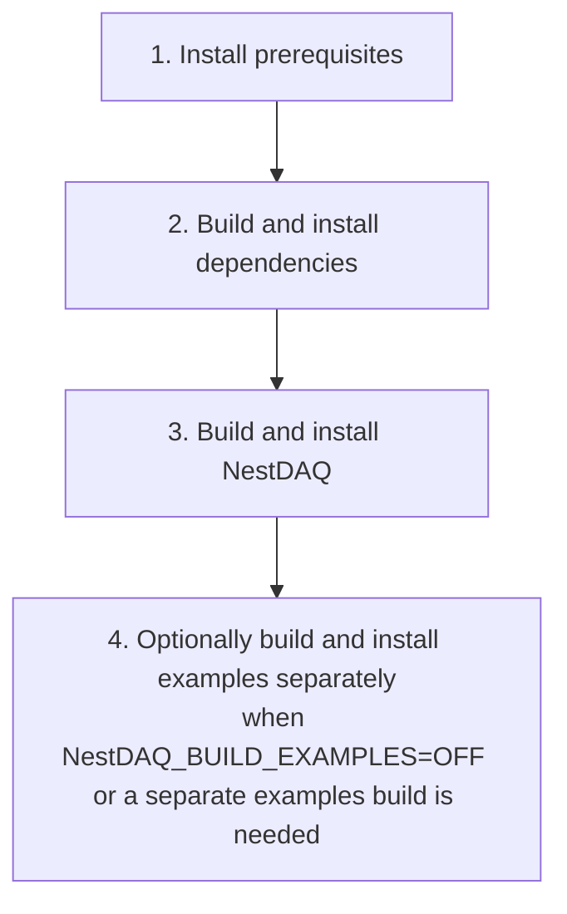

# Installation

[English](INSTALL.md) | [日本語](INSTALL.ja.md)

## Installation flow



The main NestDAQ build builds and installs the examples by default when `NestDAQ_BUILD_EXAMPLES=ON`.
Build the examples separately only when they were disabled in the main build or when they require a separate build directory or install prefix.

## 1. Install prerequisites

Prerequisites are the compilers, build tools, development headers, and libraries that must be available before building NestDAQ and its external dependencies.
Install them as operating-system packages with the package manager provided by each Linux distribution: `dnf` on AlmaLinux and `apt` on Debian and Ubuntu.
The commands in this section install these operating-system packages; they do not install NestDAQ itself.
In shell command examples throughout this document, lines beginning with `#` are comments for the reader and are not executed by the shell.

### AlmaLinux 9 and 10

```bash
# Update package metadata, enable the required repository, and install the build prerequisites
dnf -y update && \
dnf -y install \
    epel-release \
    dnf-plugins-core && \
dnf config-manager --set-enabled crb && \
dnf -y groupinstall "Development Tools" && \
dnf -y install \
    bash-completion \
    gcc \
    gcc-c++ \
    cmake \
    make \
    ninja-build \
    mold \
    git \
    unzip \
    rsync \
    autoconf \
    automake \
    libtool \
    libcurl-devel \
    openssl-devel \
    gnutls-devel \
    zlib-devel \
    bzip2-devel \
    libzstd-devel \
    libquadmath-devel \
    libstdc++-static \
    python3 \
    python3-devel \
    python3-pip

# Optional tools:
# - jq: format and inspect JSON output from command-line tools.
# - clang-tools-extra: provide clang-tidy, clang-format, and related Clang tools.
# - doxygen: generate API documentation.
# - graphviz: provide the dot command for Doxygen diagrams.
# - astyle: format C/C++ source when needed.
# - tmux: keep long-running local validation sessions attached.
# dnf -y install jq clang-tools-extra doxygen graphviz astyle tmux

# Install the GCC 14 toolset when the system compiler is insufficient on AlmaLinux 9
# dnf -y install gcc-toolset-14
```

### AlmaLinux 8

```bash
# Update package metadata, enable PowerTools, and install the build prerequisites
dnf -y update && \
dnf -y install \
    epel-release \
    dnf-plugins-core && \
dnf config-manager --set-enabled powertools && \
dnf -y groupinstall "Development Tools" && \
dnf -y install \
    bash-completion \
    gcc \
    gcc-c++ \
    gcc-toolset-14 \
    cmake \
    make \
    ninja-build \
    mold \
    git \
    unzip \
    rsync \
    autoconf \
    automake \
    libtool \
    libcurl-devel \
    openssl-devel \
    gnutls-devel \
    zlib-devel \
    bzip2-devel \
    libzstd-devel \
    libquadmath-devel \
    libstdc++-static \
    python3.11 \
    python3.11-devel \
    python3.11-pip
```

AlmaLinux 8 uses `powertools` instead of `crb`.
Use the Python 3.11 packages shown above instead of `python3`, `python3-devel`, and `python3-pip`.

### Debian 12/13 and Ubuntu 22.04/24.04/26.04

```bash
# Update package metadata and install the build prerequisites
apt update && \
apt install -y \
    bash-completion \
    build-essential \
    ca-certificates \
    cmake \
    curl \
    make \
    ninja-build \
    mold \
    git \
    unzip \
    rsync \
    pkg-config \
    autoconf \
    automake \
    libtool \
    libc6-dev \
    libcurl4-openssl-dev \
    libssl-dev \
    libgnutls28-dev \
    zlib1g-dev \
    libz2-dev \
    libzstd-dev \
    python3 \
    python3-dev \
    python3-venv \
    python3-pip

# Optional tools:
# - jq: format and inspect JSON output from command-line tools.
# - clang-tools: provide clang-tidy and related LLVM/Clang tools.
# - clang-format: provide clang-format, packaged separately from clang-tools on Debian and Ubuntu.
# - doxygen: generate API documentation.
# - graphviz: provide the dot command for Doxygen diagrams.
# - astyle: format C/C++ source when needed.
# - tmux: keep long-running local validation sessions attached.
# apt install -y jq clang-tools clang-format doxygen graphviz astyle tmux
```

`pkg-config` is included in the common Debian and Ubuntu list because the dependency build requires it on Ubuntu 22.04.

## 2. Build and install external dependencies

The following procedure installs ZeroMQ, Boost, FairLogger, FairMQ, Catch2, nlohmann/json, hiredis, redis++, and Redis Stack.

### 2.1 Clone or check out the source

In this guide, the **upstream repository** is [github.com/spadi-alliance/nestdaq](https://github.com/spadi-alliance/nestdaq).

#### 2.1.1 Users who do not contribute to the upstream repository

The default procedure builds the latest stable release from its `main` branch.
This is the normal choice for users who do not contribute changes to the upstream repository.
Because `main` is the repository's default branch, a normal clone checks it out.

```bash
# Download the latest stable release source
git clone https://github.com/spadi-alliance/nestdaq.git
```

To build a specific released version, replace `<release-tag>` with the required tag from the repository's Releases or Tags page.
Use a release tag when the NestDAQ version must be fixed or the build must be reproducible.

```bash
# Clone only the selected release tag
git clone --branch <release-tag> --depth 1 \
  https://github.com/spadi-alliance/nestdaq.git
```

Alternatively, switch an existing clone to the release tag.
A tag is not a development branch, so `git switch --detach` checks it out in detached HEAD state.

```bash
# Fetch tags and check out the selected release in the existing clone
cd nestdaq
git fetch --tags
git switch --detach <release-tag>
```

#### 2.1.2 Contributors to the upstream repository

Contributors to the upstream repository should first fork `spadi-alliance/nestdaq` to their own GitHub account.
To build the latest development version, clone the fork, register the upstream repository as the `upstream` remote used to fetch and pull changes, and create a local `develop` branch that tracks the fork's `origin/develop`.
Pull updates from upstream, but push only to the branch in the fork (`origin`).

```bash
# Clone the fork and configure its upstream remote and local development branch
git clone https://github.com/<your-github-account>/nestdaq.git
cd nestdaq
git remote add upstream https://github.com/spadi-alliance/nestdaq.git
git fetch upstream
git switch --create develop --track origin/develop

# Integrate any updates from upstream/develop and rebase the local develop branch onto them
git pull --rebase upstream develop

# Push the updated local develop branch to origin/develop in the fork
git push origin develop
```

Do not push development branches to the upstream repository.

Create a working branch in your fork before modifying the source; see [`CONTRIBUTING.md`](CONTRIBUTING.md).

### 2.2 Build and installation procedure

The remaining commands build whichever branch is checked out in `nestdaq`.

```bash
# Configure an out-of-source dependency build under ./build-external
cmake \
  -DCMAKE_INSTALL_PREFIX=./install \
  -DBUILD_PARALLEL_LEVEL=$(nproc) \
  -B ./build-external \
  -S nestdaq/cmake

# Build and install external dependencies
cmake --build ./build-external
```

Redis Stack is an external service required while NestDAQ applications run, not a direct library dependency.
Use one of the following methods to provide Redis Stack:

- Build and install Redis Stack from source with the external dependency build shown above.
  This is the default when `WITH_REDIS_STACK=ON`.
- Build and install Redis 7.x server plus standalone RedisTimeSeries from source with `-DWITH_REDIS_STACK=OFF -DWITH_REDIS_SERVER_7=ON`.
- Run Redis Stack in a container with the helper scripts in [`share/redis-stack-container/README.md`](share/redis-stack-container/README.md).
- Install Redis and Redis Stack modules as host packages with the installer helper scripts in [`share/installers/README.md`](share/installers/README.md).

If a container or host package provides Redis Stack, add `-DWITH_REDIS_STACK=OFF` to the external dependency configure command.

The Redis Stack CMake files and helper shell scripts under `cmake/dependencies/` are intended for Redis 8 or later.
Redis 7.x uses a separate CMake path because RedisTimeSeries 1.x is built as a standalone module rather than through the Redis 8 `redis/modules` tree.

- The command above uses CMake's `ExternalProject` to clone, build, and install each dependency.
  The `--parallel` (or `-j`) option passed to `cmake --build` does not control nested `ExternalProject` builds.
  Set their parallel build level during the initial configuration with `-DBUILD_PARALLEL_LEVEL=xxx`.
  The `nproc` command prints the number of available CPU cores; specify a smaller value if the build consumes too much memory.
- The default dependency versions are listed below.
  To override a version, pass `-Dxxxx_VERSION=yyyy` to CMake.
- If Doxygen is found during the external dependency configure step, `doxygen-awesome-css` is installed as an optional documentation asset under `./install/share/doxygen-awesome-css`.
- To use Ninja instead of Make, add `-G Ninja` to the CMake options.
- To use `mold` instead of the system `ld`, add the linker flags appropriate for the GCC version:
  - GCC 12.1 or later: add `-DCMAKE_EXE_LINKER_FLAGS="-fuse-ld=mold"` and `-DCMAKE_SHARED_LINKER_FLAGS="-fuse-ld=mold"` to the CMake options.
  - GCC 12.0 or earlier: add `-DCMAKE_EXE_LINKER_FLAGS="-B<path-to-mold>"` and `-DCMAKE_SHARED_LINKER_FLAGS="-B<path-to-mold>"`.

### 2.3 External dependency build options

| Option | Default | Description |
| :-- | :-- | :-- |
| `BUILD_PARALLEL_LEVEL` | unset | Parallel level passed to inner `ExternalProject` builds. Set this at configure time; `cmake --build --parallel` does not control those inner builds. |
| `WITH_REDIS_STACK` | `ON` | Build and install the Redis Stack server and modules. Set to `OFF` when Redis Stack is provided separately, for example by a container. |
| `WITH_REDIS_SERVER_7` | `OFF` | Build and install Redis 7.x server with standalone RedisTimeSeries. This option is mutually exclusive with `WITH_REDIS_STACK`. |
| `REDIS_SERVER_7_SERIES` | `7.4` | Redis 7.x series used when `WITH_REDIS_SERVER_7=ON`: `7.4` selects Redis 7.4.9 and RedisTimeSeries 1.12.14; `7.2` selects Redis 7.2.14 and RedisTimeSeries 1.10.24. |
| `REDIS_BUILD_REDISBLOOM` | `ON` | Build and install the RedisBloom module when `WITH_REDIS_STACK` is `ON`. |
| `REDIS_BUILD_REDISEARCH` | `ON` | Build and install the RediSearch module when `WITH_REDIS_STACK` is `ON`. Disable this when the compiler cannot build RediSearch. |
| `REDIS_BUILD_REDISJSON` | `ON` | Build and install the RedisJSON module when `WITH_REDIS_STACK` is `ON`. |
| `REDIS_BUILD_REDISTIMESERIES` | `ON` | Build and install the RedisTimeSeries module when `WITH_REDIS_STACK` is `ON`. |
| `WITH_SPDLOG` | `ON` | Build and install spdlog. This supports the optional NestDAQ spdlog OpenTelemetry sink. |
| `WITH_OTEL_CPP` | `ON` | Build and install opentelemetry-cpp and optional transport dependencies such as gRPC. |
| `<package>_VERSION` | package-specific | Override the dependency version listed below, for example `-DFairMQ_VERSION=...`. |
| `Redis7_VERSION` | series-specific | Override the Redis 7.x version selected by `REDIS_SERVER_7_SERIES`. |
| `RedisTimeSeries7_VERSION` | series-specific | Override the RedisTimeSeries standalone version selected by `REDIS_SERVER_7_SERIES`. |

The default `FairMQ_VERSION` depends on the GNU compiler version.
GCC 9.1 or later uses FairMQ 1.10.0 by default; older GCC releases use FairMQ 1.9.2.
Pass `-DFairMQ_VERSION=...` to override this selection.

When all `REDIS_BUILD_*` module options are set to `OFF`, the dependency build installs only the Redis server tools.
Redis Stack also exposes low-level cache variables for settings such as TLS, the allocator, and temporary Rust toolchain paths.
These variables are intended for dependency build maintenance; inspect the CMake cache or `cmake/dependencies/redis-stack.cmake` when they are needed.
For Redis 7.x maintenance settings, inspect `cmake/dependencies/redis-server-7.cmake`.

### 2.4 Versions of installed external dependencies

| Package                                                                  | Version (default) | CMake options to modify versions |
| :--                                                                      | :--               | :--                              |
| [ZeroMQ(libzmq)](https://github.com/zeromq/libzmq)                       | 4.3.5             | `ZeroMQ_VERSION`                 |
| [Boost](https://github.com/boostorg/boost)                               | 1.85.0            | `Boost_VERSION`                  | 
| [FairLogger](https://github.com/FairRootGroup/FairLogger)                | 2.3.0             | `FairLogger_VERSION`             |
| [FairMQ](https://github.com/FairRootGroup/FairMQ)                        | 1.10.0 with GCC 9.1 or later; 1.9.2 with older GCC | `FairMQ_VERSION` |
| [Catch2](https://github.com/catchorg/Catch2)                             | 3.15.2            | `Catch2_VERSION`                 |
| [nlohmann/json](https://github.com/nlohmann/json)                        | 3.12.0            | `nlohmann_json_VERSION`          |
| [spdlog](https://github.com/gabime/spdlog)                                | 1.17.0            | `spdlog_VERSION`                 |
| [hiredis](https://github.com/redis/hiredis)                              | 1.4.0             | `hiredis_VERSION`                |
| [redis++](https://github.com/sewenew/redis-plus-plus)                    | 1.3.15            | `redis_plus_plus_VERSION`        |
| [opentelemetry-cpp](https://github.com/open-telemetry/opentelemetry-cpp) | 1.28.0            | `opentelemetry-cpp_VERSION`      |
| [doxygen-awesome-css](https://github.com/jothepro/doxygen-awesome-css)   | 2.4.2             | `doxygen-awesome-css_VERSION`    |

<a id="external-runtime-components"></a>
#### 2.4.1 Redis Server and Modules

Redis Stack (`redis-server`, `redis-cli`, Redis modules, and related tools) is included in the external dependency build and is built and installed from source by default.
Disable individual Redis modules with `REDIS_BUILD_REDISBLOOM`, `REDIS_BUILD_REDISEARCH`, `REDIS_BUILD_REDISJSON`, and `REDIS_BUILD_REDISTIMESERIES`.
Redis is required while NestDAQ applications run, but it is not a direct library dependency.
A container or the host package installer scripts can provide Redis instead.
By default, the package installer installs Redis 8.2.7 with Redis Stack modules but without RedisInsight.
When RedisInsight is required and the repository provides the package, use the Redis Stack container helper or set `REDIS_PACKAGE=redis-stack` and `REDIS_VERSION=latest`.

RediSearch requires a compiler with C++20 support.
On AlmaLinux 8 with GCC 8.5, builds with `REDIS_BUILD_REDISEARCH=ON` fail because RediSearch uses C++20 features such as `<ranges>`.
For an AlmaLinux 8 dependency build with GCC 8.5, pass `-DREDIS_BUILD_REDISEARCH=OFF` unless a newer compiler toolchain provides the required C++20 support.
The default Redis module versions follow the module release tags selected by the Redis 8.2.7 source tree.

| Package                                                                  | Version (default) | CMake options |
| :--                                                                      | :--               | :--            |
| [Redis](https://github.com/redis/redis)                                  | 8.2.7             | `Redis_VERSION` |
| [RedisBloom](https://github.com/RedisBloom/RedisBloom)                   | 8.2.12            | `RedisBloom_VERSION`, `REDIS_BUILD_REDISBLOOM` |
| [RediSearch](https://github.com/RediSearch/RediSearch)                   | 8.2.13            | `RediSearch_VERSION`, `REDIS_BUILD_REDISEARCH` |
| [RedisJSON](https://github.com/RedisJSON/RedisJSON)                      | 8.2.9             | `RedisJSON_VERSION`, `REDIS_BUILD_REDISJSON` |
| [RedisTimeSeries](https://github.com/RedisTimeSeries/RedisTimeSeries)    | 8.2.10            | `RedisTimeSeries_VERSION`, `REDIS_BUILD_REDISTIMESERIES` |
| [Redis 7.x](https://github.com/redis/redis)                              | 7.4.9 for `REDIS_SERVER_7_SERIES=7.4`; 7.2.14 for `7.2` | `Redis7_VERSION`, `REDIS_SERVER_7_SERIES` |
| [RedisTimeSeries standalone](https://github.com/RedisTimeSeries/RedisTimeSeries) | 1.12.14 for Redis 7.4; 1.10.24 for Redis 7.2 | `RedisTimeSeries7_VERSION`, `REDIS_SERVER_7_SERIES` |


## 3. Build and install NestDAQ library

```bash
# Configure the NestDAQ library build
cmake \
  -DCMAKE_PREFIX_PATH=./install \
  -DCMAKE_INSTALL_PREFIX=./install \
  -B ./build \
  -S nestdaq

# Build the library and bundled components in parallel
cmake --build ./build --parallel $(nproc)

# Install the completed build
cmake --install ./build
```

- The example installs both the main NestDAQ package and its external dependencies in `./install`.
  If the external dependencies are installed elsewhere, specify their location with `-DCMAKE_PREFIX_PATH=xxx`.
- When `doxygen-awesome-css` is available, it is installed with the generated documentation under `./install/share/doc/nestdaq/doxygen-awesome-css`.
- When `-DNestDAQ_BUILD_DOCS=ON` and Doxygen is available, the HTML documentation is generated under `./build/docs/html` and installed under `./install/share/doc/nestdaq/html`.

### Verbose CMake builds

To show the compiler and linker commands, add `--verbose` to `cmake --build`.
Use this output to inspect include paths, compiler options, and linker flags.

```bash
# Show commands from the external dependency build
cmake --build ./build-external --verbose

# Show commands from the main NestDAQ build
cmake --build ./build --parallel $(nproc) --verbose

# Show commands from the separate examples build
cmake --build ./build-examples --parallel $(nproc) --verbose
```

The environment form is also supported:

```bash
# Enable verbose output through the build tool's conventional environment variable
VERBOSE=1 cmake --build ./build
```

### NestDAQ build options

| Option | Default | Description |
| :-- | :-- | :-- |
| `NESTDAQ_ENABLE_CLANG_TIDY` | `OFF` | Run `clang-tidy` during the NestDAQ build. This requires the `clang-tidy` command, provided by `clang-tools-extra` on AlmaLinux. |
| `NestDAQ_BUILD_DOCS` | `OFF` | Build and install Doxygen documentation. This requires `doxygen`; if Doxygen is not found, documentation generation is skipped. If `dot` from Graphviz is available, Doxygen can use it to generate diagrams. |
| `NestDAQ_BUILD_EXAMPLES` | `ON` | Build and install `Sampler`, `Sink`, and `NullDevice` with the main NestDAQ build. Set this to `OFF` to skip them. |
| `NESTDAQ_DOXYGEN_AWESOME_DIR` | discovered from `CMAKE_PREFIX_PATH` or install prefix | Directory containing `doxygen-awesome-css` assets used by generated documentation. |
| `BUILD_TESTING` | `ON` | Build NestDAQ tests when enabled. |

## Run local OpenTelemetry Collector and backend containers

NestDAQ can export OpenTelemetry logs, metrics, and traces to an OpenTelemetry Collector.
The repository provides Compose setups for local validation under [`share/otel-collector-compose/`](share/otel-collector-compose/README.md).
Here, **Compose** means either `docker compose` or `podman compose`.
The setups run services such as OpenTelemetry Collector Contrib, OpenSearch, and OpenSearch Dashboards in containers.
These services and tools are not build dependencies and the supplied configurations are not intended for production deployment as-is.

Containers or host packages can provide the external services required while NestDAQ applications run.

| External service | Source build | Container helper | Host package installer |
| :-- | :-- | :-- | :-- |
| Redis Stack | `WITH_REDIS_STACK=ON` in the external dependency build | [`share/redis-stack-container/`](share/redis-stack-container/README.md) | [`share/installers/`](share/installers/README.md) |
| OpenTelemetry Collector Contrib | not built by NestDAQ | [`share/otel-collector-compose/`](share/otel-collector-compose/README.md) | [`share/installers/`](share/installers/README.md) |
| OpenSearch | not built by NestDAQ | [`share/otel-collector-compose/opensearch/`](share/otel-collector-compose/opensearch/README.md) | [`share/installers/`](share/installers/README.md) |
| OpenSearch Dashboards | not built by NestDAQ | [`share/otel-collector-compose/opensearch/`](share/otel-collector-compose/opensearch/README.md) | [`share/installers/`](share/installers/README.md) |

After installing NestDAQ, copy the installed configuration to a working directory and start one backend stack.

```bash
# Copy the installed Compose configuration into a writable working directory
cp -a <install-prefix>/share/otel-collector-compose ./otel-collector-compose

# Enter the OpenSearch setup and start its services
cd ./otel-collector-compose/opensearch
docker compose -f compose-opensearch.yaml up
```

For Podman, use the same Compose files with `podman compose`.

The following local backend setups are available:

- [`opensearch/`](share/otel-collector-compose/opensearch/README.md): stores logs and traces in OpenSearch and displays them in OpenSearch Dashboards.
- [`victoria/`](share/otel-collector-compose/victoria/README.md): stores logs, metrics, and traces in VictoriaLogs, VictoriaMetrics, and VictoriaTraces and displays them in Grafana.
- [`clickhouse/`](share/otel-collector-compose/clickhouse/README.md): stores logs, metrics, and traces in ClickStack/ClickHouse and displays them in the ClickStack user interface (UI).

By default, the Compose stacks expose OpenTelemetry Protocol (OTLP) gRPC on `localhost:4317` and OTLP HTTP on `localhost:4318`.
See [`share/otel-collector-compose/README.md`](share/otel-collector-compose/README.md) and the backend-specific README files for information about ports, volumes, credentials, SELinux, and rootless Podman.

For host package installation and systemd-managed services, use [`share/installers/README.md`](share/installers/README.md).
Those scripts use `apt-get` on Debian and Ubuntu systems and `dnf` or `yum` on RHEL-family systems.
They install files in system-managed locations such as `/usr` and `/etc`.

## 4. Build and install examples

The main NestDAQ build includes the examples by default.
After installing NestDAQ, the examples can also be built as a separate CMake project.
For a separate build, use the NestDAQ install prefix when configuring the examples with `find_package(NestDAQ)`.

```bash
# Configure a separate build against the installed NestDAQ package
cmake \
  -DCMAKE_PREFIX_PATH=./install \
  -DCMAKE_INSTALL_PREFIX=./install \
  -B ./build-examples \
  -S nestdaq/examples

# Build the examples in parallel
cmake --build ./build-examples --parallel $(nproc)

# Install the completed examples
cmake --install ./build-examples
```

- `-DCMAKE_PREFIX_PATH=./install` must point to the NestDAQ installation directory.
- The installed example binaries are placed under `./install/bin`.
