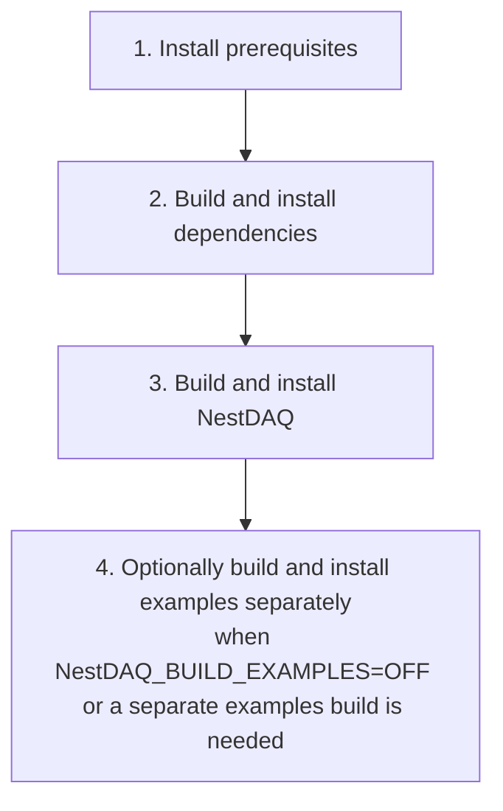

# Installation

[English](INSTALL.md) | [日本語](INSTALL.ja.md)

## Installation flow



The main NestDAQ build builds and installs the examples by default when
`NestDAQ_BUILD_EXAMPLES=ON`. Run the separate examples build only when examples
were disabled in the main build, or when a separate examples build directory or
install prefix is needed.

## 1. Install prerequisites

### AlmaLinux 9 and 10

```bash
dnf -y update && \
dnf -y install \
    epel-release \
    dnf-plugins-core && \
dnf config-manager --set-enabled crb && \
dnf -y groupinstall "Development Tools" && \
dnf -y install \
    bash-completion \
    gcc \
    gcc-c++ \
    cmake \
    make \
    ninja-build \
    mold \
    git \
    unzip \
    rsync \
    autoconf \
    automake \
    libtool \
    libcurl-devel \
    openssl-devel \
    gnutls-devel \
    zlib-devel \
    bzip2-devel \
    libzstd-devel \
    libquadmath-devel \
    libstdc++-static \
    python3 \
    python3-devel \
    python3-pip

# Optional tools:
# - jq: format and inspect JSON output from command-line tools.
# - clang-tools-extra: provide clang-tidy, clang-format, and related Clang tools.
# - doxygen: generate API documentation.
# - graphviz: provide the dot command for Doxygen diagrams.
# - astyle: format C/C++ source when needed.
# - tmux: keep long-running local validation sessions attached.
# dnf -y install jq clang-tools-extra doxygen graphviz astyle tmux

# If needed for AlmaLinux 9
# dnf -y install gcc-toolset-14
```

### AlmaLinux 8

```bash
dnf -y update && \
dnf -y install \
    epel-release \
    dnf-plugins-core && \
dnf config-manager --set-enabled powertools && \
dnf -y groupinstall "Development Tools" && \
dnf -y install \
    bash-completion \
    gcc \
    gcc-c++ \
    gcc-toolset-14 \
    cmake \
    make \
    ninja-build \
    mold \
    git \
    unzip \
    rsync \
    autoconf \
    automake \
    libtool \
    libcurl-devel \
    openssl-devel \
    gnutls-devel \
    zlib-devel \
    bzip2-devel \
    libzstd-devel \
    libquadmath-devel \
    libstdc++-static \
    python3.11 \
    python3.11-devel \
    python3.11-pip
```

AlmaLinux 8 uses `powertools` instead of `crb`. Use the Python 3.11 packages
shown above instead of `python3`, `python3-devel`, and `python3-pip`.

### Debian 12/13 and Ubuntu 22.04/24.04/26.04

```bash
apt update && \
apt install -y \
    bash-completion \
    build-essential \
    ca-certificates \
    cmake \
    curl \
    make \
    ninja-build \
    mold \
    git \
    unzip \
    rsync \
    pkg-config \
    autoconf \
    automake \
    libtool \
    libc6-dev \
    libcurl4-openssl-dev \
    libssl-dev \
    libgnutls28-dev \
    zlib1g-dev \
    libz2-dev \
    libzstd-dev \
    python3 \
    python3-dev \
    python3-venv \
    python3-pip

# Optional tools:
# - jq: format and inspect JSON output from command-line tools.
# - clang-tools: provide clang-tidy and related LLVM/Clang tools.
# - clang-format: provide clang-format, packaged separately from clang-tools on Debian and Ubuntu.
# - doxygen: generate API documentation.
# - graphviz: provide the dot command for Doxygen diagrams.
# - astyle: format C/C++ source when needed.
# - tmux: keep long-running local validation sessions attached.
# apt install -y jq clang-tools clang-format doxygen graphviz astyle tmux
```

`pkg-config` is included in the common Debian/Ubuntu list because Ubuntu 22.04
needs it for the dependency build.

## 2. Build and install external dependencies
The following command installs ZeroMQ, Boost, FairLogger, FairMQ, Catch2,
nlohmann/json, hiredis, redis++, and Redis Stack.

The default procedure in this guide builds the latest stable release from the
upstream `main` branch. Clone `main` explicitly:

```bash
# Download the latest stable release source
git clone --branch main https://github.com/spadi-alliance/nestdaq.git
```

NestDAQ developers should first fork `spadi-alliance/nestdaq` to their own
GitHub account. To build the latest development version, clone that fork, add
the upstream repository, and check out the upstream `develop` branch:

```bash
git clone https://github.com/<your-github-account>/nestdaq.git
git -C nestdaq remote add upstream https://github.com/spadi-alliance/nestdaq.git
git -C nestdaq fetch upstream
git -C nestdaq switch --create develop --track upstream/develop
```

Create a working branch in your fork before modifying the source; see
[`CONTRIBUTING.md`](CONTRIBUTING.md). The remaining commands build whichever
branch is checked out in `nestdaq`.

```bash
# Configure
cmake \
  -DCMAKE_INSTALL_PREFIX=./install \
  -DBUILD_PARALLEL_LEVEL=$(nproc) \
  -B ./build-external \
  -S nestdaq/cmake

# Build and install external dependencies
cmake --build ./build-external
```

Redis Stack is an external service required while NestDAQ applications run,
not a direct library dependency. The following ways to provide it are supported:

- Build and install Redis Stack from source with the external dependency build
  shown above. This is the default when `WITH_REDIS_STACK=ON`.
- Build and install Redis 7.x server plus standalone RedisTimeSeries from
  source with `-DWITH_REDIS_STACK=OFF -DWITH_REDIS_SERVER_7=ON`.
- Run Redis Stack in a container with the helper scripts in
  [`share/redis-stack-container/README.md`](share/redis-stack-container/README.md).
- Install Redis and Redis Stack modules as a host package with the installer helper scripts
  in [`share/installers/README.md`](share/installers/README.md).

If Redis Stack is provided by a container or host package, add
`-DWITH_REDIS_STACK=OFF` to the external dependency configure command.

The Redis Stack CMake files and helper shell scripts under
`cmake/dependencies/` are intended for Redis 8 or later. Redis 7.x uses a
separate CMake path because RedisTimeSeries 1.x is built as a standalone module
rather than through the Redis 8 `redis/modules` tree.

- In the command example above, CMake’s `ExternalProject` is used to perform `git clone`, build, and install.
  - In this case, the `--parallel` (or `-j`) option passed to cmake --build does not control the inner ExternalProject builds, so please specify the parallel build level during the initial configuration using `-DBUILD_PARALLEL_LEVEL=xxx`.
    - The `nproc` command prints the number of available CPU cores on the system. If this causes excessive memory usage, specify a smaller value manually.
- The default dependency versions are listed below. To override a version, pass `-Dxxxx_VERSION=yyyy` to CMake.
- If Doxygen is found during the external dependency configure step, `doxygen-awesome-css` is installed as an optional documentation asset under `./install/share/doxygen-awesome-css`.
- To use Ninja instead of Make, add `-G Ninja` to the CMake options.
- To use `mold` instead of the system `ld`.
  - GCC 12.1 or later: Add `-DCMAKE_EXE_LINKER_FLAGS="-fuse-ld=mold"` and `-DCMAKE_SHARED_LINKER_FLAGS="-fuse-ld=mold"` to the CMake options
  - GCC 12.0 or earlier: Add `-DCMAKE_EXE_LINKER_FLAGS="-B<path-to-mold>"` and `-DCMAKE_SHARED_LINKER_FLAGS="-B<path-to-mold>"`

### External dependency build options

| Option | Default | Description |
| :-- | :-- | :-- |
| `BUILD_PARALLEL_LEVEL` | unset | Parallel level passed to inner `ExternalProject` builds. Set this at configure time; `cmake --build --parallel` does not control those inner builds. |
| `WITH_REDIS_STACK` | `ON` | Build and install the Redis Stack server and modules. Set to `OFF` when Redis Stack is provided separately, for example by a container. |
| `WITH_REDIS_SERVER_7` | `OFF` | Build and install Redis 7.x server with standalone RedisTimeSeries. This option is mutually exclusive with `WITH_REDIS_STACK`. |
| `REDIS_SERVER_7_SERIES` | `7.4` | Redis 7.x series used when `WITH_REDIS_SERVER_7=ON`: `7.4` selects Redis 7.4.9 and RedisTimeSeries 1.12.14; `7.2` selects Redis 7.2.14 and RedisTimeSeries 1.10.24. |
| `REDIS_BUILD_REDISBLOOM` | `ON` | Build and install the RedisBloom module when `WITH_REDIS_STACK` is `ON`. |
| `REDIS_BUILD_REDISEARCH` | `ON` | Build and install the RediSearch module when `WITH_REDIS_STACK` is `ON`. Disable this when the compiler cannot build RediSearch. |
| `REDIS_BUILD_REDISJSON` | `ON` | Build and install the RedisJSON module when `WITH_REDIS_STACK` is `ON`. |
| `REDIS_BUILD_REDISTIMESERIES` | `ON` | Build and install the RedisTimeSeries module when `WITH_REDIS_STACK` is `ON`. |
| `WITH_SPDLOG` | `ON` | Build and install spdlog. This supports the optional NestDAQ spdlog OpenTelemetry sink. |
| `WITH_OTEL_CPP` | `ON` | Build and install opentelemetry-cpp and optional transport dependencies such as gRPC. |
| `<package>_VERSION` | package-specific | Override the dependency version listed below, for example `-DFairMQ_VERSION=...`. |
| `Redis7_VERSION` | series-specific | Override the Redis 7.x version selected by `REDIS_SERVER_7_SERIES`. |
| `RedisTimeSeries7_VERSION` | series-specific | Override the RedisTimeSeries standalone version selected by `REDIS_SERVER_7_SERIES`. |

The default `FairMQ_VERSION` depends on the GNU compiler version. GCC 9.1 or
later uses FairMQ 1.10.0 by default; older GCC releases use FairMQ 1.9.2. Pass
`-DFairMQ_VERSION=...` to override this selection explicitly.

When all `REDIS_BUILD_*` module options are set to `OFF`, the dependency build
installs Redis server tools only. Redis Stack also exposes low-level cache
variables such as Redis build TLS, allocator, and temporary Rust toolchain
paths. These are intended for dependency build maintenance; inspect the CMake
cache or `cmake/dependencies/redis-stack.cmake` when those knobs are needed.
For Redis 7.x maintenance knobs, inspect
`cmake/dependencies/redis-server-7.cmake`.

### Versions of installed external dependencies

| Package                                                                  | Version (default) | CMake options to modify versions |
| :--                                                                      | :--               | :--                              |
| [ZeroMQ(libzmq)](https://github.com/zeromq/libzmq)                       | 4.3.5             | `ZeroMQ_VERSION`                 |
| [Boost](https://github.com/boostorg/boost)                               | 1.85.0            | `Boost_VERSION`                  | 
| [FairLogger](https://github.com/FairRootGroup/FairLogger)                | 2.3.0             | `FairLogger_VERSION`             |
| [FairMQ](https://github.com/FairRootGroup/FairMQ)                        | 1.10.0 with GCC 9.1 or later; 1.9.2 with older GCC | `FairMQ_VERSION` |
| [Catch2](https://github.com/catchorg/Catch2)                             | 3.15.2            | `Catch2_VERSION`                 |
| [nlohmann/json](https://github.com/nlohmann/json)                        | 3.12.0            | `nlohmann_json_VERSION`          |
| [spdlog](https://github.com/gabime/spdlog)                                | 1.17.0            | `spdlog_VERSION`                 |
| [hiredis](https://github.com/redis/hiredis)                              | 1.4.0             | `hiredis_VERSION`                |
| [redis++](https://github.com/sewenew/redis-plus-plus)                    | 1.3.15            | `redis_plus_plus_VERSION`        |
| [opentelemetry-cpp](https://github.com/open-telemetry/opentelemetry-cpp) | 1.28.0            | `opentelemetry-cpp_VERSION`      |
| [doxygen-awesome-css](https://github.com/jothepro/doxygen-awesome-css)   | 2.4.2             | `doxygen-awesome-css_VERSION`    |

<a id="external-runtime-components"></a>
##### Redis Server and Modules
Redis Stack (`redis-server`, `redis-cli`, Redis modules, etc.) is included in
the external dependency build and is built and installed from source by default.
The Redis modules can be disabled individually with `REDIS_BUILD_REDISBLOOM`,
`REDIS_BUILD_REDISEARCH`, `REDIS_BUILD_REDISJSON`, and
`REDIS_BUILD_REDISTIMESERIES`. Redis is required while NestDAQ applications
are running, but it is not a direct library dependency. It may also be provided
by a container or by the host package installer scripts. The package installer
default is Redis 8.2.7 with Redis Stack modules, without RedisInsight; use the
Redis Stack container helper or `REDIS_PACKAGE=redis-stack` with
`REDIS_VERSION=latest` when RedisInsight is needed and the repository provides
that package.
RediSearch requires a compiler with C++20 support. Builds with
`REDIS_BUILD_REDISEARCH=ON` fail with AlmaLinux 8 GCC 8.5 because RediSearch
uses C++20 features such as `<ranges>`. For AlmaLinux 8 dependency builds with
GCC 8.5, pass `-DREDIS_BUILD_REDISEARCH=OFF` unless using a newer compiler
toolchain that supports the required C++20 features.
The default Redis module versions follow the module release tags selected by
the Redis 8.2.7 source tree.

| Package                                                                  | Version (default) | CMake options |
| :--                                                                      | :--               | :--            |
| [Redis](https://github.com/redis/redis)                                  | 8.2.7             | `Redis_VERSION` |
| [RedisBloom](https://github.com/RedisBloom/RedisBloom)                   | 8.2.12            | `RedisBloom_VERSION`, `REDIS_BUILD_REDISBLOOM` |
| [RediSearch](https://github.com/RediSearch/RediSearch)                   | 8.2.13            | `RediSearch_VERSION`, `REDIS_BUILD_REDISEARCH` |
| [RedisJSON](https://github.com/RedisJSON/RedisJSON)                      | 8.2.9             | `RedisJSON_VERSION`, `REDIS_BUILD_REDISJSON` |
| [RedisTimeSeries](https://github.com/RedisTimeSeries/RedisTimeSeries)    | 8.2.10            | `RedisTimeSeries_VERSION`, `REDIS_BUILD_REDISTIMESERIES` |
| [Redis 7.x](https://github.com/redis/redis)                              | 7.4.9 for `REDIS_SERVER_7_SERIES=7.4`; 7.2.14 for `7.2` | `Redis7_VERSION`, `REDIS_SERVER_7_SERIES` |
| [RedisTimeSeries standalone](https://github.com/RedisTimeSeries/RedisTimeSeries) | 1.12.14 for Redis 7.4; 1.10.24 for Redis 7.2 | `RedisTimeSeries7_VERSION`, `REDIS_SERVER_7_SERIES` |


## 3. Build and install NestDAQ library
```bash
cmake \
  -DCMAKE_PREFIX_PATH=./install \
  -DCMAKE_INSTALL_PREFIX=./install \
  -B ./build \
  -S nestdaq
cmake --build ./build --parallel $(nproc)
cmake --install ./build
```

- In the example above, both the main NestDAQ package and the external dependencies are installed in the same directory (`./install`).
  If the external dependencies are installed in a different location, specify that directory with `-DCMAKE_PREFIX_PATH=xxx`.
- When `doxygen-awesome-css` is available, it is installed with the generated documentation under `./install/share/doc/nestdaq/doxygen-awesome-css`.
- When `-DNestDAQ_BUILD_DOCS=ON` and Doxygen is available, the HTML documentation is generated under `./build/docs/html` and installed under `./install/share/doc/nestdaq/html`.

### Verbose CMake builds

To show the underlying compiler and linker commands, add `--verbose` to the
`cmake --build` command. This is useful when checking include paths, compiler
options, or link flags.

```bash
cmake --build ./build-external --verbose
cmake --build ./build --parallel $(nproc) --verbose
cmake --build ./build-examples --parallel $(nproc) --verbose
```

The environment form is also supported:

```bash
VERBOSE=1 cmake --build ./build
```

### NestDAQ build options

| Option | Default | Description |
| :-- | :-- | :-- |
| `NESTDAQ_ENABLE_CLANG_TIDY` | `OFF` | Run `clang-tidy` during the NestDAQ build. This requires the `clang-tidy` command, provided by `clang-tools-extra` on AlmaLinux. |
| `NestDAQ_BUILD_DOCS` | `OFF` | Build and install Doxygen documentation. This requires `doxygen`; if Doxygen is not found, documentation generation is skipped. If `dot` from Graphviz is available, Doxygen can use it to generate diagrams. |
| `NestDAQ_BUILD_EXAMPLES` | `ON` | Build and install `Sampler`, `Sink`, and `NullDevice` with the main NestDAQ build. Set this to `OFF` to skip them. |
| `NESTDAQ_DOXYGEN_AWESOME_DIR` | discovered from `CMAKE_PREFIX_PATH` or install prefix | Directory containing `doxygen-awesome-css` assets used by generated documentation. |
| `BUILD_TESTING` | `ON` | Build NestDAQ tests when enabled. |

## Run local OpenTelemetry Collector and backend containers

NestDAQ can export OpenTelemetry logs, metrics, and traces to an OpenTelemetry
Collector. The repository provides optional Compose setups for local validation
under [`share/otel-collector-compose/`](share/otel-collector-compose/README.md).
They run services used for local operation, such as OpenTelemetry Collector
Contrib, OpenSearch, and OpenSearch Dashboards, in containers. These services
and tools are not build dependencies and are not intended for production
deployment as-is.

External services required while NestDAQ applications run can be provided
either by containers or by host packages:

| External service | Source build | Container helper | Host package installer |
| :-- | :-- | :-- | :-- |
| Redis Stack | `WITH_REDIS_STACK=ON` in the external dependency build | [`share/redis-stack-container/`](share/redis-stack-container/README.md) | [`share/installers/`](share/installers/README.md) |
| OpenTelemetry Collector Contrib | not built by NestDAQ | [`share/otel-collector-compose/`](share/otel-collector-compose/README.md) | [`share/installers/`](share/installers/README.md) |
| OpenSearch | not built by NestDAQ | [`share/otel-collector-compose/opensearch/`](share/otel-collector-compose/opensearch/README.md) | [`share/installers/`](share/installers/README.md) |
| OpenSearch Dashboards | not built by NestDAQ | [`share/otel-collector-compose/opensearch/`](share/otel-collector-compose/opensearch/README.md) | [`share/installers/`](share/installers/README.md) |

After installing NestDAQ, copy the installed setup to a working directory and
start one backend stack:

```bash
cp -a <install-prefix>/share/otel-collector-compose ./otel-collector-compose
cd ./otel-collector-compose/opensearch
docker compose -f compose-opensearch.yaml up
```

For Podman, use the same Compose files with `podman compose`.

Available local backend setups are:

- [`opensearch/`](share/otel-collector-compose/opensearch/README.md): logs and
  traces in OpenSearch, viewed with OpenSearch Dashboards.
- [`victoria/`](share/otel-collector-compose/victoria/README.md): logs,
  metrics, and traces in VictoriaLogs, VictoriaMetrics, and VictoriaTraces,
  viewed with Grafana.
- [`clickhouse/`](share/otel-collector-compose/clickhouse/README.md): logs,
  metrics, and traces in ClickStack/ClickHouse, viewed with the ClickStack user
  interface (UI).

By default, the Compose stacks expose OpenTelemetry Protocol (OTLP) gRPC on
`localhost:4317` and OTLP HTTP on `localhost:4318`. See
[`share/otel-collector-compose/README.md`](share/otel-collector-compose/README.md)
and the backend-specific README files for ports, volumes, credentials,
SELinux, and rootless Podman notes.

For host package installation and systemd-managed services, use
[`share/installers/README.md`](share/installers/README.md). Those scripts use
`apt-get` on Debian/Ubuntu systems and `dnf` or `yum` on RHEL-family systems,
and install into system-managed locations such as `/usr` and `/etc`.

## 4. Build and install examples

The examples are included in the main NestDAQ build by default. They can also be
built as a separate CMake project after installing NestDAQ. For a separate
examples build, configure the examples with `find_package(NestDAQ)` using the
NestDAQ install prefix.

```bash
cmake \
  -DCMAKE_PREFIX_PATH=./install \
  -DCMAKE_INSTALL_PREFIX=./install \
  -B ./build-examples \
  -S nestdaq/examples
cmake --build ./build-examples --parallel $(nproc)
cmake --install ./build-examples
```

- `-DCMAKE_PREFIX_PATH=./install` must point to the directory where NestDAQ was installed.
- The installed example binaries are placed under `./install/bin`.
