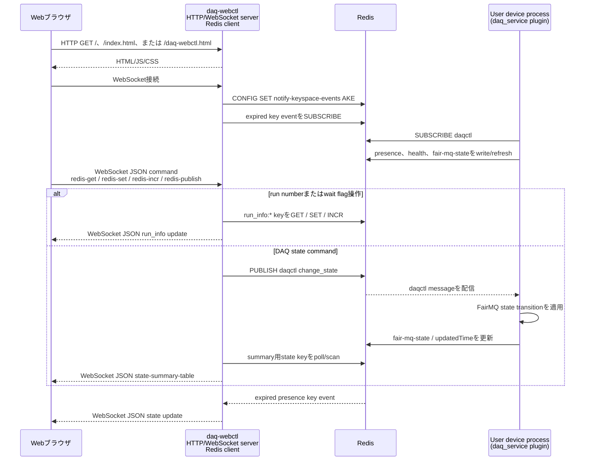

# データ収集 (DAQ) `daq-webctl`実装

[English](README.md) | [日本語](README.ja.md)

[トップ: NestDAQ](../README.ja.md) | [前へ: Plugin](../plugins/README.ja.md) | [次へ: `daq-webctl`のブラウザUI file](../share/controller/README.ja.md)

このディレクトリには、NestDAQのweb controller processである`daq-webctl`の実装があります。
`daq-webctl`は、ブラウザuser interface (UI) 用のHTTP server、対話的client用のWebSocket session、およびRedisをbackendとするDAQ device制御操作を提供します。

`daq-webctl`が配信するHTML、JavaScript、CSS fileについては、[`share/controller/README.ja.md`](../share/controller/README.ja.md)に記載されています。

<a id="1-controller-responsibilities"></a>
## 1. `daq-webctl`の役割

`daq-webctl`はHTTP endpointをlistenし、設定されたdocument rootを配信して、WebSocket clientを受け付けます。
ブラウザから受信したcommandをRedisをbackendとするDAQ制御操作へ変換し、接続中のWebSocket clientへstate updateを返します。

起動時に`daq-webctl`はFairLogger出力を設定し、必要に応じてNestDAQ OpenTelemetry pluginをloadできます。

<a id="2-main-components"></a>
## 2. 主要コンポーネント

| 構成要素 | 用途 |
| :-- | :-- |
| `run_daq-webctl.cxx` | executable entry point、command-line parsing、logging、telemetry、Redis設定、server起動。 |
| `HttpWebSocketServer` | Boost.Asio I/O context、signal handling、listener、worker threadを所有します。 |
| `Listener` | Transmission Control Protocol (TCP) connectionを受け付け、HTTP sessionを開始します。 |
| `HttpSession` | HTTP requestを処理し、WebSocket requestをupgradeします。 |
| `WebSocketSession` | 1つのWebSocket client connectionを管理します。 |
| `WebSocketHandle` | WebSocket clientから受信したJavaScript Object Notation (JSON) messageをdispatchします。 |
| `WebGui` | RedisをbackendとするDAQ制御、state polling、command publishを実装します。 |
| `beast_tools` | 共通のBoost.Beast HTTP response helperを提供します。 |
| `DaqWebControlDefaultDocRootPath.h.in` | `--doc-root`で使用する、インストール済み`daq-webctl` default document root pathを生成します。 |

<a id="3-typical-usage"></a>
## 3. 一般的な使用方法

shell command例の中で`#`から始まる行は読者向けのcommentであり、shellでは実行されません。

```sh
# ローカルのHTTP endpointとRedis endpointを使用してdaq-webctlを起動します。
daq-webctl --http-uri=http://0.0.0.0:8080 --redis-uri=tcp://127.0.0.1:6379
```

`daq-webctl`起動後に、`http://localhost:8080/`、`http://localhost:8080/index.html`、または`http://localhost:8080/daq-webctl.html`を開きます。
インストールされる`index.html`は`daq-webctl.html`へのsymbolic linkであり、`/`へのrequestは`index.html`へ解決されます。
Redis serverは`daq-webctl`より先に起動してください。
OpenTelemetry Collectorへtelemetryをexportする場合は、Collectorとtelemetry dataの保存先も`daq-webctl`より先に起動してください。
全体の起動順は、[ローカル実行シーケンス](../examples/README.ja.md#31-local-run-sequence)を参照してください。
DAQ deviceがRunning stateへ遷移する前に、`daq-webctl`でrun numberを設定してください。

利用可能なHTTP、Redis、FairLogger、OpenTelemetry optionは`daq-webctl --help`で確認できます。

<a id="4-communication-flow"></a>
## 4. 通信フロー

ブラウザはRedisやuser device processへ直接接続しません。
`daq-webctl`はブラウザ向けのHTTP/WebSocket serverであり、commandのpublish、keyへのaccess、Pub/Sub channelのsubscribe、およびstate pollingを行うRedis clientでもあります。
user device processは`daq_service` pluginを通じてRedisと通信します。



この図は制御とstatusの経路を示します。
user device process間のFairMQ data-channel trafficは別経路であり、`daq-webctl`を経由しません。

<a id="5-command-line-options"></a>
## 5. コマンドラインオプション

`daq-webctl`は以下のoptionを受け付けます。
OpenTelemetry optionも利用できます。
`--otel-service-instance-id`を指定しない場合、`daq-webctl`は生成したUUIDをOpenTelemetryの`service.instance.id` resource attributeへ記録します。
OpenTelemetry optionの一覧は[`nestdaq/telemetry/README.ja.md`](../nestdaq/telemetry/README.ja.md)を参照してください。

| Option | 既定値 | 説明 |
| :-- | :-- | :-- |
| `--help`, `-h` | none | command-line helpを表示して終了します。 |
| `--http-uri` | `http://0.0.0.0:8080` | `daq-webctl`がHTTP connectionをlistenするendpoint。`scheme://address:port`形式で指定します。 |
| `--threads` | `1` | HTTP server worker thread数。 |
| `--doc-root` | installed `daq-webctl` document root | `daq-webctl`がHTML、JavaScript、CSS fileを配信するdirectory。 |
| `--pre-run` | `echo "pre-run command"` | `RUN`をpublishする前に実行するscript pathまたはcommand line。 |
| `--post-run` | `echo "post-run command"` | `RUN`をpublishした後に実行するscript pathまたはcommand line。 |
| `--pre-stop` | `echo "pre-stop command"` | `STOP`をpublishする前に実行するscript pathまたはcommand line。 |
| `--post-stop` | `echo "post-stop command"` | `STOP`をpublishした後に実行するscript pathまたはcommand line。 |
| `--redis-uri` | `tcp://127.0.0.1:6379` | Redis server URI。URIの末尾に`/N`を追加するとdatabase `N`を選択し、省略するとdatabase `0`を使用します。 |
| `--separator` | `:` | Redis key path構成時のseparator。 |
| `--poll-interval` | `500` | millisecond単位のstate polling interval。 |
| `--log-to-file` | 空文字列 (未指定) | FairLogger output file。空でないpathを指定するとfile loggingを有効にし、console loggingを無効にします。 |
| `--file-severity` | `info` | FairLogger file severity。 |
| `--severity` | `info` | FairLogger console severity。consoleへのlog出力を停止するには、`nolog`を指定します。 |
| `--verbosity` | `medium` | FairLogger verbosity。 |
| `--color` | `true` | FairLogger console colorを有効にします。 |

<a id="51-opentelemetry-options"></a>
### 5.1. OpenTelemetryオプション

`daq-webctl`のOpenTelemetry `service.name`のdefaultは`daq-webctl`です。
`--otel-library`が空でなくlibraryが見つかる場合は、`daq-webctl`がprocess起動時にtelemetry libraryを動的loadします。

`daq-webctl`でよく使用するtelemetry optionは次のとおりです。

| Option | 既定値 | 説明 |
| :-- | :-- | :-- |
| `--otel-library` | `libnestdaq_otel.so` | process起動時に動的loadするtelemetry shared library pathまたはsoname。 |
| `--otel-log-protocol` | `console` | comma-separated log exporter: `console`、`otlp-http`、`otlp-grpc`。空の場合はlog exportを無効にします。 |
| `--otel-log-endpoint-grpc` | `localhost:4317` | OTLP gRPC log endpoint。 |
| `--otel-log-endpoint-http` | `http://localhost:4318/v1/logs` | OTLP HTTP log endpoint。 |
| `--otel-log-severity` | `info` | OpenTelemetry logへexportするFairLoggerのminimum severity。 |
| `--otel-log-required` | `false` | telemetry libraryをloadまたはinitializeできない場合、failureで終了します。 |
| `--otel-service-name` | `daq-webctl` | OpenTelemetry `service.name` resource attribute。 |
| `--otel-service-namespace` | `nestdaq` | OpenTelemetry `service.namespace` resource attribute。 |
| `--otel-service-instance-id` | generated UUID | OpenTelemetry `service.instance.id` resource attribute。 |
| `--otel-timeout-ms` | `5000` | millisecond単位のforce-flush、shutdown、exporter timeout。 |
| `--otel-metric-protocol` | empty | metric exporter。空の場合はmetricsを無効にします。`console` debugに利用できます。 |
| `--otel-trace-protocol` | empty | trace exporter。空の場合はtracesを無効にします。`console` debugに利用できます。 |

次の例は、ローカルOpenTelemetry CollectorへOTLP gRPCで`daq-webctl` logを送信します。

```sh
# daq-webctlを起動し、OTLP gRPCでローカルcollectorへlogをexportします。
daq-webctl \
  --http-uri=http://0.0.0.0:8080 \
  --redis-uri=tcp://127.0.0.1:6379 \
  --otel-log-protocol=otlp-grpc \
  --otel-log-endpoint-grpc=localhost:4317 \
  --otel-log-severity=info \
  --otel-service-name=daq-webctl
```

`daq-webctl`の実行場所に応じてOTLP endpointを選択します。

ここでComposeとは、`docker compose`または`podman compose`で管理するcontainer構成を指します。

- host processからOpenSearch Composeでpublishされたcollector portへ接続:
  `localhost:4317`。
- 同じOpenSearch Compose network内の`daq-webctl` container:
  `otel-collector:4317`。

metricsとtracesはdefaultで無効です。
collectorを使用しないローカルdebugでは、`--otel-metric-protocol=console`や`--otel-trace-protocol=console`などのconsole exporterを使用します。
OpenTelemetry optionの一覧とresource attributeの詳細は[`nestdaq/telemetry/README.ja.md`](../nestdaq/telemetry/README.ja.md)を参照してください。

<a id="6-redis-command-interface"></a>
## 6. Redisコマンドインターフェース

`daq-webctl`は`daq_service` pluginが実装するRedis command interfaceを使用します。
DAQ command key、`daqctl` Publish/Subscribe (Pub/Sub) channel、message形式、受け付けるcommand value、および`RUN`/`STOP` sequenceについては、[`plugins/README.ja.md`](../plugins/README.ja.md#24-daq-command-publishsubscribe-pubsub)に記載されています。
`daq-webctl`以外のcustom controllerを開発する場合も、このsectionで説明するRedis keyとPub/Sub interfaceを利用できます。

起動時に`daq-webctl`はRedis `notify-keyspace-events`を`AKE`に設定し、expired key eventを含むkey-event notificationを受信できるようにします。
さらに、ブラウザのstate summaryを構築するため、`daq_service{sep}*{sep}*{sep}fair-mq-state`と`daq_service{sep}*{sep}*{sep}updatedTime`をpollします。

次の表は、`daq-webctl`が直接操作するRedis keyおよびchannelを示します。

| Key pattern | `daq-webctl`が行う操作 | 目的 |
| :-- | :-- | :-- |
| `daq_service{sep}{service}{sep}{id}{sep}fair-mq-state` | read | 各device instanceの現在のFairMQ stateを取得。 |
| `daq_service{sep}{service}{sep}{id}{sep}updatedTime` | read | 各device instanceが最後にstateを更新した時刻を取得。 |
| `daq_service{sep}service-instance-index{sep}{service}` | 対応するpresence keyのexpire後にinstance index fieldをdelete | 数値instance indexを再利用できる状態に戻す。 |
| `run_info{sep}run_number` | read、set、increment | 現在または次のrun numberを管理。 |
| `run_info{sep}latest_run_number` | read/write | `RUN`要求時にcopyしたrun numberを保存。 |
| `run_info{sep}wait-device-ready` | read/write | `1`または`true`の場合、選択した全deviceが`DeviceReady`、`Ready`、`Running`のいずれか1つの同じstateを報告するまで`CONNECT`後に待機。keyがない場合またはその他の値の場合は待機しません。 |
| `run_info{sep}wait-ready` | read/write | `1`または`true`の場合、選択した全deviceが`Ready`または全deviceが`Running`を報告するまで`INIT TASK`後に待機。keyがない場合またはその他の値の場合は待機しません。 |
| `daqctl` | publish | 選択したdevice instanceへDAQ state transition要求を送信。 |

`daq-webctl`は`RUN`要求を処理するときに、`run_info{sep}run_number`を`run_info{sep}latest_run_number`へcopyします。
2つのwait flagの設定に応じて、前提となる`CONNECT`および`INIT TASK`要求を送信し、選択したdeviceを待ってから`RUN`を送信します。
前提となるstate transitionを待つ場合にも、同じ`services`および`instances`の選択を使用します。
`STOP`要求を処理するときは、前提となるstate transitionを行わずに`STOP`を送信します。
設定済みのpre/post hookは、対応する`RUN`および`STOP`要求の前後で実行します。

<a id="7-websocket-messages"></a>
## 7. WebSocketメッセージ

browser clientはWebSocket endpointへJSON commandを送信します。
`daq-webctl`はRedis操作を実行するか、Redis Pub/Sub messageをpublishします。
`redis-publish`のRedis Pub/Sub command message形式、受け付けるcommand value、および`services` / `instances` target選択規則については、[`plugins/README.ja.md`](../plugins/README.ja.md#24-daq-command-publishsubscribe-pubsub)に記載されています。

| Client message | 動作 |
| :-- | :-- |
| `{"command":"redis-get","value":"run_number"}` | `run_info{sep}run_number`と`run_info{sep}latest_run_number`を読み取ります。 |
| `{"command":"redis-incr","value":"run_number"}` | `run_info{sep}run_number`をincrementします。 |
| `{"command":"redis-set","name":"wait-ready","value":"true"}` | 既知の`run_info` valueの1つを設定します。有効なnameは`run_number`、`wait-device-ready`、`wait-ready`です。 |
| `{"command":"redis-publish","value":"RUN","services":["Sampler"],"instances":["Sampler:Sampler-0"]}` | 設定に応じたprerequisite command処理とともにDAQ commandを`daqctl`へpublishします。 |

`daq-webctl`はbrowser clientへJSON messageを返します。

| `daq-webctl` message | 意味 |
| :-- | :-- |
| `{"type":"set run_number","value":"..."}` | 更新されたrun number。 |
| `{"type":"set latest_run_number","value":"..."}` | 更新されたlatest run number。 |
| `{"type":"error","value":"..."}` | Redis readまたはcommand handling error。 |
| `{"type":"state-summary-table", ...}` | service/instance state summary全体。 |

`state-summary-table` messageには次が含まれます。

- `service_list_changed`: service集合が変化したときtrue。
- `instance_list_changed`: instance集合が変化したときtrue。
- `services`: service summaryのarray。
- serviceごとの`counts`: FairMQ state counterのarray。
- serviceごとの`instances`: `service`、`instance`、`state`、`date`を
  持つarray。

<a id="8-state-polling-and-expiration"></a>
## 8. 状態pollingと期限切れ

`daq-webctl`は`--poll-interval` millisecondごとに`daq_service{sep}*{sep}*{sep}fair-mq-state`と`daq_service{sep}*{sep}*{sep}updatedTime`をpollします。
得られたsummaryは、接続中のすべてのWebSocket clientへbroadcastされます。

Redis expired key eventは別に処理されます。
`presence` keyがexpireすると、`daq-webctl`はkey nameからserviceとinstanceを導出し、接続中のclientを更新します。
この更新により、消失したinstanceがUIへ反映されます。
