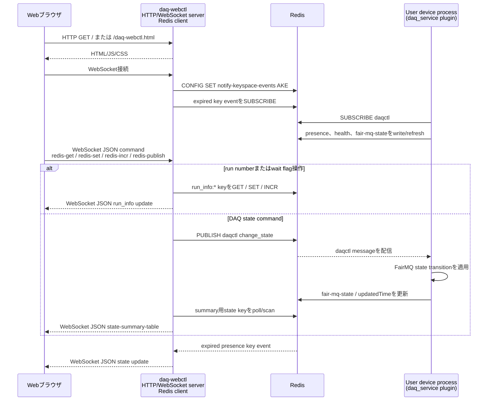

# データ収集(DAQ)Webコントローラー実装

[English](README.md) | [日本語](README.ja.md)

このディレクトリには、NestDAQ web controller process `daq-webctl`の
実装があります。ブラウザuser interface(UI)用Hypertext Transfer
Protocol(HTTP)server、対話的client用WebSocket session、および
RedisをbackendとするDAQ device制御操作を提供します。

`daq-webctl`が配信するstatic browser assetについては、
[`share/controller/README.md`](../share/controller/README.ja.md)に記載されています。

<a id="1-controller-responsibilities"></a>
## 1. コントローラーの役割

`daq-webctl`はHTTP endpointをlistenし、設定されたdocument rootを配信して
WebSocket clientを受け付けます。ブラウザからのcommandはRedisをbackendとする
DAQ制御操作に変換され、state updateは接続中のWebSocket clientへ返されます。

起動時に`daq-webctl`はFairLogger出力を設定し、共通telemetry loaderを通じて
必要に応じてNestDAQ OpenTelemetry pluginをloadできます。controllerはOpenTelemetryへ
直接linkしません。

<a id="2-main-components"></a>
## 2. 主要コンポーネント

| 構成要素 | 用途 |
| :-- | :-- |
| `run_daq-webctl.cxx` | executable entry point、command-line parsing、logging、telemetry、Redis設定、server起動。 |
| `HttpWebSocketServer` | Boost.Asio I/O context、signal handling、listener、worker threadを所有します。 |
| `Listener` | Transmission Control Protocol(TCP)connectionを受け付け、HTTP sessionを開始します。 |
| `HttpSession` | HTTP requestを処理し、WebSocket requestをupgradeします。 |
| `WebSocketSession` | 1つのWebSocket client connectionを管理します。 |
| `WebSocketHandle` | WebSocket clientから受信したJavaScript Object Notation(JSON)messageをdispatchします。 |
| `WebGui` | RedisをbackendとするDAQ制御、state polling、command publishを実装します。 |
| `beast_tools` | 共通のBoost.Beast HTTP response helperを提供します。 |
| `DaqWebControlDefaultDocRootPath.h.in` | `--doc-root`で使用する、インストール済みdefault document root pathを生成します。 |

<a id="3-typical-usage"></a>
## 3. 一般的な使用方法

```sh
daq-webctl --http-uri=http://0.0.0.0:8080 --redis-uri=tcp://127.0.0.1:6379
```

process起動後に`http://localhost:8080/`または
`http://localhost:8080/daq-webctl.html`を開きます。制御操作を成功させるには、
Redis serverとDAQ deviceが利用可能でなければなりません。Running stateへ
遷移する前にrun numberを設定してください。

利用可能なHTTP、Redis、FairLogger、OpenTelemetry optionは
`daq-webctl --help`で確認できます。

<a id="4-communication-flow"></a>
## 4. 通信フロー

ブラウザはRedisやuser device processへ直接接続しません。`daq-webctl`には、
ブラウザ向けHTTP/WebSocket serverと、command publish、key access、Pub/Sub
subscribe、state pollingを行うRedis向けclientという2つの役割があります。
user device processは`daq_service` pluginを通じてRedisと通信します。



この図は制御とstatusの経路を示します。user device process間のFairMQ
data-channel trafficは別経路であり、`daq-webctl`を経由しません。

<a id="5-command-line-options"></a>
## 5. コマンドラインオプション

`daq-webctl`は以下のoptionを受け付けます。OpenTelemetry optionも、
`daq-webctl` component用の共通NestDAQ telemetry option helperを通じて
利用できます。`--otel-service-instance-id`を指定しない場合、
`daq-webctl`は生成したuniversally unique identifier(UUID)をOpenTelemetryの
`service.instance.id` resource attributeへ記録します。OpenTelemetry optionの
完全な一覧は
[`nestdaq/telemetry/README.md`](../nestdaq/telemetry/README.ja.md)を参照してください。

| Option | 既定値 | 説明 |
| :-- | :-- | :-- |
| `--help`, `-h` | none | command-line helpを表示して終了します。 |
| `--http-uri` | `http://0.0.0.0:8080` | `scheme://address:port`形式のHTTP server uniform resource identifier(URI)。 |
| `--threads` | `1` | HTTP server worker thread数。 |
| `--doc-root` | installed controller document root | HTMLとstatic fileを配信するdirectory。 |
| `--pre-run` | `echo "pre-run command"` | `RUN`をpublishする前に実行するscript pathまたはcommand line。 |
| `--post-run` | `echo "post-run command"` | `RUN`をpublishした後に実行するscript pathまたはcommand line。 |
| `--pre-stop` | `echo "pre-stop command"` | `STOP`をpublishする前に実行するscript pathまたはcommand line。 |
| `--post-stop` | `echo "post-stop command"` | `STOP`をpublishした後に実行するscript pathまたはcommand line。 |
| `--redis-uri` | `tcp://127.0.0.1:6379` | Redis server URI。`/N`としてdatabase numberを含められます。 |
| `--separator` | `:` | Redis key path構成時のseparator。 |
| `--poll-interval` | `500` | millisecond単位のstate polling interval。 |
| `--log-to-file` | empty | FairLogger output file。設定するとconsole loggingは無効になります。 |
| `--file-severity` | `info` | FairLogger file severity。 |
| `--severity` | `info` | FairLogger console severity。 |
| `--verbosity` | `medium` | FairLogger verbosity。 |
| `--color` | `true` | FairLogger console colorを有効にします。 |

<a id="51-opentelemetry-options"></a>
### 5.1. OpenTelemetryオプション

`daq-webctl`は、defaultの`service.name`を`daq-webctl`として
共通NestDAQ OpenTelemetry option helperを使用します。controllerは
OpenTelemetryへ直接linkしません。`--otel-library`が空でなくlibraryが
見つかる場合に、process起動時にtelemetry libraryを動的loadします。

controllerでよく使用するtelemetry optionは次のとおりです。

| Option | 既定値 | 説明 |
| :-- | :-- | :-- |
| `--otel-library` | `libnestdaq_otel.so` | process起動時に動的loadするtelemetry shared library pathまたはsoname。 |
| `--otel-log-protocol` | `console` | comma-separated log exporter: `console`、`otlp-http`、`otlp-grpc`。空の場合はlog exportを無効にします。 |
| `--otel-log-endpoint-grpc` | `localhost:4317` | OTLP gRPC log endpoint。 |
| `--otel-log-endpoint-http` | `http://localhost:4318/v1/logs` | OTLP HTTP log endpoint。 |
| `--otel-log-severity` | `info` | OpenTelemetry logへexportするFairLoggerのminimum severity。 |
| `--otel-log-required` | `false` | telemetry libraryをloadまたはinitializeできない場合、failureで終了します。 |
| `--otel-service-name` | `daq-webctl` | OpenTelemetry `service.name` resource attribute。 |
| `--otel-service-namespace` | `nestdaq` | OpenTelemetry `service.namespace` resource attribute。 |
| `--otel-service-instance-id` | generated UUID | OpenTelemetry `service.instance.id` resource attribute。 |
| `--otel-timeout-ms` | `5000` | millisecond単位のforce-flush、shutdown、exporter timeout。 |
| `--otel-metric-protocol` | empty | metric exporter。空の場合はmetricsを無効にします。`console` debugに利用できます。 |
| `--otel-trace-protocol` | empty | trace exporter。空の場合はtracesを無効にします。`console` debugに利用できます。 |

ローカルOpenTelemetry CollectorへOTLP gRPCで`daq-webctl` logを送信する例:

```sh
daq-webctl \
  --http-uri=http://0.0.0.0:8080 \
  --redis-uri=tcp://127.0.0.1:6379 \
  --otel-log-protocol=otlp-grpc \
  --otel-log-endpoint-grpc=localhost:4317 \
  --otel-log-severity=info \
  --otel-service-name=daq-webctl
```

`daq-webctl`の実行場所に応じてOTLP endpointを選択します。

ここでComposeとは、`docker compose`または`podman compose`で管理するcontainer構成を
指します。

- host processからComposeでpublishされたcollector portへ接続:
  `localhost:4317`。
- 同じOpenSearchまたはVictoria Compose network内の`daq-webctl` container:
  `otel-collector:4317`。
- 同じClickStack Compose network内の`daq-webctl` container:
  `clickstack:4317`。

metricsとtracesはdefaultで無効です。collectorを使用しないローカルdebugでは、
`--otel-metric-protocol=console`や`--otel-trace-protocol=console`などの
console exporterを使用します。OpenTelemetry optionの完全な一覧とresource
attributeの詳細は
[`nestdaq/telemetry/README.md`](../nestdaq/telemetry/README.ja.md)を参照してください。

<a id="6-redis-command-interface"></a>
## 6. Redisコマンドインターフェース

`daq-webctl`は`daq_service` pluginが実装するRedis command interfaceを
使用します。DAQ command key、`daqctl` Publish/Subscribe(Pub/Sub)channel、
message形式、受け付けるcommand value、`RUN`/`STOP` sequenceについては
[`plugins/README.md`](../plugins/README.ja.md#24-daq-command-publishsubscribe-pubsub)
に記載されています。

起動時に`daq-webctl`はRedis `notify-keyspace-events`を`AKE`に設定し、
expired key eventを含むkey-event notificationを受信できるようにします。
さらに、ブラウザのstate summaryを構築するため
`daq_service{sep}*{sep}*{sep}fair-mq-state`と
`daq_service{sep}*{sep}*{sep}updatedTime`をpollします。

<a id="7-websocket-messages"></a>
## 7. WebSocketメッセージ

browser clientはWebSocket endpointへJSON commandを送信します。controllerは
Redis操作を実行するか、Redis pub/sub messageをpublishします。
`redis-publish`のRedis Pub/Sub command message形式、受け付けるcommand value、
`services` / `instances` target選択規則については
[`plugins/README.md`](../plugins/README.ja.md#24-daq-command-publishsubscribe-pubsub)
に記載されています。

| Client message | 動作 |
| :-- | :-- |
| `{"command":"redis-get","value":"run_number"}` | `run_info{sep}run_number`と`run_info{sep}latest_run_number`を読み取ります。 |
| `{"command":"redis-incr","value":"run_number"}` | `run_info{sep}run_number`をincrementします。 |
| `{"command":"redis-set","name":"wait-ready","value":"true"}` | 既知の`run_info` valueの1つを設定します。有効なnameは`run_number`、`wait-device-ready`、`wait-ready`です。 |
| `{"command":"redis-publish","value":"RUN","services":["Sampler"],"instances":["Sampler-0"]}` | 設定に応じたprerequisite command処理とともにDAQ commandを`daqctl`へpublishします。 |

controllerはbrowser clientへJSON messageを返します。

| Controller message | 意味 |
| :-- | :-- |
| `{"type":"set run_number","value":"..."}` | 更新されたrun number。 |
| `{"type":"set latest_run_number","value":"..."}` | 更新されたlatest run number。 |
| `{"type":"error","value":"..."}` | Redis readまたはcommand handling error。 |
| `{"type":"state-summary-table", ...}` | service/instance state summary全体。 |

`state-summary-table` messageには次が含まれます。

- `service_list_changed`: service集合が変化したときtrue。
- `instance_list_changed`: instance集合が変化したときtrue。
- `services`: service summaryのarray。
- serviceごとの`counts`: FairMQ state counterのarray。
- serviceごとの`instances`: `service`、`instance`、`state`、`date`を
  持つarray。

<a id="8-state-polling-and-expiration"></a>
## 8. 状態pollingと期限切れ

`daq-webctl`は`--poll-interval` millisecondごとに
`daq_service{sep}*{sep}*{sep}fair-mq-state`と
`daq_service{sep}*{sep}*{sep}updatedTime`をpollします。得られたsummaryは
接続中のすべてのWebSocket clientへbroadcastされます。

Redis expired key eventは別に処理されます。`presence` keyがexpireすると、
controllerはkey nameからserviceとinstanceを導出し、接続中のclientを更新して、
消失したinstanceがUIへ反映されるようにします。
