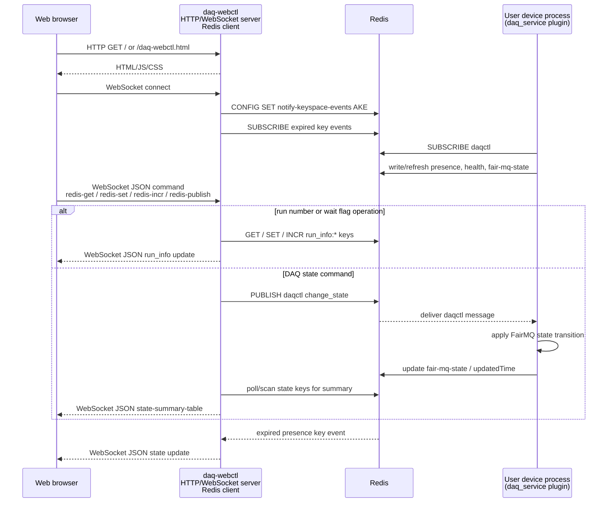

# Data Acquisition (DAQ) Web Controller Implementation

This directory contains the implementation of `daq-webctl`, the NestDAQ web
controller process. It provides a Hypertext Transfer Protocol (HTTP) server for
the browser user interface (UI), WebSocket sessions for interactive clients, and
Redis-backed control operations for DAQ devices.

The static browser assets served by `daq-webctl` are documented separately in
[`share/controller/README.md`](../share/controller/README.md).

## Runtime Role

`daq-webctl` listens on an HTTP endpoint, serves the configured document root,
and accepts WebSocket clients. Commands from the browser are translated into
Redis-backed DAQ control operations, while state updates are sent back to
connected WebSocket clients.

At startup, `daq-webctl` configures FairLogger output and can load the optional
NestDAQ OpenTelemetry plugin through the shared telemetry loader. The controller
does not link OpenTelemetry directly.

## Main Components

| Component | Purpose |
| :-- | :-- |
| `run_daq-webctl.cxx` | Executable entry point, command-line parsing, logging, telemetry, Redis setup, and server startup. |
| `HttpWebSocketServer` | Owns the Boost.Asio I/O context, signal handling, listener, and worker threads. |
| `listener` | Accepts Transmission Control Protocol (TCP) connections and starts HTTP sessions. |
| `http_session` | Handles HTTP requests and upgrades WebSocket requests. |
| `websocket_session` | Manages one WebSocket client connection. |
| `WebSocketHandle` | Dispatches JavaScript Object Notation (JSON) messages received from WebSocket clients. |
| `WebGui` | Implements Redis-backed DAQ control, state polling, and command publication. |
| `beast_tools` | Provides shared Boost.Beast HTTP response helpers. |
| `DaqWebControlDefaultDocRootPath.h.in` | Generates the default installed document root path used by `--doc-root`. |

## Typical Usage

```sh
daq-webctl --http-uri=http://0.0.0.0:8080 --redis-uri=tcp://127.0.0.1:6379
```

Open `http://localhost:8080/` or `http://localhost:8080/daq-webctl.html` after
the process starts. The Redis server and DAQ devices must be available for
control operations to succeed. Set the run number before entering the Running
state.

Use `daq-webctl --help` to inspect the available HTTP, Redis, FairLogger, and
OpenTelemetry options.

## Communication Flow

The browser never connects to Redis or user device processes directly.
`daq-webctl` has two roles: it is the browser-facing HTTP/WebSocket server, and
it is the Redis-facing client for command publication, key access, Pub/Sub
subscription, and state polling. User device processes communicate with Redis
through the `daq_service` plugin.



The diagram shows the control and status path. FairMQ data-channel traffic
between user device processes is separate and is not routed through
`daq-webctl`.

## Command-Line Options

`daq-webctl` accepts the following options. OpenTelemetry options are also
available through the shared NestDAQ telemetry option helper for the
`daq-webctl` component. When `--otel-service-instance-id` is not specified,
`daq-webctl` records a generated universally unique identifier (UUID) in the OpenTelemetry
`service.instance.id` resource attribute. See
[`nestdaq/telemetry/README.md`](../nestdaq/telemetry/README.md) for the full
OpenTelemetry option list.

| Option | Default | Description |
| :-- | :-- | :-- |
| `--help`, `-h` | none | Print command-line help and exit. |
| `--http-uri` | `http://0.0.0.0:8080` | HTTP server uniform resource identifier (URI) in `scheme://address:port` form. |
| `--threads` | `1` | Number of HTTP server worker threads. |
| `--doc-root` | installed controller document root | Directory used to serve HTML and static files. |
| `--pre-run` | `echo "pre-run command"` | Script path or command line executed before publishing `RUN`. |
| `--post-run` | `echo "post-run command"` | Script path or command line executed after publishing `RUN`. |
| `--pre-stop` | `echo "pre-stop command"` | Script path or command line executed before publishing `STOP`. |
| `--post-stop` | `echo "post-stop command"` | Script path or command line executed after publishing `STOP`. |
| `--redis-uri` | `tcp://127.0.0.1:6379` | Redis server URI. A database number can be included as `/N`. |
| `--separator` | `:` | Separator used when composing Redis key paths. |
| `--poll-interval` | `500` | State polling interval in milliseconds. |
| `--log-to-file` | empty | FairLogger output file. If set, console logging is disabled. |
| `--file-severity` | `info` | FairLogger file severity. |
| `--severity` | `info` | FairLogger console severity. |
| `--verbosity` | `medium` | FairLogger verbosity. |
| `--color` | `true` | Enable FairLogger console colors. |

### OpenTelemetry Options

`daq-webctl` uses the shared NestDAQ OpenTelemetry option helper with
`daq-webctl` as the default `service.name`. The controller does not link
OpenTelemetry directly; it loads the runtime telemetry library when
`--otel-library` is non-empty and the library can be found.

Common controller telemetry options are:

| Option | Default | Description |
| :-- | :-- | :-- |
| `--otel-library` | `libnestdaq_otel.so` | Telemetry shared library path or soname loaded at runtime. |
| `--otel-log-protocol` | `console` | Comma-separated log exporters: `console`, `otlp-http`, `otlp-grpc`; empty disables log export. |
| `--otel-log-endpoint-grpc` | `localhost:4317` | OTLP gRPC log endpoint. |
| `--otel-log-endpoint-http` | `http://localhost:4318/v1/logs` | OTLP HTTP log endpoint. |
| `--otel-log-severity` | `info` | Minimum FairLogger severity exported to OpenTelemetry logs. |
| `--otel-log-required` | `false` | Exit with failure if the telemetry library cannot be loaded or initialized. |
| `--otel-service-name` | `daq-webctl` | OpenTelemetry `service.name` resource attribute. |
| `--otel-service-namespace` | `nestdaq` | OpenTelemetry `service.namespace` resource attribute. |
| `--otel-service-instance-id` | generated UUID | OpenTelemetry `service.instance.id` resource attribute. |
| `--otel-timeout-ms` | `5000` | Force-flush, shutdown, and exporter timeout in milliseconds. |
| `--otel-metric-protocol` | empty | Metric exporters; empty disables metrics. Useful for `console` debugging. |
| `--otel-trace-protocol` | empty | Trace exporters; empty disables traces. Useful for `console` debugging. |

Example for sending `daq-webctl` logs to a local OpenTelemetry Collector by
OTLP gRPC:

```sh
daq-webctl \
  --http-uri=http://0.0.0.0:8080 \
  --redis-uri=tcp://127.0.0.1:6379 \
  --otel-log-protocol=otlp-grpc \
  --otel-log-endpoint-grpc=localhost:4317 \
  --otel-log-severity=info \
  --otel-service-name=daq-webctl
```

Choose the OTLP endpoint according to where `daq-webctl` runs:

- Host process to a compose-published collector port: `localhost:4317`.
- `daq-webctl` container in the same OpenSearch or Victoria compose network:
  `otel-collector:4317`.
- `daq-webctl` container in the same ClickStack compose network:
  `clickstack:4317`.

Metrics and traces are disabled by default. For local debugging without a
collector, use console exporters such as `--otel-metric-protocol=console` or
`--otel-trace-protocol=console`. See
[`nestdaq/telemetry/README.md`](../nestdaq/telemetry/README.md) for the full
OpenTelemetry option list and resource attribute details.

## Redis Command Interface

`daq-webctl` uses the Redis command interface implemented by the `daq_service`
plugin. DAQ command keys, the `daqctl` Publish/Subscribe (Pub/Sub) channel,
message shape, accepted command values, and `RUN`/`STOP` sequencing are
documented in
[`plugins/README.md`](../plugins/README.md#daq-command-publishsubscribe-pubsub).

At startup, `daq-webctl` sets Redis `notify-keyspace-events` to `AKE` so it can
receive key-event notifications, including expired key events. It also polls
`daq_service{sep}*{sep}*{sep}fair-mq-state` and
`daq_service{sep}*{sep}*{sep}updatedTime` to build browser state summaries.

## WebSocket Messages

Browser clients send JSON commands to the WebSocket endpoint. The controller
executes Redis operations or publishes Redis pub/sub messages.
For `redis-publish`, the Redis Pub/Sub command message shape, accepted command
values, and `services` / `instances` target selection rules are documented in
[`plugins/README.md`](../plugins/README.md#daq-command-publishsubscribe-pubsub).

| Client message | Effect |
| :-- | :-- |
| `{"command":"redis-get","value":"run_number"}` | Reads `run_info{sep}run_number` and `run_info{sep}latest_run_number`. |
| `{"command":"redis-incr","value":"run_number"}` | Increments `run_info{sep}run_number`. |
| `{"command":"redis-set","name":"wait-ready","value":"true"}` | Sets one of the known `run_info` values. Valid names are `run_number`, `wait-device-ready`, and `wait-ready`. |
| `{"command":"redis-publish","value":"RUN","services":["Sampler"],"instances":["Sampler-0"]}` | Publishes a DAQ command to `daqctl`, with optional prerequisite command handling. |

The controller sends JSON messages back to browser clients.

| Controller message | Meaning |
| :-- | :-- |
| `{"type":"set run_number","value":"..."}` | Updated run number. |
| `{"type":"set latest_run_number","value":"..."}` | Updated latest run number. |
| `{"type":"error","value":"..."}` | Redis read or command handling error. |
| `{"type":"state-summary-table", ...}` | Full service/instance state summary. |

The `state-summary-table` message contains:

- `service_list_changed`: true when the set of services changed.
- `instance_list_changed`: true when the set of instances changed.
- `services`: array of service summaries.
- per-service `counts`: array of FairMQ state counters.
- per-service `instances`: array with `service`, `instance`, `state`, and
  `date`.

## State Polling and Expiration

`daq-webctl` polls `daq_service{sep}*{sep}*{sep}fair-mq-state` and
`daq_service{sep}*{sep}*{sep}updatedTime` every `--poll-interval` milliseconds.
The resulting summary is broadcast to all connected WebSocket clients.

Redis expired key events are processed separately. When a `presence` key expires,
the controller derives the service and instance from the key name and updates
connected clients so the UI can reflect disappeared instances.
