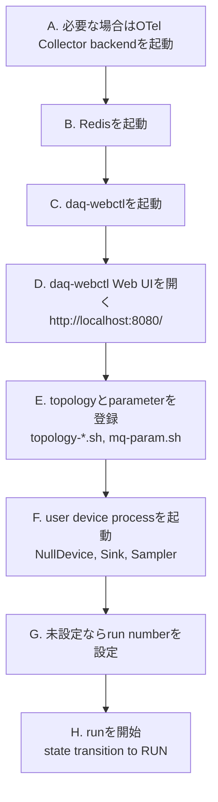
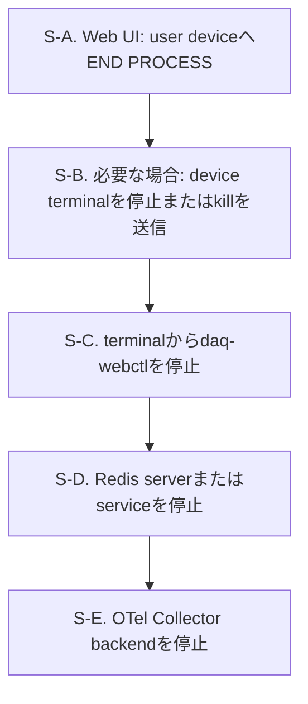

# 使用例

[English](README.md) | [日本語](README.ja.md)

このディレクトリには、小規模なNestDAQ device exampleがあります。
`NestDAQ_BUILD_EXAMPLES`のdefaultは`ON`であるため、NestDAQのmain buildはexampleを含みます。
main buildから除外するには`NestDAQ_BUILD_EXAMPLES=OFF`を設定します。
除外したexampleは、NestDAQのinstall後に独立したCMake projectとしてbuildできます。

<a id="1-example-devices"></a>
## 1. デバイス例

| 実行ファイル | 用途 |
| :-- | :-- |
| `NullDevice` | data channelを使用せず、NestDAQ `runDevice.h` entry pointとlifecycle hookを実行する最小限のFairMQ device。 |
| `Sampler` | FairMQ output channelを通じてtext messageを送信し、custom command-line optionを示します。OpenTelemetry spanとmetricsの計装例も示します。 |
| `Sink` | FairMQ input channelを通じてsingle-partまたはmultipart messageを受信し、channel callback設定を示します。OpenTelemetry spanとmetricsの計装例も示します。 |

**lifecycle hook**は、deviceのlifecycleにおける所定の段階でFairMQ state machineが呼び出すmember functionです。
例えば、`Init()`と`InitTask()`はdeviceを初期化し、`PreRun()`はrunの準備、`PostRun()`はrun終了後の処理を行います。
deviceは自身の処理やresource管理に必要なhookだけをoverrideします。
`NullDevice`は、data channelを設定せずに呼出順を確認できるよう、これらの呼出しをlogへ記録します。

各executableは`NestDAQ::NestDAQ`へlinkします。
このtargetは、NestDAQ `runDevice.h`連携、FairMQ/FairLogger依存関係、plugin search path、および必要に応じて利用できるtelemetry loader supportを提供します。

`Sampler`と`Sink`は、OpenTelemetry headerを直接includeせずにtrace spanとmetricsを示すため、NestDAQ telemetry facadeを使用します。
device起動時に`--otel-metric-protocol=console`と`--otel-trace-protocol=console`などのcommand-line optionを指定すると、これらの計装例が有効になります。

<a id="2-build"></a>
## 2. ビルド

NestDAQのmain buildはdefaultでこれらのexampleをビルドしてインストールします。
除外するには`-DNestDAQ_BUILD_EXAMPLES=OFF`を指定してconfigureします。

exampleを別にbuildする場合は、先にNestDAQをinstallします。
次に、NestDAQのinstall prefixを`CMAKE_PREFIX_PATH`へ設定してexampleをconfigureします。

```sh
cmake \
  -DCMAKE_PREFIX_PATH=<nestdaq-install-prefix> \
  -DCMAKE_INSTALL_PREFIX=<examples-install-prefix> \
  -B ./build-examples \
  -S ./examples
cmake --build ./build-examples --parallel
cmake --install ./build-examples
```

exampleをNestDAQと同じprefixへinstallする必要はありません。
ただし、動的linkerがNestDAQ、FairMQ、Boost、および関連libraryを見つけられる必要があります。
example CMake projectは、example install prefixからの相対的なinstall RPATHを設定し、`NestDAQ::NestDAQ`を通じて検出したlink pathを使用します。

<a id="3-running"></a>
## 3. 実行

install済みhelper scriptを使用するか、FairMQ channel optionを指定してbinaryを直接実行します。
一般的なローカル検証ではRedis、OpenTelemetry Collector backend、`daq-webctl`、example deviceの順に起動します。

```sh
Sampler --help
Sink --help
NullDevice --help
```

<a id="31-local-run-sequence"></a>
### 3.1. ローカル実行シーケンス

以下のcommandは、NestDAQが`<install-prefix>`以下へinstallされていると仮定しています。



この図は一般的なローカル実行sequenceであり、厳密なdependency graphではありません。
log、metrics、tracesをexportし、利用可能なcollector/backendがまだ動作していない場合は、最初にOpenTelemetry Collector backendを起動します。
telemetryが無効、console-only telemetryを使用、または既存collectorが利用可能な場合は、step Aが完了済みとみなします。

Redisは必須です。
ローカル`redis-server`、container化したRedis/Redis Stack instance、systemd管理のhost packageなど、使用中のローカルdeployment方法で起動します。
step EとFは、Redisが利用可能になった後かつstep Hより前であれば、順序を入れ替えられます。

`daq-webctl`起動後すぐにブラウザを開けますが、topologyとparameter設定が登録され、user deviceが動作するまでdeviceが表示されない場合があります。
step GとHは`daq-webctl` Web UIで行う操作です。
run-start commandの実行には対象deviceが動作中である必要があるため、step Hは最後に行います。
`daq-webctl`とuser deviceはRedisを使用し、OpenTelemetry logをcollectorへexportできます。

A. OpenTelemetry Collector backendを起動します。

   backendには、`docker compose`または`podman compose`で実行するローカルCompose設定、
   hostへインストールした`otelcol-contrib` service、またはNestDAQ processから到達可能な
   別のcollectorを使用できます。example deviceからOpenTelemetry Protocol(OTLP)dataを
   受信し、設定されたlog、metric、trace storageへ転送します。

   以下のローカル検証例ではOpenSearch Compose backendを使用します。logとtraceを
   OpenSearchへ保存し、OpenSearch Dashboardsで利用できるようにします。

   ```sh
   cp -a <install-prefix>/share/otel-collector-compose ./otel-collector-compose
   cd ./otel-collector-compose/opensearch
   docker compose -f compose-opensearch.yaml up
   ```

   Podmanでは同じfileを`podman compose`で使用します。port、rootless Podmanの
   注意事項、dashboard設定の詳細は
   [`share/otel-collector-compose/opensearch/README.ja.md`](../share/otel-collector-compose/opensearch/README.ja.md)を参照してください。
   defaultのOTLP gRPC endpointは`localhost:4317`です。
   exportされたlogとtraceを確認するには、OpenSearch Dashboardsの
   `http://localhost:5601/app/discover`を開きます。setup serviceが初期logとtrace
   Data Viewを作成します。

   代わりにhost package managerで`otelcol-contrib`をインストールする場合は、
   collector設定を編集し、`systemd`でserviceを起動します。
   [`share/installers/README.ja.md`](../share/installers/README.ja.md)を参照してください。
   collectorの実行場所に合うOTLP endpointを使用します。host processでは通常
   `localhost:4317`を使用し、同じCompose network内のprocessでは通常
   `otel-collector:4317`や`clickstack:4317`などのcollector service nameを
   使用します。

B. Redisを起動します。

   NestDAQ DAQ service、metrics、parameter configuration pluginにはRedisが必要です。
   Redisには、ローカルでビルドしたserver、`systemd`管理のhost package、または
   containerを使用できます。このstepのRedis endpointを、`daq-webctl`、
   `start_device.sh`、topology/parameter helper scriptで一貫して使用します。

   外部依存関係とともにRedis Stackをビルドしてインストールした場合、Redis Stack
   moduleを指定してインストール済みRedis serverを起動します。

   ```sh
   <install-prefix>/bin/redis-server \
     --loadmodule <install-prefix>/lib/redis/modules/redisbloom.so \
     --loadmodule <install-prefix>/lib/redis/modules/redisearch.so \
     --loadmodule <install-prefix>/lib/redis/modules/rejson.so \
     --loadmodule <install-prefix>/lib/redis/modules/redistimeseries.so
   ```

   ローカル設定で必要なmoduleだけをloadしてください。dependency build時に
   Redis Stack moduleを無効化した場合、対応する`--loadmodule`行を省略します。

   外部依存関係を`-DWITH_REDIS_STACK=OFF
   -DWITH_REDIS_SERVER_7=ON`でconfigureし、standalone RedisTimeSeriesとともに
   Redis 7.x serverをビルドした場合、インストール済みRedisTimeSeries moduleだけを
   loadします。

   ```sh
   <install-prefix>/bin/redis-server \
     --loadmodule <install-prefix>/lib/redis/modules/redistimeseries.so
   ```

   dependency installは`<install-prefix>/etc/redis/`以下にRedis設定例も
   提供します。`redis.conf`はupstreamのbase configurationで、
   `redis-full.conf`はdependency buildでインストールされたmodule pathを
   使用して生成されます。いずれかをcopyし、persistence設定やmodule loadingを
   調整して、config fileを指定してRedisを起動できます。

   ```sh
   cp <install-prefix>/etc/redis/redis-full.conf ./redis-full.conf
   # module loadingまたはpersistenceを調整する場合は./redis-full.confを編集します。
   <install-prefix>/bin/redis-server ./redis-full.conf
   ```

   RedisはdefaultでRDB snapshotを`dump.rdb`へ書き込みます。snapshot directoryと
   file nameはRedisの`dir`および`dbfilename`設定で変更できます。

   defaultのRedis endpointは`localhost:6379`です。

   Redis Stackはcontainerでも実行できます。
   以下を参照してください。
   [`share/redis-stack-container/README.ja.md`](../share/redis-stack-container/README.ja.md)
   にはDocker、Podman、volume、RedisInsight optionが記載されています。
   RedisInsight対応Redis Stack helper(`run-redis-stack.sh`)を使用する場合、
   `http://localhost:8001`でRedisInsightを開きます。Redis Stack Serverのみの
   helper(`run-redis-stack-server.sh`)にはRedisInsightが含まれません。

   host package managerでRedis Stackをインストールした場合、インストール済み
   serviceを`systemd`で起動します。
   [`share/installers/README.ja.md`](../share/installers/README.ja.md)を参照してください。
   Redis unit nameはpackageやdistributionにより異なるため、先に確認します。

C. `daq-webctl`を起動します。

   ```sh
   <install-prefix>/bin/daq-webctl \
     --http-uri=http://0.0.0.0:8080 \
     --redis-uri=tcp://127.0.0.1:6379 \
     --otel-log-protocol=otlp-grpc \
     --otel-log-endpoint-grpc=localhost:4317 \
     --otel-log-severity=info \
     --otel-service-name=daq-webctl
   ```

   `daq-webctl`はserver processです。
   HTTP/WebSocket endpointを提供し、DAQ stateとconfigurationを読み取ってuser device向けcommandをpublishするRedis clientとしても動作します。
   `daq-webctl` Web UIは、このprocessがbrowserへ配信するinterfaceであり、別のcontroller serviceではありません。
   browserは`daq-webctl`と通信し、Redisへ直接接続しません。

   OpenTelemetry optionは`daq-webctl` logを上で起動したローカルcollectorへ送信します。
   Redisやcollectorへ例のhost endpointで到達できない場合は、`--redis-uri`と
   `--otel-log-endpoint-grpc`を変更します。`daq-webctl` optionとRedis commandの
   動作は[`controller/README.ja.md`](../controller/README.ja.md)、telemetry optionの
   完全な一覧は
   [`nestdaq/telemetry/README.ja.md`](../nestdaq/telemetry/README.ja.md)を参照してください。

   `daq-webctl`を同じOpenSearchまたはVictoria compose network内のcontainerとして
   実行する場合は、代わりに`--otel-log-endpoint-grpc=otel-collector:4317`を
   使用します。同じClickStack compose network内では
   `--otel-log-endpoint-grpc=clickstack:4317`を使用します。

D. `daq-webctl` Web UIを開きます。

   ブラウザで`http://localhost:8080/`を開きます。この時点ではWeb UIに
   user deviceがまだ表示されない場合があります。topologyとparameterの登録後、
   user device processが起動すると利用可能になります。

E. topologyとparameter設定を登録します。

   deviceを起動する前に、topologyとparameterのexampleをRedisへ登録します。
   topology scriptは`daq_service` pluginが使用するchannelとlinkの設定を書き込み、
   parameter scriptは`parameter_config` pluginが使用するdevice parameterを
   書き込みます。

   ```sh
   cd <install-prefix>/scripts
   ./topology-1-1.sh
   ./mq-param.sh
   ```

F. `start_device.sh`でuser deviceを起動します。

   インストール済みscriptはNestDAQ pluginをloadし、defaultでは
   `127.0.0.1:6379`のRedisを使用して、OTLP gRPCによりOpenTelemetry logを
   `localhost:4317`へexportします。Redisまたはcollectorが別のendpointを使用する
   場合は`NESTDAQ_REDIS_SERVER`と`NESTDAQ_OTLP_GRPC_ENDPOINT`を設定します。
   scriptではmetricsとtracesがdefaultで無効です。有効化またはtelemetryを
   consoleへ出力する方法は
   [`scripts/README.ja.md`](../scripts/README.ja.md)を参照してください。

   device nameより後のoptionは、deviceまたはNestDAQ pluginが設定するdefault値を
   overrideします。異なるtopology、parameter set、service groupingにdefault値を
   合わせる必要がある場合だけ、command lineで`--service-name`や
   `--in-chan-name`などを指定します。繰り返し実行する場合は、小さなwrapper
   shell scriptへoverrideを記述しても構いません。`--service-name`または
   `--id`が空の場合に使用する`daq_service`のdefaultについては
   [`plugins/README.ja.md#22-daq-service-identity-defaults`](../plugins/README.ja.md#22-daq-service-identity-defaults)
   を参照してください。

   `NullDevice`にはdata channelがありませんが、同じscriptとRedisをbackendとする
   NestDAQ pluginを使用します。

   ```sh
   <install-prefix>/scripts/start_device.sh NullDevice
   ```

   topologyの登録後、`Sink`と`Sampler`を別々のterminalで起動します。
   `Sink`を先に起動すると、receiverがまだ接続されていない間に初期messageが
   失われるのを避けられます。

   ```sh
   <install-prefix>/scripts/start_device.sh Sink
   ```

   ```sh
   <install-prefix>/scripts/start_device.sh Sampler
   ```

G. run numberがない場合は設定します。

   Redisに`run_info:run_number`がまだない場合、runを開始する前に
   `daq-webctl` Web UIからrun numberを設定またはincrementします。Web UIでの操作に
   応じて`daq-webctl` processがRedis上のこの値を読み書きし、`RUN`のpublish時に
   使用します。Redis
   command interfaceとrun information keyについては
   [`controller/README.ja.md`](../controller/README.ja.md#6-redis-command-interface)と
   [`plugins/README.ja.md`](../plugins/README.ja.md#23-redis-keys-written-or-read)を
   参照してください。

H. `daq-webctl` Web UIからrunを開始します。

   `daq-webctl` Web UIを使用して選択したuser deviceを必要なstate-machine
   transitionで遷移させ、`RUN`をpublishしてrunを開始します。`RUN`を要求すると、
   `daq-webctl` processは`run_info:run_number`を`run_info:latest_run_number`へcopyし、
   run-start command sequenceをpublishします。受け付けるDAQ commandと`RUN`
   sequenceについては
   [`plugins/README.ja.md`](../plugins/README.ja.md#24-daq-command-publishsubscribe-pubsub)
   を参照してください。

<a id="32-stop-the-local-services"></a>
### 3.2. ローカルサービスの停止

`daq-webctl` processと共通serviceを停止する前に、`daq-webctl` Web UIを使用して
user device processを終了します。



この図は推奨する停止順序を示します。`END PROCESS`後にuser deviceがすでに
終了している場合、terminalでのfallback stepは省略します。

S-A. `daq-webctl` Web UIで対象user deviceを選択し、`END PROCESS`をclickします。
   選択したdeviceへDAQ `END` commandがpublishされます。

S-B. user deviceが終了しない場合、たとえばCtrl-Cを使用して実行中のterminalから
   停止します。別途signalが必要な場合、最初は通常のtermination signalを
   使用してください。

   ```sh
   kill -TERM <pid>
   ```

   processが通常のterminationに応答しない場合に限り、最後の手段として
   `kill -KILL <pid>`を使用します。

S-C. `daq-webctl`を停止します。`END PROCESS` buttonは`daq-webctl`自体を
   停止せず、user deviceへ`END`をpublishするだけです。たとえばCtrl-Cを使用して、
   実行中のterminalから`daq-webctl`を停止します。必要であれば別のterminalから
   SIGTERMを送信します。

   ```sh
   kill -TERM <daq-webctl-pid>
   ```

   `daq-webctl`はcleanなHTTP/WebSocket server shutdownのためSIGINTとSIGTERMを
   処理します。

S-D. Redisを停止します。
   Redisの起動方法に合った停止手順を使用してください。
   ローカルにインストールしたRedis serverの場合:

   ```sh
   <install-prefix>/bin/redis-cli shutdown
   ```

   container-based Redis Stackでは、
   [`share/redis-stack-container/README.ja.md`](../share/redis-stack-container/README.ja.md)
   の停止手順を使用します。

   `systemd`管理のhost packageではRedis serviceを停止します。unit nameは
   packageやdistributionにより異なるため、先に確認します。

   ```sh
   systemctl list-unit-files 'redis*'
   sudo systemctl stop redis-stack-server
   ```

S-E. OpenTelemetry backendを停止します。collectorとbackendの起動方法に合った
   停止手順を使用してください。OpenSearch backend Compose exampleの場合:

   ```sh
   cd ./otel-collector-compose/opensearch
   docker compose -f compose-opensearch.yaml down
   ```

   Podmanの場合:

   ```sh
   cd ./otel-collector-compose/opensearch
   podman compose -f compose-opensearch.yaml down
   ```

   hostにインストールした`otelcol-contrib` serviceの場合、`systemd`で
   serviceを停止します。

   ```sh
   sudo systemctl stop otelcol-contrib
   ```

   Compose `down` commandはローカル検証用containerとnetworkを停止して削除します。
   OpenSearch data directoryは削除しません。同じdata directoryを指定して同じ
   backendを再度起動すると、以前のOpenSearch dataが再利用されます。data
   directory nameと明示的な破棄commandはbackend READMEを参照してください。

<a id="33-example-specific-options"></a>
### 3.3. サンプル固有オプション

exampleはFairMQ option、NestDAQ plugin option、NestDAQ telemetry optionも受け付けます。
完全なoption setは各executableの`--help`で確認してください。

| 実行ファイル | Option | 既定値 | 説明 |
| :-- | :-- | :-- | :-- |
| `Sampler` | `--out-chan-name` | `data` | producerが使用するoutput channel name。 |
| `Sampler` | `--text` | `Hello` | 各messageで送信するtext payload prefix。 |
| `Sampler` | `--max-iterations` | `0` | run-loop iterationの最大回数。`0`は無限を意味します。 |
| `Sink` | `--in-chan-name` | `in` | consumerが使用するinput channel name。 |
| `Sink` | `--multipart` | `true` | incoming dataをmultipart messageとして処理します。 |

script-basedの起動例は[`scripts/README.ja.md`](../scripts/README.ja.md)を参照してください。

<a id="4-creating-your-own-user-device"></a>
## 4. 独自ユーザーデバイスの作成

NestDAQ user deviceは、dataを生成、消費、変換するprocessです。
C++では`fair::mq::Device`から派生するclassとして実装します。

主な構成要素は次のとおりです。

- FairMQはdevice state machine、message channel、base class
  `fair::mq::Device`を提供します。
- FairLoggerはFairMQとこれらのexampleが`LOG(info)`、`LOG(error)`などの
  macroを通じて使用するlogging systemです。
- NestDAQは`nestdaq/runDevice.h`、Redisをbackendとするplugin、DAQ command
  integration、plugin search path、必要に応じて有効にできるtelemetry設定を提供します。
- RedisはNestDAQ pluginが使用する登録済みprocess/service情報、topology設定、
  parameter設定、DAQ command、metricsを保存します。

<a id="41-start-from-the-skeleton-generator"></a>
### 4.1. スケルトン生成ツールから始める

最初の手順として、小さなprojectを生成し、生成されたfileを編集する方法を推奨します。

```sh
<install-prefix>/scripts/generate-device-skeleton.py MyDevice \
  --output ./MyDevice
```

これにより`MyDevice.h`、`MyDevice.cxx`、`CMakeLists.txt`、`README.md`が作成されます。
`--force`を指定しない限り既存fileは上書きされません。
defaultのskeletonには`in`、`out`、`dqm`という名前のinput、output、DQM channelが含まれます。

便利なvariant:

```sh
# dataの送信だけを行うsource型device。
<install-prefix>/scripts/generate-device-skeleton.py MySource \
  --output ./MySource \
  --no-input-channel \
  --no-dqm-channel

# OnData()で受信dataを処理するsink型device。
<install-prefix>/scripts/generate-device-skeleton.py MySink \
  --output ./MySink \
  --processing-mode on-data \
  --no-output-channel \
  --no-dqm-channel

# interactive modeでは生成内容を質問します。
<install-prefix>/scripts/generate-device-skeleton.py --interactive
```

generator optionは生成するC++ codeの内容を指定します。生成されたdeviceの最終的な
command-line optionではありません。たとえば
`--input-channel source-chan-name:raw`はinputのdefaultをoverrideし、生成される
C++に、default valueが`raw`のdevice command-line option
`source-chan-name`を登録させます。
生成deviceでdefault channelのいずれかが不要な場合は、対応する
`--no-*-channel` optionを使用します。代わりに生成後、関連するoption、member、
initialization、polling、processing codeをすべて削除することもできますが、
生成時にchannelを除外する方が簡単です。

generator optionの一覧は
[`scripts/README.ja.md#4-device-skeleton-generation`](../scripts/README.ja.md#4-device-skeleton-generation)
を参照してください。

<a id="42-c-device-structure"></a>
### 4.2. C++デバイスの構造

最小限のNestDAQ deviceは、`fair::mq::Device` subclassを中心に3つのC++
entry pointを持ちます。

```cpp
#include <memory>
#include <string>

#include <nestdaq/runDevice.h>

#include "MyDevice.h"

namespace bpo = boost::program_options;

auto addCustomOptions(bpo::options_description& options) -> void
{
    options.add_options()
        ("in-chan-name", bpo::value<std::string>()->default_value("in"),
         "Input channel name")
        ("max-iterations,n", bpo::value<std::string>()->default_value("0"),
         "Maximum number of processing iterations");
}

auto getDevice(const fair::mq::ProgOptions& /*config*/) -> std::unique_ptr<fair::mq::Device>
{
    return std::make_unique<nestdaq::MyDevice>();
}
```

`addCustomOptions()`はcommand-line optionを追加します。
`getDevice()`はdevice objectを作成します。
`nestdaq/runDevice.h`がNestDAQ対応main program wrapperを提供するため、生成sourceで`main()`を定義する必要はありません。

`addCustomOptions()`はBoost.Program_optionsのsyntaxを使用します。
`options.add_options()`は、call chainによりoption descriptionを受け付ける
objectを返します。

```cpp
options.add_options()
    ("option-1", bpo::value<std::string>()->default_value("value1"),
     "Help text for option 1")
    ("option-2,o", bpo::value<std::string>()->default_value("value2"),
     "Help text for option 2")
    ("option-N", bpo::value<std::string>()->default_value("valueN"),
     "Help text for option N");
```

各option descriptionは、直前のものに続けて次の `(...)` を書くことで接続します。
semicolonは、最後のoption descriptionの後に一度だけ書きます。

各option descriptionは3つの部分からなります。

- 第1引数はoption name stringです。`"option-2,o"`はlong option
  `--option-2`とshort option `-o`を定義します。`"option-1"`のように
  commaがない場合はlong option `--option-1`だけを定義します。
- 第2引数は保存するvalueとdefaultを指定します。現在のNestDAQ exampleと
  skeleton codeでは、数値設定でも`bpo::value<std::string>()`を使用し、
  device class内でstringを変換します。
- 第3引数は`--help`で表示するhelp textです。

device classは`fair::mq::Device`から派生します。

```cpp
namespace nestdaq {

class MyDevice : public fair::mq::Device
{
private:
    auto InitTask() -> void override;
    auto ConditionalRun() -> bool override;
    auto PostRun() -> void override;

    std::string fInputChannelName{"in"};
    std::size_t fMaxIterations{0};
    std::size_t fIterations{0};
};

} // namespace nestdaq
```

異なる種類の処理には、それぞれのlifecycle functionを使用します。

| Function | 使用場面 |
| :-- | :-- |
| `InitTask()` | `fConfig`からcommand-line optionを読み、stringを型付きmemberへ変換し、`OnData()` callbackを登録してtelemetry instrumentを作成します。 |
| `PreRun()` | deviceがRUNNINGへ入る直前にresourceを準備します。 |
| `OnData()` | incoming FairMQ messageを起点に処理する場合、`InitTask()`でinput callbackを登録します。FairMQがmessageを受信してcallbackへ渡します。 |
| `ConditionalRun()` | 単純なactive processing loopのdefault選択です。続行する場合は`true`、RUNNINGを抜ける場合は`false`を返します。 |
| `Run()` | deviceがrun loop全体を所有する場合だけ使用します。通常、意味のある`ConditionalRun()`処理と組み合わせません。 |
| `PostRun()` | RUNNING終了後にrun-time resourceをflush、drain、releaseします。 |

<a id="43-command-line-options-and-type-conversion"></a>
### 4.3. コマンドラインオプションと型変換

現在のNestDAQ exampleとskeleton codeでは、論理的な値が数値の場合でも、custom
optionを通常`std::string`として登録します。通常は`InitTask()`内でdevice
classの型へ変換します。

```cpp
auto MyDevice::InitTask() -> void
{
    fInputChannelName = fConfig->GetProperty<std::string>("in-chan-name");

    const auto maxIterations = fConfig->GetProperty<std::string>("max-iterations");
    fMaxIterations = std::stoull(maxIterations);
}
```

この方法により、command-line処理、Redis parameter injection、および生成codeの動作が一貫します。
数値optionが不正な場合は、変換を早い段階で失敗させるか、exceptionをcatchして明確なerrorをlogへ記録します。

<a id="44-choosing-ondata-conditionalrun-or-run"></a>
### 4.4. OnData()、ConditionalRun()、Run()の選択

FairMQはstate-machine wrapperからuser hookを呼び出します。次のpseudo-codeは
FairMQの`Device.cxx`の関連部分を要約したものです。

```cpp
auto Device::InitTaskWrapper() -> void
{
    InitTask();
}

auto Device::RunWrapper() -> void
{
    PreRun();

    // InitTask()でOnData(...)を登録するとfDataCallbacksが設定されます。
    // callbackが登録されている場合、このpathがConditionalRun()とRun()より
    // 優先されます。
    if (fDataCallbacks) {
        if (fInputChannelKeys.size() == 1 && GetChannels().at(fInputChannelKeys.at(0)).size() == 1) {
            HandleSingleChannelInput();
        } else {
            HandleMultipleChannelInput();
        }
    } else {
        tools::RateLimiter rateLimiter(fRate);

        // このpathはOnData(...) callbackが登録されていない場合だけ実行されます。
        // state transition commandがpendingになるとNewStatePending()はtrueになります。
        while (!NewStatePending() && ConditionalRun()) {
            if (fRate > 0.001) {
                rateLimiter.maybe_sleep();
            }
        }

        // ConditionalRun() loopの終了後にRun()が呼び出されます。
        Run();
    }

    if (!NewStatePending()) {
        ChangeStateOrThrow(Transition::Stop);
    }

    PostRun();
}
```

deviceのmain processing styleには、次のうち1つを使用します。

- input data到着時だけ処理するreceiverには`OnData()`を使用します。
  `InitTask()`でcallbackを登録します。FairMQのinput-handling pathが
  `Receive()`を実行し、受信した`MessagePtr`または`Parts`をcallbackへ渡す
  唯一のstyleです。callbackには受信messageに対する操作を書き、再度
  `Receive()`を呼び出さないでください。`OnData()` callbackを登録すると、
  FairMQはcallback pathを処理し、`ConditionalRun()` / `Run()` pathへ入りません。
- source device、polling receiver、単純なprocessorには`ConditionalRun()`を使用します。
  最もdebugしやすいstyleです。
  FairMQは各iteration前に`NewStatePending()`を確認するloopから呼び出すため、`STOP`や`END`などのstate transitionがpendingになるとloopを終了します。
- `ConditionalRun()` modelに合わないcustom loopが必要な場合は`Run()`を
  使用します。`ConditionalRun()`がすぐに`false`を返すと、FairMQは同じ
  RUNNING transitionから`Run()`を呼び出します。

`OnData()`と異なり、`ConditionalRun()`と`Run()`はmessageを自動的に
受信しません。いずれかのfunctionでinputを消費する場合、device codeに
`Receive()`、polling、timeout handlingを記述します。

`OnData()`、`ConditionalRun()`、`Run()`のいずれか1つをmain processing styleとして実装します。
1つのdeviceに3つすべてを実装する必要はありません。
`OnData()` callback、`ConditionalRun()`、`Run()`の内部で無期限にwaitしないでください。
loop、retry、waitを追加する場合は、deviceがstate transition commandへ応答できるよう`NewStatePending()`を確認します。
`OnData()`が使用するFairMQ input-handling pathと`ConditionalRun()`を囲むFairMQ loopは、すでに`NewStatePending()`を確認します。
ただし、user codeも無期限にblockせず、それらのloopへ制御を戻す必要があります。
FairMQ loopへ速やかに戻ることで、state transitionへの応答性が向上します。

callback-based sinkの例:

```cpp
auto MySink::InitTask() -> void
{
    fInputChannelName = fConfig->GetProperty<std::string>("in-chan-name");
    OnData(fInputChannelName, &MySink::HandleData);
}

auto MySink::HandleData(fair::mq::MessagePtr& msg, int index) -> bool
{
    LOG(info) << "received " << msg->GetSize() << " bytes on subchannel " << index;
    return true;
}
```

loop-based sourceの例:

```cpp
auto MySource::ConditionalRun() -> bool
{
    auto msg = NewSimpleMessage("payload");
    if (Send(msg, fOutputChannelName) < 0) {
        LOG(error) << "failed to send";
    }

    ++fIterations;
    return fMaxIterations == 0 || fIterations < fMaxIterations;
}
```

<a id="45-cmake-project"></a>
### 4.5. CMakeプロジェクト

生成される`CMakeLists.txt`は意図的に小さくしています。standalone device
projectで必要なのは、NestDAQを検索して`NestDAQ::NestDAQ`へlinkすることだけです。

```cmake
cmake_minimum_required(VERSION 3.22)

project(MyDevice LANGUAGES CXX)

include(GNUInstallDirs)

set(CMAKE_CXX_STANDARD_REQUIRED ON)
set(CMAKE_CXX_STANDARD 17)
set(CMAKE_CXX_EXTENSIONS OFF)

find_package(NestDAQ REQUIRED CONFIG)

add_executable(MyDevice
  MyDevice.cxx
)

target_link_libraries(MyDevice PUBLIC
  NestDAQ::NestDAQ
)

install(TARGETS MyDevice
  RUNTIME DESTINATION ${CMAKE_INSTALL_BINDIR}
)
```

`find_package(NestDAQ REQUIRED CONFIG)`はインストール済みNestDAQ CMake
packageを検索します。`NestDAQ::NestDAQ`はNestDAQ、FairMQ、FairLogger、
関連依存関係の実行に必要なinclude directory、link library、link設定、
library search設定を伝播します。

生成projectをout-of-sourceでビルドしてインストールします。

```sh
cmake -S ./MyDevice -B ./build-MyDevice \
  -DCMAKE_PREFIX_PATH=<nestdaq-install-prefix> \
  -DCMAKE_INSTALL_PREFIX=<device-install-prefix>

cmake --build ./build-MyDevice --parallel
cmake --install ./build-MyDevice
```

`CMAKE_PREFIX_PATH`はNestDAQ install prefixを指す必要があります。これにより
CMakeが`NestDAQConfig.cmake`を見つけられます。`CMAKE_INSTALL_PREFIX`は
新しいdevice executableのインストール先です。NestDAQと同じprefixでも、
別のprefixでも構いません。

<a id="46-running-the-new-device"></a>
### 4.6. 新しいデバイスの実行

上のローカル実行sequenceで説明したものと同じ外部serviceを使用します。

既存のローカル検証環境がすでに動作している場合、対応する以下のstepを省略します。
たとえば、新しいdeviceで同じendpointを使用する場合、別のRedis server、
OpenTelemetry Collector backend、`daq-webctl` processを起動する必要はありません。
ただし`start_device.sh`が使用するRedis endpoint、OpenTelemetry endpoint、
`daq-webctl` endpointは、すでに動作中のserviceと一致する必要があります。
既存のRedis設定が新しいdeviceの`--service-name`またはchannel nameと一致しない
場合だけ、topologyとparameter設定を再登録します。

1. telemetry exportが必要な場合、OpenTelemetry Collector backendを起動します。
2. Redisを起動します。
3. browser controlが必要な場合、`daq-webctl`を起動します。
4. Redisへtopologyとparameter設定を登録します。
5. user device processを起動します。

NestDAQ helper scriptを使用してインストール済みdeviceを起動します。

```sh
<nestdaq-install-prefix>/scripts/start_device.sh <device-install-prefix>/bin/MyDevice \
  --service-name MyDevice \
  --in-chan-name in
```

`start_device.sh`はNestDAQ FairMQ pluginをloadし、device nameより後のoptionを
deviceとpluginへ渡します。Redisと`daq-webctl`に表示するservice nameは
`--service-name`で選択します。

これらのcommand-line optionはdeviceまたはpluginが登録したdefaultをoverrideします。
defaultがtopologyとすでに一致する場合はそのまま使用し、特定のuse caseで異なる
serviceまたはchannel nameが必要な場合はcommand lineかwrapper shell scriptで
overrideします。`--service-name`または`--id`が空の場合に使用する
`daq_service`のdefaultについては
[`plugins/README.ja.md#22-daq-service-identity-defaults`](../plugins/README.ja.md#22-daq-service-identity-defaults)
を参照してください。

service nameとchannel nameはRedisへ登録したtopologyと一致する必要があります。
deviceでexample `Sink`を置き換える場合、serviceとinput channelを一致させて
実行するか、新しいtopology scriptを作成します。

```sh
<nestdaq-install-prefix>/scripts/start_device.sh <device-install-prefix>/bin/MyDevice \
  --service-name Sink \
  --in-chan-name in
```

新しいservice nameを使用する場合、インストール済み`topology-*.sh` scriptの
いずれかをcopyし、serviceとchannelのendpoint/link entryを追加します。topology
scriptは、存在するFairMQ channelとservice間の接続方法を`daq_service` pluginへ
伝えるRedis keyを書き込みます。Redis keyとchannel動作については
[`scripts/README.ja.md#2-topology-configuration`](../scripts/README.ja.md#2-topology-configuration)
および[`plugins/README.ja.md`](../plugins/README.ja.md)を参照してください。

telemetry optionについては
[`nestdaq/telemetry/README.ja.md`](../nestdaq/telemetry/README.ja.md)を参照してください。
完全に動作するproducer/consumer実装については、生成codeとこのディレクトリの
`Sampler.cxx`および`Sink.cxx`を比較してください。
