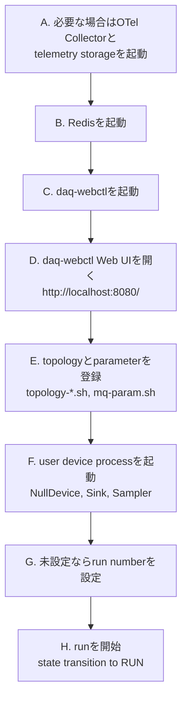
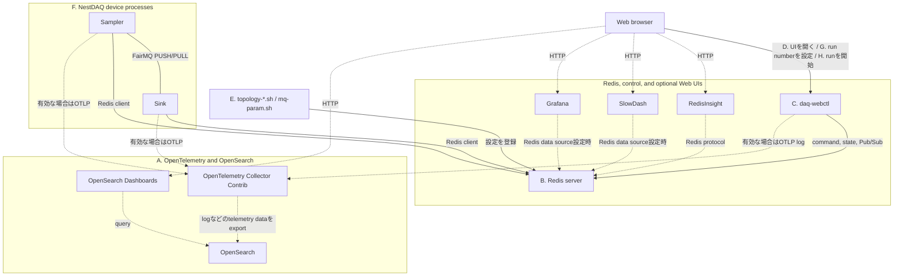
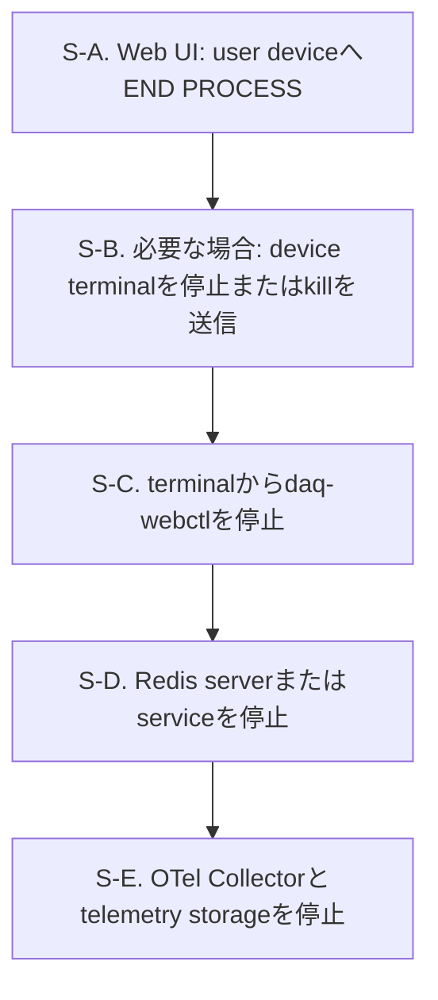

# 使用例

[English](README.md) | [日本語](README.ja.md)

[トップ: NestDAQ](../README.ja.md) | [前へ: インストール](../INSTALL.ja.md) | [次へ: スクリプト](../scripts/README.ja.md)

このディレクトリには、小規模なNestDAQ device exampleがあります。
CMake option `NestDAQ_BUILD_EXAMPLES`は、NestDAQのmain buildにexampleを含めるかどうかを制御し、defaultは`ON`です。

<a id="1-example-devices"></a>
## 1. デバイス例

| 実行ファイル | 用途 |
| :-- | :-- |
| `NullDevice` | data channelを使用せず、NestDAQ `runDevice.h` entry pointとlifecycle hookを実行する最小限のFairMQ device。 |
| `Sampler` | FairMQ output channelを通じてtext messageを送信します。custom command-line optionの使用例を示します。OpenTelemetry spanとmetricsの計装例も示します。 |
| `Sink` | FairMQ input channelを通じてsingle-partまたはmultipart messageを受信します。channel callbackの設定例を示します。OpenTelemetry spanとmetricsの計装例も示します。 |

**lifecycle hook**は、deviceのlifecycleにおける所定の段階でFairMQ state machineが呼び出すmember functionです。
例えば、`Init()`と`InitTask()`はdeviceを初期化し、`PreRun()`はrunの準備、`PostRun()`はrun終了後の処理を行います。
deviceは自身の処理やresource管理に必要なhookだけをoverrideします。
`NullDevice`は、data channelを設定せずに呼出順を確認できるよう、これらの呼出しをlogへ記録します。

各executableは`NestDAQ::NestDAQ`へlinkします。
このtargetは、NestDAQ `runDevice.h`連携、FairMQ/FairLogger依存関係、plugin search path、および必要に応じて利用できるtelemetry loader supportを提供します。

`Sampler`と`Sink`は、OpenTelemetry headerを直接includeせずにtrace spanとmetricsを示すため、NestDAQ telemetry facadeを使用します。
device起動時に`--otel-metric-protocol=console`と`--otel-trace-protocol=console`などのcommand-line optionを指定すると、これらの計装例が有効になります。
NestDAQのOpenTelemetry metricsおよびtrace instrumentationはexperimentalであり、
production codeでは使用しないでください。

<a id="2-build"></a>
## 2. ビルド

NestDAQのmain buildはdefaultでこれらのexampleをビルドしてインストールします。
除外するには、`-DNestDAQ_BUILD_EXAMPLES=OFF`を指定してNestDAQをconfigureします。

exampleを別にbuildする場合は、先にNestDAQをinstallします。
次に、NestDAQのinstall prefixを`CMAKE_PREFIX_PATH`へ設定してexampleをconfigureします。

以下のcommandでは、`-D`でCMake cache variableの`CMAKE_PREFIX_PATH`と`CMAKE_INSTALL_PREFIX`を設定します。
`-S`と`-B`は、source directoryとbuild directoryを選択する`cmake` command-line optionです。

shell command例の中で`#`から始まる行は読者向けのcommentであり、shellでは実行されません。

```sh
# install済みNestDAQ packageを使用するout-of-source buildをconfigureします。
cmake \
  -DCMAKE_PREFIX_PATH=<nestdaq-install-prefix> \
  -DCMAKE_INSTALL_PREFIX=<examples-install-prefix> \
  -B ./build-examples \
  -S ./examples
# configure済みexampleを並列buildします。
cmake --build ./build-examples --parallel
# 選択したprefix以下へexample executableをinstallします。
cmake --install ./build-examples
```

exampleをNestDAQと同じprefixへinstallする必要はありません。
ただし、動的linkerがNestDAQ、FairMQ、Boost、および関連libraryを見つけられる必要があります。
example CMake projectは、example install prefixからの相対的なinstall RPATHを設定し、`NestDAQ::NestDAQ`を通じて検出したlink pathを使用します。

<a id="3-running"></a>
## 3. 実行

<a id="31-local-run-sequence"></a>
### 3.1. ローカル実行シーケンス

以下のcommandは、NestDAQが`<install-prefix>`以下へinstallされていると仮定しています。



この図は一般的なローカル実行sequenceであり、厳密なdependency graphではありません。
このsectionにおけるtelemetry storageは、OpenSearchなど、Collectorから転送された
telemetry dataを保存するserviceを指します。
log、metrics、tracesをexportし、利用可能なCollectorとtelemetry storageがまだ
動作していない場合は、最初にOpenTelemetry Collectorと必要なtelemetry storageを
起動します。
telemetryが無効、console-only telemetryを使用、または既存Collectorが利用可能な場合は、step Aが完了済みとみなします。

Redisは必須です。
ローカル`redis-server`、container化したRedis/[Redis Stack](../INSTALL.ja.md#redis-server-and-modules) instance、systemd管理のhost packageなど、使用中のローカルdeployment方法で起動します。
step EとFは、Redisが利用可能になった後かつstep Hより前であれば、順序を入れ替えられます。

`daq-webctl`起動後すぐにブラウザを開けますが、topologyとparameter設定が登録され、user deviceが動作するまでdeviceが表示されない場合があります。
step GとHは`daq-webctl` Web UIで行う操作です。
run-start commandの実行には対象deviceが動作中である必要があるため、step Hは最後に行います。
`daq-webctl`とuser deviceはRedisを使用し、OpenTelemetry logをCollectorへexportできます。

<a id="311-step-a-start-an-opentelemetry-collector"></a>
#### 3.1.1. Step A: OpenTelemetry Collectorを起動

ローカルCompose構成のCollector、hostへインストールした`otelcol-contrib` service、
またはNestDAQ processから到達可能な別のCollectorを使用できます。
Collectorはexample deviceからOpenTelemetry Protocol (OTLP) dataを受信し、
設定されたlog、metric、trace storageへ転送します。

<a id="3111-compose"></a>
##### 3.1.1.1. Compose

以下のローカル検証例ではOpenSearch Compose stackを使用します。
logとtraceをOpenSearchへ保存し、OpenSearch Dashboardsで利用できるようにします。

```sh
# インストール済みCompose fileをcurrent directoryへcopyします。
cp -a <install-prefix>/share/otel-collector-compose ./otel-collector-compose
# OpenSearch Compose directoryへ移動します。
cd ./otel-collector-compose/opensearch
# Collector、OpenSearch、OpenSearch Dashboards、setup serviceを起動します。
docker compose -f compose-opensearch.yaml up
```

Podmanでは同じfileを`podman compose`で使用します。
port、rootless Podmanの注意事項、dashboard設定の詳細は
[`share/otel-collector-compose/opensearch/README.ja.md`](../share/otel-collector-compose/opensearch/README.ja.md)を参照してください。
host processが使用するdefaultのOTLP gRPC endpointは`localhost:4317`です。
同じCompose network内のprocessは、`otel-collector:4317`などのCollector service nameを使用します。

`opensearch-dashboards-setup` serviceは、`docker compose up`または
`podman compose up`の一部として自動的に実行され、logとtraceの初期Data Viewを作成します。
exportされたlogとtraceを確認するには、OpenSearch Dashboardsで
`http://localhost:5601/app/discover`を開きます。

<a id="3112-host-package"></a>
##### 3.1.1.2. Host package

host package managerで`otelcol-contrib`をインストールした場合は、Collector設定を編集し、
`systemd`でserviceを起動します。
[`share/installers/README.ja.md`](../share/installers/README.ja.md)を参照してください。
このserviceに設定したOTLP endpointを使用します。
同じhost上のclient processは通常`localhost:4317`を使用します。

<a id="312-step-b-start-redis"></a>
#### 3.1.2. Step B: Redisを起動

   NestDAQの`daq_service`、`metrics`、`parameter_config`という3つのpluginにはRedisが必要です。
   `metrics` pluginにはRedisTimeSeriesも必要です。
   各pluginの要件は[`plugins/README.ja.md`](../plugins/README.ja.md)を参照してください。
   Redisには、ローカルでビルドしたserver、`systemd`管理のhost package、または
   containerを使用できます。このstepで起動したRedisのendpointを、`daq-webctl`、
   `start_device.sh`、topology/parameter helper scriptで一貫して使用します。
   `parameter_config`のlive reloadを使用する場合、このRedis serverでkeyspace
   notificationを有効にします。永続的な`redis.conf`設定と一時的な`redis-cli`
   commandは
   [`plugins/README.ja.md`](../plugins/README.ja.md#42-redis-keys-read-or-subscribed)
   を参照してください。device process起動時にparameterを最初に読み取る処理では、
   この設定は不要です。

<a id="3121-start-with-a-configuration-file"></a>
##### 3.1.2.1. 設定fileを使用して起動

   dependency installは`<install-prefix>/etc/redis/`以下に2つのRedis設定fileを
   インストールします。

   - `redis.conf`は[Redis GitHub repository](https://github.com/redis/redis)の
     source treeにあるfileを変更せずにcopyしたものです。
   - `redis-full.conf`は`redis.conf`をincludeし、dependency buildでインストールした
     各moduleを絶対pathでloadします。

   デフォルト設定を変更しない場合は、生成された設定fileを直接指定して起動します。

   ```sh
   # 生成されたmodule設定を使用してRedisを起動します。
   <install-prefix>/bin/redis-server \
     <install-prefix>/etc/redis/redis-full.conf
   ```

   module loadingまたはpersistence設定を変更する場合は、設定fileをcopyして
   必要な設定を変更してからRedisを起動します。

   ```sh
   # 編集するためのlocal設定fileを作成します。
   cp <install-prefix>/etc/redis/redis-full.conf ./redis-full.conf
   # 必要な設定を変更してからRedisを起動します。
   <install-prefix>/bin/redis-server ./redis-full.conf
   ```

<a id="3122-start-without-a-configuration-file"></a>
##### 3.1.2.2. 設定fileを使用せずに起動

   Redisの組み込みデフォルト設定を使用し、module pathをcommand-line optionで
   指定して起動することもできます。
   外部依存関係とともにRedis Stackをビルドしてインストールした場合は、次のように
   インストール済みmoduleを指定します。

   ```sh
   # Redis 8を起動し、デフォルトビルドでインストールした全moduleをloadします。
   <install-prefix>/bin/redis-server \
     --loadmodule <install-prefix>/lib/redis/modules/redisbloom.so \
     --loadmodule <install-prefix>/lib/redis/modules/redisearch.so \
     --loadmodule <install-prefix>/lib/redis/modules/rejson.so \
     --loadmodule <install-prefix>/lib/redis/modules/redistimeseries.so
   ```

   ローカル設定で必要なmoduleだけをloadしてください。dependency build時に
   Redis Stack moduleを無効化した場合、対応する`--loadmodule`行を省略します。

   CMake optionの`WITH_REDIS_STACK=OFF`と`WITH_REDIS_SERVER_7=ON`を設定して、
   standalone RedisTimeSeriesとともに
   Redis 7.x serverをビルドした場合、インストール済みRedisTimeSeries moduleだけを
   loadします。

   ```sh
   # Redis 7を起動し、standalone RedisTimeSeries moduleをloadします。
   <install-prefix>/bin/redis-server \
     --loadmodule <install-prefix>/lib/redis/modules/redistimeseries.so
   ```

<a id="3123-persistence-and-endpoint"></a>
##### 3.1.2.3. データ保存とendpoint

   RDB snapshotは、Redisがmemory上に保持するdatasetを、ある時点でbinary fileへ
   保存したものです。Redisは再起動後のデータ復元にRDB snapshotを使用できます。
   RedisはdefaultでRDB snapshotを`dump.rdb`へ書き込みます。snapshot directoryと
   file nameはRedisの`dir`および`dbfilename`設定で変更できます。

   defaultのRedis endpointは`localhost:6379`です。

<a id="3124-container-and-host-package-methods"></a>
##### 3.1.2.4. Containerおよびhost packageを使用する方法

   Redis Stackはcontainerでも実行できます。
   以下を参照してください。
   [`share/redis-stack-container/README.ja.md`](../share/redis-stack-container/README.ja.md)
   にはDocker、Podman、volume、RedisInsight optionが記載されています。
   RedisInsight対応Redis Stack helper (`run-redis-stack.sh`) を使用する場合、
   `http://localhost:8001`でRedisInsightを開きます。Redis Stack Serverのみの
   helper (`run-redis-stack-server.sh`) にはRedisInsightが含まれません。

   host package managerでRedis Stackをインストールした場合、インストール済み
   serviceを`systemd`で起動します。
   [`share/installers/README.ja.md`](../share/installers/README.ja.md)を参照してください。
   Redis unit nameはpackageやdistributionにより異なるため、先に確認します。

<a id="313-step-c-start-daq-webctl"></a>
#### 3.1.3. Step C: `daq-webctl`を起動

   ```sh
   <install-prefix>/bin/daq-webctl \
     --http-uri=http://0.0.0.0:8080 \
     --redis-uri=tcp://127.0.0.1:6379 \
     --otel-log-protocol=otlp-grpc \
     --otel-log-endpoint-grpc=localhost:4317 \
     --otel-log-severity=info \
     --otel-service-name=daq-webctl
   ```

   `daq-webctl`はserver processです。
   HTTP/WebSocket endpointを提供し、DAQ stateとconfigurationを読み取ってuser device向けcommandをpublishするRedis clientとしても動作します。
   `daq-webctl` Web UIは、このprocessがbrowserへ配信するinterfaceであり、別のcontroller serviceではありません。
   browserは`daq-webctl`と通信し、Redisへ直接接続しません。

   OpenTelemetry optionは`daq-webctl` logを上で起動したローカルCollectorへ送信します。
   RedisやCollectorへ例のhost endpointで到達できない場合は、`--redis-uri`と
   `--otel-log-endpoint-grpc`を変更します。`daq-webctl` optionとRedis commandの
   動作は[`controller/README.ja.md`](../controller/README.ja.md)、telemetry optionの
   完全な一覧は
   [`nestdaq/telemetry/README.ja.md`](../nestdaq/telemetry/README.ja.md)を参照してください。

   `daq-webctl`を同じOpenSearch Compose network内のcontainerとして実行する場合は、
   代わりに`--otel-log-endpoint-grpc=otel-collector:4317`を使用します。

<a id="314-step-d-open-daq-webctl-web-ui"></a>
#### 3.1.4. Step D: `daq-webctl` Web UIを開く

   ブラウザで`http://localhost:8080/`を開きます。この時点ではWeb UIに
   user deviceがまだ表示されない場合があります。topologyとparameterの登録後、
   user device processが起動すると利用可能になります。

<a id="315-step-e-register-topology-and-parameters"></a>
#### 3.1.5. Step E: topologyとparameter設定を登録

   deviceを起動する前に、topologyとparameterのexampleをRedisへ登録します。
   topology scriptは`daq_service` pluginが使用するchannelとlinkの設定を書き込み、
   parameter scriptはdevice parameterを書き込みます。
   device parameterは、NestDAQ device processが`parameter_config` pluginを通じて
   取得し、使用するparameterです。

   ```sh
   cd <install-prefix>/scripts
   ./topology-1-1.sh
   ./mq-param.sh
   ```

<a id="316-step-f-start-user-devices"></a>
#### 3.1.6. Step F: `start_device.sh`でuser deviceを起動

   `<install-prefix>/scripts/start_device.sh`はNestDAQ pluginをloadし、defaultでは
   `127.0.0.1:6379`のRedisを使用して、OTLP gRPCによりOpenTelemetry logを
   `localhost:4317`へexportします。RedisまたはCollectorが別のendpointを使用する
   場合は`NESTDAQ_REDIS_SERVER`と`NESTDAQ_OTLP_GRPC_ENDPOINT`を設定します。
   `start_device.sh`ではmetricsとtracesがdefaultで無効です。
   有効化またはtelemetryをconsoleへ出力する方法は
   [`scripts/README.ja.md`](../scripts/README.ja.md)を参照してください。

   device nameより後のoptionは、deviceまたはNestDAQ pluginが設定するdefault値を
   overrideします。Redisへ登録したtopologyとparameter設定がdefault値を使用する
   場合、overrideは不要です。登録した設定または使用するservice groupingで
   defaultとは異なるservice nameやchannel nameを使用する場合は、対応する
   `--service-name`や`--in-chan-name`などをcommand lineで指定します。
   繰り返し実行する場合は、利用者がこれらのoverrideを付けて`start_device.sh`を
   呼び出すwrapper shell scriptを作成するか、`start_device.sh`自体にoverrideを
   記述できます。NestDAQを再installすると、install先のscriptへ直接加えた変更が
   置き換わる場合があります。`--service-name`または
   `--id`が空の場合に使用する`daq_service`のdefaultについては
   [`plugins/README.ja.md#22-daq-service-identity-defaults`](../plugins/README.ja.md#22-daq-service-identity-defaults)
   を参照してください。

   `NullDevice`にはdata channelがありませんが、`start_device.sh`とRedisを使用する
   NestDAQ pluginを使用します。

   ```sh
   <install-prefix>/scripts/start_device.sh NullDevice
   ```

   topologyの登録後、`Sink`と`Sampler`を別々のterminalで起動します。
   このPUSH/PULL例では、初期messageを保持するために起動順を固定する必要は
   ありません。defaultでは、PUSH側の送信はPULL peerが利用可能になるまで
   待機します。

   ```sh
   <install-prefix>/scripts/start_device.sh Sink
   ```

   ```sh
   <install-prefix>/scripts/start_device.sh Sampler
   ```

<a id="317-step-g-set-run-number"></a>
#### 3.1.7. Step G: run numberがない場合は設定

   Redisに`run_info:run_number`がまだない場合、runを開始する前に
   `daq-webctl` Web UIで使用する値を入力して`SET`を選択するか、`+1`を
   選択します。`+1`はRedisの`INCR`を使用します。keyがない場合、Redisは
   値が`1`のkeyを作成します。現行の`daq-webctl`実装は、`RUN`要求時にkeyが
   ないとerrorを通知しますが、`RUN` commandのpublishは停止しません。Redis
   command interfaceとrun information keyについては
   [`controller/README.ja.md`](../controller/README.ja.md#6-redis-command-interface)と
   [`plugins/README.ja.md`](../plugins/README.ja.md#23-redis-keys-written-or-read)を
   参照してください。

<a id="318-step-h-start-run"></a>
#### 3.1.8. Step H: `daq-webctl` Web UIからrunを開始

   `daq-webctl` Web UIを使用して選択したuser deviceを必要なstate-machine
   transitionで遷移させ、`RUN`をpublishしてrunを開始します。`RUN`を要求すると、
   `daq-webctl` processはsource keyがある場合に`run_info:run_number`を
   `run_info:latest_run_number`へcopyし、run-start command sequenceをpublishします。
   受け付けるDAQ commandと`RUN`
   sequenceについては
   [`plugins/README.ja.md`](../plugins/README.ja.md#24-daq-command-publishsubscribe-pubsub)
   を参照してください。

<a id="319-component-connection-groups"></a>
#### 3.1.9. Component接続group

次の図は、ローカル実行例のcomponentを3つのgroupに分けて示します。
実線は通常のdataおよび制御経路、破線は省略可能なtelemetry、確認用tool、
external toolの経路です。
矢印はclientからserverへ向けています。
矢印が示すのはconnectionの向きであり、dataを送受信する向きとは限りません。
connection確立後のdataの向きはprotocolとsocket typeによって決まります。
FairMQ PUSH/PULL接続のclientとserverはbind/connect設定によって変わるため、
この接続には矢印を付けていません。
図中のアルファベットは、上記の起動sequenceにあるstep AからHに対応します。



Web browserは`daq-webctl`を介してdevice processを操作し、deviceまたはRedisへ
直接接続しません。
FairMQ data channelは`Sampler`から`Sink`へ直接接続し、Redisまたは`daq-webctl`を
経由しません。

RedisInsightを利用できるのは、選択したRedis deploymentに含まれる場合だけです。
SlowDashとGrafanaは、Redisをdata sourceとして設定した場合にRedisへ接続します。

<a id="32-stop-the-local-services"></a>
### 3.2. ローカルサービスの停止

`daq-webctl` processと共通serviceを停止する前に、`daq-webctl` Web UIを使用して
user device processを終了します。



この図は推奨する停止順序を示します。`END PROCESS`後にuser deviceがすでに
終了している場合、terminalでのfallback stepは省略します。

S-A. `daq-webctl` Web UIで対象user deviceを選択し、`END PROCESS`をclickします。
   選択したdeviceへDAQ `END` commandがpublishされます。

S-B. user deviceが終了しない場合、たとえばCtrl-Cを使用して実行中のterminalから
   停止します。別途signalが必要な場合、最初は通常のtermination signalを
   使用してください。

   ```sh
   kill -TERM <pid>
   ```

   processが通常のterminationに応答しない場合に限り、最後の手段として
   `kill -KILL <pid>`を使用します。

S-C. `daq-webctl`を停止します。`END PROCESS` buttonは`daq-webctl`自体を
   停止せず、user deviceへ`END`をpublishするだけです。たとえばCtrl-Cを使用して、
   実行中のterminalから`daq-webctl`を停止します。必要であれば別のterminalから
   SIGTERMを送信します。

   ```sh
   kill -TERM <daq-webctl-pid>
   ```

   `daq-webctl`はcleanなHTTP/WebSocket server shutdownのためSIGINTとSIGTERMを
   処理します。

S-D. Redisを停止します。
   Redisの起動方法に合った停止手順を使用してください。
   ローカルにインストールしたRedis serverの場合:

   ```sh
   <install-prefix>/bin/redis-cli shutdown
   ```

   container-based Redis Stackでは、
   [`share/redis-stack-container/README.ja.md`](../share/redis-stack-container/README.ja.md)
   の停止手順を使用します。

   `systemd`管理のhost packageではRedis serviceを停止します。unit nameは
   packageやdistributionにより異なるため、先に確認します。

   ```sh
   systemctl list-unit-files 'redis*'
   sudo systemctl stop redis-stack-server
   ```

S-E. OpenTelemetry Collectorとtelemetry storageを停止します。これらのserviceの
   起動方法に合った停止手順を使用してください。OpenSearch Compose exampleの場合:

   ```sh
   cd ./otel-collector-compose/opensearch
   docker compose -f compose-opensearch.yaml down
   ```

   Podmanの場合:

   ```sh
   cd ./otel-collector-compose/opensearch
   podman compose -f compose-opensearch.yaml down
   ```

   hostにインストールした`otelcol-contrib` serviceの場合、`systemd`で
   serviceを停止します。

   ```sh
   sudo systemctl stop otelcol-contrib
   ```

   Compose `down` commandはローカル検証用containerとnetworkを停止して削除します。
   OpenSearch data directoryは削除しません。同じdata directoryを指定して同じ
   Compose stackを再度起動すると、以前のOpenSearch dataが再利用されます。data
   directory nameと明示的な破棄commandはCompose設定のREADMEを参照してください。

<a id="33-example-specific-options"></a>
### 3.3. examples固有オプション

exampleはFairMQ option、NestDAQ plugin option、NestDAQ telemetry optionも受け付けます。
完全なoption setは各executableの`--help`で確認してください。

| 実行ファイル | Option | 既定値 | 説明 |
| :-- | :-- | :-- | :-- |
| `Sampler` | `--out-chan-name` | `data` | `Sampler`が使用するoutput channel name。 |
| `Sampler` | `--text` | `Hello` | 各messageで送信するtext payload prefix。 |
| `Sampler` | `--max-iterations` | `0` | run-loop iterationの最大回数。`0`は無限を意味します。 |
| `Sink` | `--in-chan-name` | `in` | `Sink`が使用するinput channel name。 |
| `Sink` | `--multipart` | `true` | incoming dataをmultipart messageとして処理します。 |

script-basedの起動例は[`scripts/README.ja.md`](../scripts/README.ja.md)を参照してください。

<a id="4-creating-your-own-user-device"></a>
## 4. 独自ユーザーデバイスの作成

NestDAQ user deviceは、dataを生成、消費、変換するprocessです。
C++では`fair::mq::Device`から派生するclassとして実装します。

主な構成要素は次のとおりです。

- FairMQはdevice state machine、message channel、base class
  `fair::mq::Device`を提供します。
- FairLoggerはFairMQとこれらのexampleが`LOG(info)`、`LOG(error)`などの
  macroを通じて使用するlogging systemです。
- NestDAQは`nestdaq/runDevice.h`、Redisを使用するplugin、DAQ command
  integration、plugin search path、必要に応じて有効にできるtelemetry設定を提供します。
- RedisはNestDAQ pluginが使用する登録済みprocess/service情報、topology設定、
  parameter設定、metricsを保存します。DAQ commandはPub/Subで配送します。

<a id="41-start-from-the-skeleton-generator"></a>
### 4.1. スケルトン生成ツールから始める

スケルトン生成ツールで小さなprojectを生成し、生成されたコードを編集する方法を紹介します。
以下のコマンド例は、default skeletonから`MyDevice`を生成します。

```sh
# default skeletonからdevice projectを生成します。
<install-prefix>/scripts/generate-device-skeleton.py MyDevice \
  --output ./MyDevice
```

これにより`MyDevice.hpp`、`MyDevice.cpp`、`CMakeLists.txt`、`README.md`が作成されます。
`--force`を指定しない限り既存fileは上書きされません。
defaultのskeletonには`in`、`out`、`dqm`という名前のinput、output、
Data Quality Monitoring (DQM; データ品質監視) channelが含まれます。

以下のコマンド例は、source型device、sink型device、対話形式で設定するdeviceを
それぞれ生成します。

```sh
# dataの送信だけを行うsource型device。
<install-prefix>/scripts/generate-device-skeleton.py MySource \
  --output ./MySource \
  --no-input-channel \
  --no-dqm-channel

# OnData()で受信dataを処理するsink型device。
<install-prefix>/scripts/generate-device-skeleton.py MySink \
  --output ./MySink \
  --processing-mode on-data \
  --no-output-channel \
  --no-dqm-channel

# interactive modeでは生成内容を質問します。
<install-prefix>/scripts/generate-device-skeleton.py --interactive
```

generator optionは生成するC++ codeの内容を指定します。生成されたdeviceの最終的な
command-line optionではありません。たとえば
`--input-channel source-chan-name:raw`はinputのdefaultをoverrideし、生成される
C++に、default valueが`raw`のdevice command-line option
`source-chan-name`を登録させます。
生成deviceでdefault channelのいずれかが不要な場合は、対応する
`--no-*-channel` optionを使用します。生成後に、関連するoption、member、
initialization、polling、processing codeをすべて削除することもできます。

generator optionの一覧は
[`scripts/README.ja.md#4-device-skeleton-generation`](../scripts/README.ja.md#4-device-skeleton-generation)
を参照してください。

<a id="42-c-device-structure"></a>
### 4.2. C++デバイスの構造

最小限のNestDAQ deviceは、`fair::mq::Device` subclassを中心に3つのC++
entry pointを持ちます。以下のsource codeは、これらのentry pointを示します。

```cpp
#include <memory>
#include <string>

#include <nestdaq/runDevice.h>

#include "MyDevice.hpp"

namespace bpo = boost::program_options;

auto addCustomOptions(bpo::options_description& options) -> void
{
    options.add_options()
        ("in-chan-name", bpo::value<std::string>()->default_value("in"),
         "Input channel name")
        ("max-iterations,n", bpo::value<std::string>()->default_value("0"),
         "Maximum number of processing iterations");
}

auto getDevice(const fair::mq::ProgOptions& /*config*/) -> std::unique_ptr<fair::mq::Device>
{
    return std::make_unique<nestdaq::MyDevice>();
}
```

`addCustomOptions()`はcommand-line optionを追加します。
`getDevice()`はdevice objectを作成します。
`nestdaq/runDevice.h`がNestDAQ対応main program wrapperを提供するため、生成sourceで`main()`を定義する必要はありません。

`addCustomOptions()`はBoost.Program_optionsのsyntaxを使用します。
`options.add_options()`は、call chainによりoption descriptionを受け付ける
objectを返します。以下の例は複数のoptionを登録します。

```cpp
options.add_options()
    ("option-1", bpo::value<std::string>()->default_value("value1"),
     "Help text for option 1")
    ("option-2,o", bpo::value<std::string>()->default_value("value2"),
     "Help text for option 2")
    ("option-N", bpo::value<std::string>()->default_value("valueN"),
     "Help text for option N");
```

各option descriptionは、直前のものに続けて次の `(...)` を書くことで接続します。
semicolonは、最後のoption descriptionの後に一度だけ書きます。

各option descriptionは3つの部分からなります。

- 第1引数はoption name stringです。`"option-2,o"`はlong option
  `--option-2`とshort option `-o`を定義します。`"option-1"`のように
  commaがない場合はlong option `--option-1`だけを定義します。
- 第2引数は保存するvalueとdefaultを指定します。
  `ParameterConfigPlugin`はRedis経由で受け取るuser-defined scalar parameterを
  string propertyとして扱います。propertyの型を一致させるため、現在の
  NestDAQ exampleとskeleton codeでは、数値設定でも
  `bpo::value<std::string>()`を使用し、device class内でstringを変換します。
- 第3引数は`--help`で表示するhelp textです。

以下のclass宣言では、`MyDevice`を`fair::mq::Device`から派生させます。

```cpp
namespace nestdaq {

class MyDevice : public fair::mq::Device
{
private:
    auto InitTask() -> void override;
    auto ConditionalRun() -> bool override;
    auto PostRun() -> void override;

    std::string fInputChannelName{"in"};
    std::size_t fMaxIterations{0};
    std::size_t fIterations{0};
};

} // namespace nestdaq
```

処理内容に応じたlifecycle functionをoverrideします。
`OnData()`はlifecycle functionのoverrideではなくcallback登録APIであり、通常は
`InitTask()`から呼び出します。

| FunctionまたはAPI | 使用場面 |
| :-- | :-- |
| `InitTask()` | task実行に必要な初期化を行います。必要に応じて`fConfig`からcommand-line optionを読み、stringを型付きmemberへ変換します。`OnData()`を使用する場合はcallbackを登録し、telemetry instrumentが必要な場合は作成します。 |
| `PreRun()` | deviceがRUNNINGへ入る直前にresourceを準備します。 |
| `OnData()` | incoming FairMQ messageを起点に処理する場合、`InitTask()`でinput callbackを登録します。FairMQがmessageを受信してcallbackへ渡します。 |
| `ConditionalRun()` | 単純なactive processing loopのdefault選択です。続行する場合は`true`、RUNNINGを抜ける場合は`false`を返します。 |
| `Run()` | deviceがrun loop全体を所有する場合だけ使用します。通常、意味のある`ConditionalRun()`処理と組み合わせません。 |
| `PostRun()` | RUNNING終了後にrun-time resourceをflush、drain、releaseします。 |

<a id="43-command-line-options-and-type-conversion"></a>
### 4.3. コマンドラインオプションと型変換

FairMQはprogram optionを`fair::mq::ProgOptions`で管理します。
property collectionは`std::map<std::string, boost::any>`として定義されていますが、user device codeからこのmapを直接操作しません。
基底classの`fair::mq::Device`は、protected pointer memberとして`fConfig`を宣言しています。
`fair::mq::Device`の派生classであるuser deviceは、`fConfig->GetProperty<T>(name)`などを呼び出して個別のoptionを読み取ります。

現在のNestDAQ exampleとskeleton codeでは、論理的な値が数値の場合でも、custom
optionを通常`std::string`として登録します。以下の`InitTask()`実装では、数値optionを
device class内で変換します。

```cpp
auto MyDevice::InitTask() -> void
{
    fInputChannelName = fConfig->GetProperty<std::string>("in-chan-name");

    const auto maxIterations = fConfig->GetProperty<std::string>("max-iterations");
    fMaxIterations = std::stoull(maxIterations);
}
```

command-lineとRedisのどちらから値を設定した場合も、device classは同じstring
propertyを受け取り、同じ変換処理を使用できます。
user-definedの数値optionの変換とvalidationは、device class開発者の責任です。
NestDAQはcustom string optionの数値形式や許容範囲を自動検証しません。
通常は`InitTask()`で変換します。変換exceptionをそのまま伝播させて初期化を
失敗させるか、exceptionをcatchし、option nameと不正なvalueをlogへ記録してから
rethrowする処理をdevice classに実装します。skeleton generatorは、generator自身が
生成する数値optionの変換codeだけを出力します。

<a id="44-choosing-ondata-conditionalrun-or-run"></a>
### 4.4. OnData()、ConditionalRun()、Run()の選択

FairMQはstate-machine wrapperからuser hookを呼び出します。次のpseudo-codeは
FairMQの`Device.cxx`の関連部分を要約したものです。

```cpp
auto Device::InitTaskWrapper() -> void
{
    InitTask();
}

auto Device::RunWrapper() -> void
{
    PreRun();

    // InitTask()でOnData(...)を登録するとfDataCallbacksが設定されます。
    // callbackが登録されている場合、このpathがConditionalRun()とRun()より
    // 優先されます。
    if (fDataCallbacks) {
        if (fInputChannelKeys.size() == 1 && GetChannels().at(fInputChannelKeys.at(0)).size() == 1) {
            HandleSingleChannelInput();
        } else {
            HandleMultipleChannelInput();
        }
    } else {
        tools::RateLimiter rateLimiter(fRate);

        // このpathはOnData(...) callbackが登録されていない場合だけ実行されます。
        // state transition commandがpendingになるとNewStatePending()はtrueになります。
        while (!NewStatePending() && ConditionalRun()) {
            if (fRate > 0.001) {
                rateLimiter.maybe_sleep();
            }
        }

        // ConditionalRun() loopの終了後にRun()が呼び出されます。
        Run();
    }

    if (!NewStatePending()) {
        ChangeStateOrThrow(Transition::Stop);
    }

    PostRun();
}
```

`OnData()`、`ConditionalRun()`、`Run()`のいずれか1つをdeviceのmain processing
styleとして使用します。1つのdeviceに3つすべてを実装する必要はありません。

<a id="441-ondata"></a>
#### 4.4.1. OnData()

input data到着時だけ処理するreceiverには`OnData()`を使用します。
`InitTask()`でcallbackを登録します。FairMQのinput-handling pathが`Receive()`を
実行し、受信したsingle-part messageまたはmultipart messageをcallbackへ渡す唯一の
styleです。callbackには受信messageに対する操作を書き、`Receive()`を再度
呼び出さないでください。

`OnData()` callbackは`ConditionalRun()`と`Run()`より優先されます。callbackを登録すると、
FairMQはcallback pathを使用し、`ConditionalRun()` / `Run()` pathへ入りません。
FairMQのinput-handling pathは`NewStatePending()`を確認しますが、deviceがstate
transition commandへ応答できるよう、callback内で無期限にblockせず制御を
戻す必要があります。

以下のcallback-based sinkは、FairMQから渡されたmessageを処理します。

```cpp
auto MySink::InitTask() -> void
{
    fInputChannelName = fConfig->GetProperty<std::string>("in-chan-name");
    OnData(fInputChannelName, &MySink::HandleData);
}

auto MySink::HandleData(fair::mq::MessagePtr& msg, int index) -> bool
{
    LOG(info) << "received " << msg->GetSize() << " bytes on subchannel " << index;
    return true;
}
```

<a id="442-conditionalrun"></a>
#### 4.4.2. ConditionalRun()

source device、polling receiver、単純なprocessorには`ConditionalRun()`を使用します。
最もdebugしやすいstyleです。FairMQは各iteration前に`NewStatePending()`を
確認するloopからこのfunctionを呼び出します。そのため、`STOP`や`END`などの
state transitionがpendingになると、次のcallの前にloopを終了します。

戻り値はloopの継続を制御するものであり、成功または失敗を表しません。`true`を返すと、
次のiterationを要求します。次のcallの前にFairMQが`NewStatePending()`を確認します。
`false`を返すと`ConditionalRun()` loopを抜け、FairMQが`Run()`を呼び出します。
deviceが`Run()`をoverrideしていない場合、default実装はすぐにreturnします。他のstate
transitionがpendingでなければ、FairMQはRUNNINGからREADYへ遷移します。

`ConditionalRun()`はmessageを自動的に受信しません。inputを消費する場合は、
device class開発者が`Receive()`、polling、timeout handlingを実装します。また、
1回のcall内で無期限にwaitせず、FairMQ loopが`NewStatePending()`を確認できるよう、
FairMQ loopへ制御を戻す必要があります。

以下のloop-based sourceは、`ConditionalRun()`のcallごとにmessageを1つ送信します。

```cpp
auto MySource::ConditionalRun() -> bool
{
    auto msg = NewSimpleMessage("payload");
    if (Send(msg, fOutputChannelName) < 0) {
        LOG(error) << "failed to send";
    }

    ++fIterations;
    return fMaxIterations == 0 || fIterations < fMaxIterations;
}
```

この例では、`fMaxIterations == 0`の場合、state transitionが要求されるまで
`true`を返し続けます。正の上限値では、指定したiteration数の実行後に
`false`を返します。

<a id="443-run"></a>
#### 4.4.3. Run()

`ConditionalRun()` modelに合わないcustom loopが必要な場合は`Run()`を使用します。
`OnData()` callbackが登録されていない場合、FairMQは`ConditionalRun()` loopの
終了後、同じRUNNING transitionから`Run()`を呼び出します。

device class開発者は、`Run()`で必要な`Receive()`、polling、timeout handlingを
実装します。custom loop、retry、waitでは`NewStatePending()`も確認する必要があります。
state transition commandがpendingの場合はloopを終了し、`Run()`から制御を戻す
必要があります。

<a id="45-cmake-project"></a>
### 4.5. CMakeプロジェクト

生成される`CMakeLists.txt`は意図的に小さくしています。以下のCMake fileはNestDAQを
検索し、standalone deviceを`NestDAQ::NestDAQ`へlinkします。

```cmake
cmake_minimum_required(VERSION 3.22)

project(MyDevice LANGUAGES CXX)

include(GNUInstallDirs)

set(CMAKE_CXX_STANDARD_REQUIRED ON)
set(CMAKE_CXX_STANDARD 17)
set(CMAKE_CXX_EXTENSIONS OFF)

find_package(NestDAQ REQUIRED CONFIG)

add_executable(MyDevice
  MyDevice.cpp
)

target_link_libraries(MyDevice PUBLIC
  NestDAQ::NestDAQ
)

install(TARGETS MyDevice
  RUNTIME DESTINATION ${CMAKE_INSTALL_BINDIR}
)
```

`find_package(NestDAQ REQUIRED CONFIG)`はインストール済みNestDAQ CMake
packageを検索します。`NestDAQ::NestDAQ`はNestDAQ、FairMQ、FairLogger、
関連依存関係の実行に必要なinclude directory、link library、link設定、
library search設定を伝播します。

以下のコマンド例は、生成projectをout-of-sourceでconfigure、build、installします。

```sh
# 生成したdeviceをout-of-source buildとしてconfigureします。
cmake -S ./MyDevice -B ./build-MyDevice \
  -DCMAKE_PREFIX_PATH=<nestdaq-install-prefix> \
  -DCMAKE_INSTALL_PREFIX=<device-install-prefix>

# configure済みdeviceを並列buildします。
cmake --build ./build-MyDevice --parallel
# 選択したprefix以下へdevice executableをinstallします。
cmake --install ./build-MyDevice
```

`CMAKE_PREFIX_PATH`と`CMAKE_INSTALL_PREFIX`はCMake cache variableです。
`CMAKE_PREFIX_PATH`には、CMakeが`NestDAQConfig.cmake`を検出できるようにNestDAQ install prefixを指定します。
`CMAKE_INSTALL_PREFIX`には、新しいdeviceのインストール先を指定します。NestDAQと同じprefixでも、別のprefixでも構いません。
