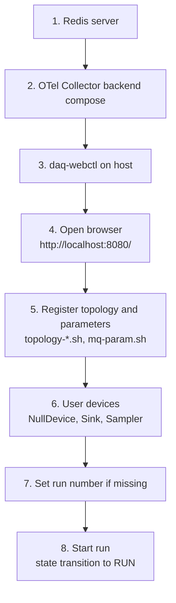
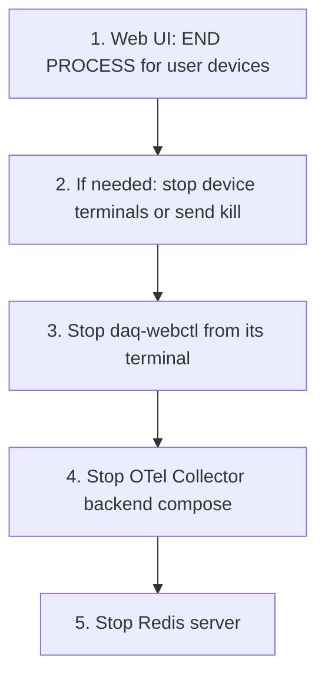

# Examples

This directory contains small NestDAQ device examples. The examples are a
standalone CMake project, and are also included in the main NestDAQ build when
`NestDAQ_BUILD_EXAMPLES=ON` is set. `NestDAQ_BUILD_EXAMPLES` defaults to `ON`.

## Example Devices

| Executable | Purpose |
| :-- | :-- |
| `NullDevice` | Minimal FairMQ device that exercises the NestDAQ `runDevice.h` entry point and lifecycle hooks without data channels. |
| `Sampler` | Sends text messages through an output channel and demonstrates custom command-line options, spans, and metrics. |
| `Sink` | Receives single-part or multipart messages through an input channel and demonstrates channel callback setup, spans, and metrics. |

Each executable links to `NestDAQ::NestDAQ`, which provides the NestDAQ
`runDevice.h` integration, FairMQ/FairLogger dependencies, plugin search paths,
and optional telemetry loader support.

`Sampler` and `Sink` use the NestDAQ telemetry facade to demonstrate trace spans
and metrics without including OpenTelemetry headers. Enable them at runtime with
the telemetry options, for example `--otel-metric-protocol=console` and
`--otel-trace-protocol=console`.

## Build

The main NestDAQ build builds and installs these examples by default. Configure
with `-DNestDAQ_BUILD_EXAMPLES=OFF` to skip them.

For a separate examples build, install NestDAQ first, then configure the
examples with the NestDAQ install prefix in `CMAKE_PREFIX_PATH`.

```sh
cmake \
  -DCMAKE_PREFIX_PATH=<nestdaq-install-prefix> \
  -DCMAKE_INSTALL_PREFIX=<examples-install-prefix> \
  -B ./build-examples \
  -S ./examples
cmake --build ./build-examples --parallel
cmake --install ./build-examples
```

The examples do not need to be installed into the same prefix as NestDAQ, but
the runtime linker must be able to find NestDAQ, FairMQ, Boost, and related
libraries. The example CMake project sets an install runtime search path
(rpath) relative to the
example install prefix and uses link paths discovered through `NestDAQ::NestDAQ`.

## Running

Use the installed helper scripts or invoke the binaries directly with FairMQ
channel options. A typical local validation run starts Redis, an OpenTelemetry
Collector backend, `daq-webctl`, and then the example devices.

```sh
Sampler --help
Sink --help
NullDevice --help
```

### Local Run Sequence

The commands below assume that NestDAQ was installed under
`<install-prefix>`. Run long-lived processes in separate terminals.



The diagram shows a typical local run sequence, not a strict dependency graph.
Start Redis and the OpenTelemetry Collector backend first, and perform the run
start operation last. Steps 5 and 6 may be reordered as long as they are done
after step 2 and before step 8. The browser can be opened as soon as
`daq-webctl` starts; devices may not appear until the topology and parameter
settings are registered and the user devices are running. Steps 7 and 8 are
browser-controller operations. Run-start commands require the target devices to
be running. `daq-webctl` and the user devices use Redis and export
OpenTelemetry logs to the collector.

1. Start Redis.

   Redis is required by the NestDAQ DAQ service, metrics, and parameter
   configuration plugins. If Redis Stack was built and installed with the
   external dependencies, start the installed Redis server with the Redis Stack
   modules:

   ```sh
   <install-prefix>/bin/redis-server \
     --loadmodule <install-prefix>/lib/redis/modules/redisbloom.so \
     --loadmodule <install-prefix>/lib/redis/modules/redisearch.so \
     --loadmodule <install-prefix>/lib/redis/modules/rejson.so \
     --loadmodule <install-prefix>/lib/redis/modules/redistimeseries.so
   ```

   Load only the modules required by your local setup. For example, omit a
   `--loadmodule` line if the corresponding Redis Stack module is not used by
   the plugins or checks you are running.

   The dependency install also provides Redis configuration examples under
   `<install-prefix>/etc/redis/`. `redis.conf` is the upstream base
   configuration, and `redis-full.conf` is generated with installed module
   paths. You can copy one of these files, edit the `loadmodule` lines to keep
   only the modules you need, adjust persistence settings, and start Redis with
   the config file:

   ```sh
   cp <install-prefix>/etc/redis/redis-full.conf ./redis-full.conf
   # Edit ./redis-full.conf if you want to load only a subset of modules.
   <install-prefix>/bin/redis-server ./redis-full.conf
   ```

   Redis writes RDB snapshots to `dump.rdb` by default. The snapshot directory
   and file name can be changed with the Redis `dir` and `dbfilename`
   configuration settings.

   The default Redis endpoint is `localhost:6379`.

   Redis Stack can also be run in a container. See
   [`share/redis-stack-container/README.md`](../share/redis-stack-container/README.md)
   for Docker, Podman, volume, and RedisInsight options. If you use the
   RedisInsight-enabled Redis Stack helper (`run-redis-stack.sh`), open
   RedisInsight at `http://localhost:8001`. The Redis Stack Server only helper
   (`run-redis-stack-server.sh`) does not include RedisInsight.

2. Start an OpenTelemetry Collector backend.

   This example uses the OpenSearch backend. It receives OpenTelemetry Protocol
   (OTLP) data from the example devices, stores logs and traces in OpenSearch,
   and makes them available in OpenSearch Dashboards.

   ```sh
   cp -a <install-prefix>/share/otel-collector-compose ./otel-collector-compose
   cd ./otel-collector-compose/opensearch
   docker compose -f compose-opensearch.yaml up
   ```

   For Podman, use the same file with `podman compose`. See
   [`share/otel-collector-compose/opensearch/README.md`](../share/otel-collector-compose/opensearch/README.md)
   for ports, rootless Podman notes, and dashboard setup details. The default
   OTLP gRPC endpoint is `localhost:4317`. Open OpenSearch Dashboards at
   `http://localhost:5601/app/discover` to inspect exported logs and traces.
   The setup service creates the initial logs and traces Data Views.

3. Start `daq-webctl`.

   ```sh
   <install-prefix>/bin/daq-webctl \
     --http-uri=http://0.0.0.0:8080 \
     --redis-uri=tcp://127.0.0.1:6379 \
     --otel-log-protocol=otlp-grpc \
     --otel-log-endpoint-grpc=localhost:4317 \
     --otel-log-severity=info \
     --otel-service-name=daq-webctl
   ```

   The OpenTelemetry options send controller logs to the local collector
   started above. See [`controller/README.md`](../controller/README.md) for
   controller options and Redis command behavior, and
   [`nestdaq/telemetry/README.md`](../nestdaq/telemetry/README.md) for the full
   telemetry option list.

   If `daq-webctl` runs as a container in the same OpenSearch or Victoria
   compose network, use `--otel-log-endpoint-grpc=otel-collector:4317`
   instead. In the same ClickStack compose network, use
   `--otel-log-endpoint-grpc=clickstack:4317`.

4. Open the browser controller.

   Open `http://localhost:8080/` in a browser. At this point the controller may
   not show user devices yet. They become available after topology and
   parameter registration and after the user device processes start.

5. Register topology and parameter settings.

   Before starting devices, register the topology and parameter examples in
   Redis. The topology script writes channel and link settings used by the
   `daq_service` plugin. The parameter script writes device parameters used by
   the `parameter_config` plugin.

   ```sh
   cd <install-prefix>/scripts
   ./topology-1-1.sh
   ./mq-param.sh
   ```

6. Start the user devices with `start_device.sh`.

   The installed script loads the NestDAQ plugins, uses Redis at
   `127.0.0.1:6379` by default, and exports OpenTelemetry logs to the local
   collector by OTLP gRPC. Metrics and traces are disabled by default in the
   script; see [`scripts/README.md`](../scripts/README.md) to enable them or to
   print telemetry to the console.

   `NullDevice` has no data channel, but it still uses the same script and
   Redis-backed NestDAQ plugins:

   ```sh
   <install-prefix>/scripts/start_device.sh NullDevice
   ```

   Start `Sink` and `Sampler` in separate terminals after registering the
   topology. Starting `Sink` first avoids dropping early messages while the
   receiver is not yet connected.

   ```sh
   <install-prefix>/scripts/start_device.sh Sink
   ```

   ```sh
   <install-prefix>/scripts/start_device.sh Sampler
   ```

7. Set the run number if it is missing.

   If Redis does not already contain `run_info:run_number`, set or increment the
   run number from the browser controller before starting a run. The controller
   reads and writes this value through Redis and uses it when publishing `RUN`.
   See [`controller/README.md`](../controller/README.md#redis-command-interface)
   and [`plugins/README.md`](../plugins/README.md#redis-keys-written-or-read)
   for the Redis command interface and run information keys.

8. Start the run from the browser controller.

   Use the browser controller to move the selected user devices through the
   required state-machine transitions and publish `RUN` to start the run. When
   `RUN` is requested, the controller copies `run_info:run_number` to
   `run_info:latest_run_number` and publishes the run-start command sequence.
   See [`plugins/README.md`](../plugins/README.md#daq-command-publishsubscribe-pubsub)
   for the accepted DAQ commands and `RUN` sequencing.

### Stop the Local Services

Use the browser controller to end the user device processes before stopping the
controller and shared services.



The diagram shows the recommended shutdown order. If the user devices have
already exited after `END PROCESS`, skip the terminal fallback step.

1. Select the target user devices in the browser controller and click
   `END PROCESS`. This publishes the DAQ `END` command to the selected devices.

2. If a user device does not exit, stop it from the terminal where it is
   running, for example with Ctrl-C. If a separate signal is needed, prefer a
   normal termination signal first:

   ```sh
   kill -TERM <pid>
   ```

   Use `kill -KILL <pid>` only as a last resort when the process does not
   respond to normal termination.

3. Stop `daq-webctl`. The `END PROCESS` button does not stop `daq-webctl`
   itself; it only publishes `END` to user devices. Stop `daq-webctl` from the
   terminal where it is running, for example with Ctrl-C. From another terminal,
   send SIGTERM if needed:

   ```sh
   kill -TERM <daq-webctl-pid>
   ```

   `daq-webctl` handles SIGINT and SIGTERM for clean HTTP/WebSocket server
   shutdown.

4. Stop the OpenTelemetry backend compose. For the OpenSearch backend compose
   example:

   ```sh
   cd ./otel-collector-compose/opensearch
   docker compose -f compose-opensearch.yaml down
   ```

   For Podman:

   ```sh
   cd ./otel-collector-compose/opensearch
   podman compose -f compose-opensearch.yaml down
   ```

   The compose `down` command stops and removes the local validation containers
   and network. It does not delete the OpenSearch data directory. If you start
   the same backend again with the same data directory, the previous OpenSearch
   data is reused. See the backend README for data directory names and explicit
   discard commands.

5. Stop Redis. For a locally installed Redis server:

   ```sh
   <install-prefix>/bin/redis-cli shutdown
   ```

   For container-based Redis Stack, use the stop procedure in
   [`share/redis-stack-container/README.md`](../share/redis-stack-container/README.md).

### Example-Specific Options

The examples also accept FairMQ options, NestDAQ plugin options, and NestDAQ
telemetry options. Use `--help` on each executable for the complete option set.

| Executable | Option | Default | Description |
| :-- | :-- | :-- | :-- |
| `Sampler` | `--out-chan-name` | `data` | Output channel name used by the producer. |
| `Sampler` | `--text` | `Hello` | Text payload prefix sent in each message. |
| `Sampler` | `--max-iterations` | `0` | Maximum number of run-loop iterations. `0` means infinite. |
| `Sink` | `--in-chan-name` | `in` | Input channel name used by the consumer. |
| `Sink` | `--multipart` | `true` | Handle incoming data as multipart messages. |

For script-based launch examples, see [`scripts/README.md`](../scripts/README.md).
