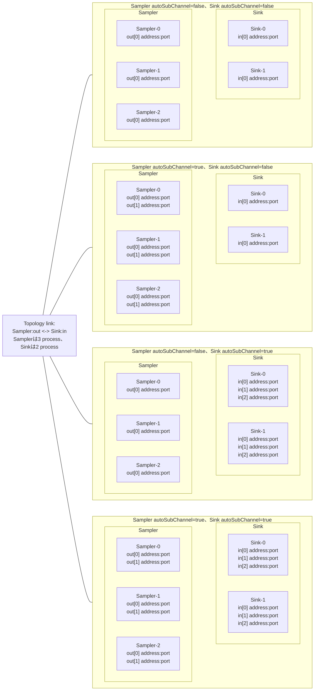
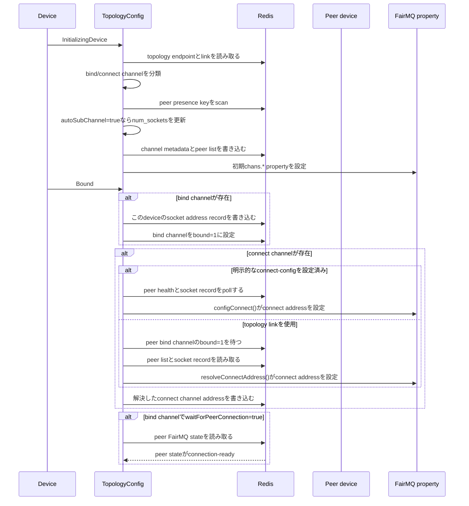
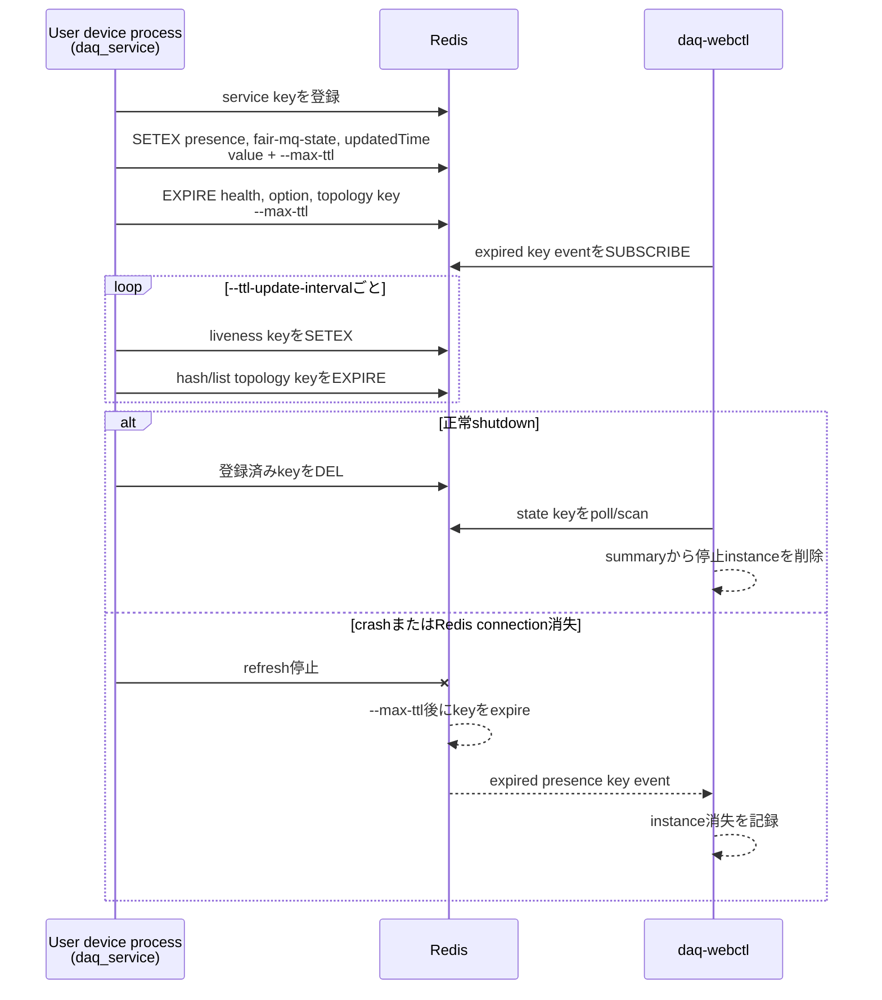

# NestDAQ FairMQプラグイン

[English](README.md) | [日本語](README.ja.md)

[トップ: NestDAQ](../README.ja.md) | [前へ: スクリプト](../scripts/README.ja.md) | [次へ: Web controller](../controller/README.ja.md)

NestDAQは3つのFairMQ pluginをshared libraryとしてinstallします。

| Plugin name | Library | 目的 |
| --- | --- | --- |
| `daq_service` | `libFairMQPlugin_daq_service.so` | FairMQ deviceをRedisへ登録し、health/stateおよびtopology/channel dataを書き込み、data acquisition (DAQ) commandを処理します。 |
| `metrics` | `libFairMQPlugin_metrics.so` | process metricsおよびFairMQ channel throughput metricsをRedisとRedisTimeSeriesへ書き込みます。 |
| `parameter_config` | `libFairMQPlugin_parameter_config.so` | Redisからparameterを読み取り、FairMQ program propertyへ反映します。 |

loadした各pluginは、想定する動作のためにRedis serverへの接続を必要とします。
RedisTimeSeriesが必要なのは、time-series keyを作成して更新する`metrics` pluginをloadする場合だけです。
`daq_service`と`parameter_config`はRedisのcore commandを使用し、RedisTimeSeriesを必要としません。

pluginをloadする正確なoptionは、FairMQとFairMQを使用するexecutableが定義します。
これらのlibraryを有効にするときは、上記のplugin nameを使用してください。

以下のkey patternでは、`{sep}`が設定されたseparatorを表します。
default separatorは`:`です。
その他のplaceholderは`{service}`、`{id}`、`{channel}`、`{subindex}`です。

<a id="1-time-to-live-ttl-behavior"></a>
## 1. Time To Live (TTL) の動作

TTLの扱いはpluginごとに異なります。

- `daq_service`はRedis keyのexpirationを管理します。
  deviceの生存中はregistry keyをrefreshし、deviceが予期せず終了した場合はexpirationをfallback cleanup mechanismとして使用します。
- `metrics`は通常、metric hashにRedis key TTLを設定しません。
  代わりに、`--metrics-max-ttl`はinstanceの最終metrics updateから、そのinstanceのfieldをmetric hashから削除するまでの時間を指定します。
  RedisTimeSeries retentionは`--retention`で別に制御します。
- `parameter_config`はparameter keyへTTLを設定しません。
  Redis keyを書き込むproducerまたはoperatorがparameterのlifetimeを制御します。

<a id="2-daq_service"></a>
## 2. daq_service

`daq_service`はRedis service registry pluginです。
device instanceの登録、TTLのrefresh、FairMQ state、health、topology、channel dataの書き込み、およびDAQ commandのsubscribeを行います。

<a id="21-command-line-options"></a>
### 2.1. コマンドラインオプション

この文書で説明するコマンドラインオプションは、すべて省略できます。
省略した場合、pluginは各表に示すデフォルト値を使用します。

| Option | デフォルト | 説明 |
| --- | --- | --- |
| `--service-name` | 空の場合はexecutable basename | Redis key pathおよびhealthの`serviceName` fieldで使用する、このNestDAQ device processのservice name。 |
| `--uuid` | 生成 | このNestDAQ device processのUUID。この値は、`--otel-service-instance-id`を設定しない限り、telemetryの`service.instance.id`のデフォルト値になります。`--uuid`を省略すると、標準FairMQ device wrapperは生成したtelemetry UUIDをこのpropertyへcopyします。このpropertyが存在しない場合、pluginがUUIDを生成します。 |
| `--host-ip` | 検出値/設定値 | healthの`hostIp` fieldへ保存する、このNestDAQ device processのaddress。名前解決可能なhostnameも指定できます。省略した場合、pluginは設定されたnetwork interfaceを使用し、取得できなければdefault routeのinterfaceを使用します。 |
| `--hostname` | 検出値/設定値 | healthの`hostName` fieldへ保存するhost name。省略した場合、pluginはoperating systemのhostnameを使用します。 |
| `--registry-uri` | `tcp://127.0.0.1:6379/0` | DAQ service registryのRedis uniform resource identifier (URI)。 |
| `--separator` | `:` | Redis keyを構成するときのseparator。 |
| `--max-ttl` | `5` | 一時registry keyのTTL (seconds)。 |
| `--ttl-update-interval` | `3` | TTL refresh interval (seconds)。 |
| `--startup-state` | `idle` | startup時にpluginがdeviceを`Idle`から自動的に進めるFairMQ state：`idle`、`initializing-device`、`initialized`、`bound`、`device-ready`、`ready`、`running`。 |
| `--enable-uds` | `true` | すべてのpeerの`hostIp`がこのprocessと同じZeroMQ bind channelだけにUnix domain socket (UDS) addressを追加します。`true`または`1`で有効になります。 |
| `--connect-config` | なし | 一時message queue (MQ) channel connection parameterを記述するJavaScript Object Notation (JSON) string。2.5.2節で構造とpeer記法を説明します。 |
| `--max-retry-to-resolve-address` | `10` | connect address解決の最大retry回数。 |

<a id="22-daq-service-identity-defaults"></a>
### 2.2. DAQサービス識別情報の既定値

`daq_service`は、Redis key path、healthの`serviceName` field、およびcontrollerの表示で、このNestDAQ device processのservice nameとして`--service-name`を使用します。
`--service-name`が未設定または空の場合、pluginはexecutable nameの最後のpath componentを使用します。

FairMQの`--id` optionが設定されている場合、その値をNestDAQ service instance idとして使用します。
`--id`が未設定または空の場合、`daq_service`は`daq_service{sep}service-instance-index{sep}{service}`で数値indexを割り当て、instance idを`Sampler-0`のような`{service-name}-{index}`に設定します。
`--uuid`値はinstance idとは別で、presence、health、index再利用においてこのprocessを識別します。
また、`--otel-service-instance-id`を明示的に設定しない限り、telemetryの`service.instance.id`のデフォルト値になります。
`--uuid`を省略すると、標準FairMQ device wrapperは生成したtelemetry UUIDを`uuid` propertyへcopyします。`uuid` propertyが存在しない場合、pluginが生成します。

<a id="23-redis-keys-written-or-read"></a>
### 2.3. `daq_service`が使用するRedis key

Health dataは、device identity、host情報、FairMQ state、およびlifecycle timestampを含むRedis hash dataです。
`TopologyConfig`はconnection resolutionに`hostIp` fieldを使用し、monitoring clientは他のfieldをdevice statusの表示に使用できます。

`Writer / reader`列は、NestDAQ device processへloadした`daq_service` pluginが行う操作を示します。
`daq-webctl`が行うRedis操作は、[`controller/README.ja.md`](../controller/README.ja.md#6-redis-command-interface)を参照してください。

`createdTime`、`updated_time`、`updatedTime`、`start_time`、`stop_time`は、local timeを秒精度の`YYYY-MM-DDTHH:MM:SS`形式で表したstringです。
timezone offsetは含みません。
`uptime`は`daq_service` pluginの生成後に経過したmillisecondsです。
`start_time_ns`と`stop_time_ns`は同じ起点からの経過nanosecondsであり、Unix epoch timestampではありません。

| Key pattern | Redis type | Field / value | Writer / reader | 目的 |
| --- | --- | --- | --- | --- |
| `daq_service{sep}{service}{sep}{id}{sep}presence` | string | TTL付きでrefreshされるUUID string | `daq_service`がwrite/read | device instanceのpresence marker。 |
| `daq_service{sep}{service}{sep}{id}{sep}health` | hash | `instanceID`, `uuid`, `hostName`, `hostIp`, `serviceName`, `fair:mq:state`, `createdTime`, `updated_time`, `uptime`。run timing記録時は`start_time`, `start_time_ns`, `stop_time`, `stop_time_ns`も含む | `daq_service`がwrite/read | device instanceのhealth/lifecycle metadata。 |
| `daq_service{sep}{service}{sep}{id}{sep}fair-mq-state` | string | FairMQ state name | `daq_service`がwrite/read、`daq-webctl`がread | TTL付きの現在のFairMQ state。 |
| `daq_service{sep}{service}{sep}{id}{sep}updatedTime` | string | 最終update timestamp | `daq_service`がwrite、`daq-webctl`がread | TTL付きの軽量な最終update key。 |
| `daq_service{sep}{service}{sep}{id}{sep}option` | hash | `severity`, `file-severity`, `verbosity`, `color`, `log-to-file`, `id`, `io-threads`, `transport`, `network-interface`, `init-timeout`、shared-memory option、`rate`, `session`などのFairMQ program option | `daq_service`がwrite | monitoring/debugging用の現在のoption値。 |
| `daq_service{sep}service-instance-index{sep}{service}` | hash | Field：数値instance index、value：UUID | `daq_service`がread/write | `--id`未指定時に`{service}-{index}` instance IDを割り当て、再利用。 |
| `run_info{sep}run_number` | string integer | 現在または次のrun number | `daq_service`がread、`daq-webctl`がread/write | run metadataへ記録するrun numberを取得。 |
| `daqctl` | pub/sub channel | JSON DAQ command message | `daq-webctl`または他のRedis clientがpublish、`daq_service`がsubscribe | DAQ state transition要求を受信。 |

<a id="24-daq-command-publishsubscribe-pubsub"></a>
### 2.4. DAQ commandのPublish/Subscribe (Pub/Sub)

Redis Pub/Subは各`daqctl` messageを、このchannelをsubscribeするすべてのuser device processへ配信します。
Redisはserviceやinstanceによってmessageをfilterしません。
完全修飾instance IDは、`service-name`、設定済みseparator、instance IDを連結した値です。
例えばdefault separatorでは、service name `Sampler`とinstance ID `Sampler-0`から`Sampler:Sampler-0`を生成します。
各deviceの`daq_service` pluginは、messageの`services`および`instances` arrayを、そのdeviceのservice nameおよび完全修飾instance IDと比較します。
これらのarrayがそのdevice instanceを選択していない場合、pluginはmessageを無視します。

`daqctl`へpublishするmessageの形式は次のとおりです。

```json
{
  "command": "change_state",
  "value": "RUN",
  "services": ["Sampler", "Sink"],
  "instances": ["Sampler:Sampler-0", "Sink:Sink-0"]
}
```

`services` arrayはservice nameを選択し、`instances` arrayはinstance idを選択します。
両arrayが存在して空でないことが必要であり、いずれも複数entryを含められます。
pluginはentryをsetとして保存するため、順序や重複はtarget matchingに影響しません。
`daq_service` pluginが現在`command` fieldで処理する値は、大文字と小文字を区別した文字列`"change_state"`だけです。
その他の`command`値を持つmessageは無視します。
`value` fieldには、pluginが扱う次のFairMQまたはNestDAQ command stringを指定できます。

```text
BIND, COMPLETE INIT, CONNECT, END, INIT DEVICE, INIT TASK, RESET DEVICE,
RESET TASK, RUN, STOP, exit, quit, reset, start
```

正しい形式のmessageであれば、`daq-webctl`を使用せず、他のRedis clientからも`daqctl`へpublishできます。
例えば次の`redis-cli` commandは、ローカルRedis serverを通して`Sampler-0` device instanceへ`RUN`をpublishします。

```sh
# RUN要求をdaqctl channelへ直接publishします。
redis-cli -u redis://127.0.0.1:6379 PUBLISH daqctl \
  '{"command":"change_state","value":"RUN","services":["Sampler"],"instances":["Sampler:Sampler-0"]}'
```

Redis Pub/Sub channelはRedis database番号で分離されません。
Redis endpoint、channel name、および設定済みseparatorは、操作対象の環境に合わせて変更してください。

target selectionは特殊な小文字の文字列`"all"`に対応します。

- `services: ["all"]`は`instances`に関係なく全deviceを対象にします。
- `services: ["Sampler"]`と`instances: ["all"]`は`Sampler` serviceの全instanceを対象にします。
- `services: ["Sampler"]`と`instances: ["Sampler:Sampler-0"]`は`Sampler-0` instanceだけを対象にします。
- その他のdeviceはmessageを無視します。

実装は大文字と小文字を変換せず、文字列`"all"`と比較します。
`"ALL"`や`"All"`ではなく、小文字の`"all"`を使用してください。

例：

```json
{
  "command": "change_state",
  "value": "STOP",
  "services": ["all"],
  "instances": ["all"]
}
```

```json
{
  "command": "change_state",
  "value": "RUN",
  "services": ["Sampler"],
  "instances": ["all"]
}
```

```json
{
  "command": "change_state",
  "value": "RUN",
  "services": ["Sampler"],
  "instances": ["Sampler:Sampler-0"]
}
```

複数serviceとその配下の全instanceを対象にします。

```json
{
  "command": "change_state",
  "value": "CONNECT",
  "services": ["Sampler", "Sink"],
  "instances": ["all"]
}
```

serviceをまたいで選択したinstanceを対象にします。

```json
{
  "command": "change_state",
  "value": "RUN",
  "services": ["Sampler", "Sink"],
  "instances": ["Sampler:Sampler-0", "Sampler:Sampler-1", "Sink:Sink-0"]
}
```

最後のmessageも全`daqctl` subscriberへ配信されます。
例えば`Sampler-2`と`Sink-1`もmessageを受信しますが、それぞれの完全修飾instance IDである`Sampler:Sampler-2`と`Sink:Sink-1`が`instances`にないため無視します。

<a id="25-topology-and-channel-keys"></a>
### 2.5. トポロジーおよびchannel key

各`daq_service` pluginの`TopologyConfig` objectはtopology定義を読み取り、そのdeviceのchannelおよびsocket metadataをRedisへ書き込みます。
bind側が最初にaddressを書き込み、connect側がそのaddressを読み取って自身のFairMQ socketを設定します。

| Key pattern | Redis type | Field / value | Writer / reader | 目的 |
| --- | --- | --- | --- | --- |
| `daq_service{sep}{service}{sep}{id}{sep}channel{sep}{channel}` | hash | `name`, `type`, `method`, `address`, `transport`、buffer/kernel size、`linger`, `rateLogging`、port range、`autoBind`, `num_sockets`, `autoSubChannel`, `bound`, `waitForPeerConnection` | `{service}`と`{id}`が示すdevice instanceの`TopologyConfig`がbind channelとconnect channelの両方をwrite。topology linkからaddressを解決する場合、connect側がpeerのbind channel metadataと`bound` fieldをread | 保存されたchannel endpoint metadata。 |
| `daq_service{sep}{service}{sep}{id}{sep}channel{sep}{channel}{sep}peer` | list | peer channel key string | 各deviceの`TopologyConfig`がwrite。topology linkからaddressを解決する場合、connect側が自身のchannelのpeer listおよび対応するpeer listをread | channelのpeer list。 |
| `daq_service{sep}{service}{sep}{id}{sep}socket{sep}chans.{channel}.{subindex}` | hash | そのdevice instanceのsubchannel/socket parameterと`num_sockets`, `autoSubChannel` | bind側の`TopologyConfig`がbind済みsocket addressをwrite。connect側がそのrecordをreadしてaddressを解決し、自身のsocket recordをwrite | subchannelごとのconnection metadata。 |
| `daq_service{sep}topology{sep}endpoint...` | hash | topology endpoint configuration | `scripts/topology-*.sh`または他のRedis clientがwrite。対象serviceの各deviceにある`TopologyConfig`がscan/read | bind channelおよびconnect channelを定義する外部topology configuration。 |
| `daq_service{sep}topology{sep}link...` | string | topology link configuration | `scripts/topology-*.sh`または他のRedis clientがwrite。link両側のdeviceにある`TopologyConfig`がscan/read | serviceとchannelを接続する外部topology configuration。 |

topology shell scriptは、deviceの起動前に`redis-cli`を通して`topology{sep}endpoint` keyおよび`topology{sep}link` keyを書き込みます。
repositoryが提供するscriptはRedis database `0`とseparator `:`を使用します。
異なる値を使用する環境では、scriptのRedis URIおよびkey生成処理を変更してください。
`scripts/mq-param.sh`はparameter configuration keyを書き込むscriptであり、これらのtopology keyは書き込みません。

<a id="251-autosubchannel"></a>
#### 2.5.1. `autoSubChannel`

FairMQでは、同じ名前のchannelを`std::vector<fair::mq::Channel>`として保持します。
各`fair::mq::Channel`は1つのFairMQ Socketを包み、vectorのindexがsubchannelを識別します。
deviceのC++コードでは、`Send()`または`Receive()`のindex引数で、そのchannelのsubchannelを選択します。
index引数を省略すると`0`を使用します。

topology endpointおよびlinkを使用する構成では、`autoSubChannel`は、Redisのpresence keyから検出したpeer device instanceに応じて`TopologyConfig`がそのdeviceのchannelへsubchannelを追加するかどうかを制御します。
defaultは`false`です。

- `autoSubChannel=false`はchannel設定にある固定のsubchannel数を維持します。
  1:1などの固定connectionに適します。
- `autoSubChannel=true`は、bind endpointとconnect endpointの両方で、検出したpeer device instanceから`num_sockets`を増やします。
  process動作中にpeerまたはsocket数を検出するn:m topologyに適します。

次の図は、process数が異なる2つのserviceをtopologyが接続するとき、各sideの`autoSubChannel`設定によってaddressを持つchannel socket数がどう変わるかを示します。
この図はsocketおよびsubchannel数の例であり、固定port numberの割り当てやmessage方向を示すものではありません。
非表示のlayout linkは`Sampler`を左、`Sink`を右に保つためのものであり、data pathではありません。



pluginは通常、topologyから`num_sockets`を計算します。
`autoSubChannel=true`のchannelでは、検出したpeer device instanceに応じて`num_sockets`が増え、各FairMQ sub-socketへ異なる`address:port`とsubchannel indexを設定できます。

<a id="252-connect-config"></a>
#### 2.5.2. `--connect-config`

`--connect-config`は、このoptionを受け取るdevice processのconnect channelおよび接続相手をJSON stringで直接定義します。
`TopologyConfig`は、このJSONの各最上位channelへ`method=connect`を設定します。
このoptionが空でない場合、`TopologyConfig`はtopology linkによるpeer解決の代わりに、このpeer参照からconnect addressを解決します。

次の例は、このoptionを受け取るdeviceに`in`というpull channelを定義し、`Sampler` serviceの`Sampler-0` instanceが持つbind channel `out`のsubchannel `0`へ接続します。

```json
{
  "in": {
    "type": "pull",
    "peer": "Sampler:Sampler-0:out[0]"
  }
}
```

最上位のkey `in`はこのoptionを受け取るdeviceへ設定するchannel name、`type`はそのFairMQ socket type、`peer`は接続相手のchannelを示します。
default separator `:`を使用する場合、完全修飾peer参照は`{service}:{instance-id}:{channel}[{subindex}]`形式です。
`[0]` suffixは接続相手のsubchannel `0`を選択します。
これは`TopologyConfig`が解釈するJSON dataであり、C++の構文やtopology shell scriptの`link` commandに記述する構文ではありません。
Redis key表の`{subindex}`はplaceholderですが、`[0]`はpeer参照に記述する実際のsuffixです。
`peer`には1つのstringまたはstring配列を指定できます。

`[0]`のようにsuffixを明示した場合は、`autoSubChannel`に関係なく、そのsubchannelだけを選択します。
suffixを省略して`autoSubChannel=false`を設定した場合、`TopologyConfig`はsubchannel `0`を選択します。
現在の実装では、suffixを省略して`autoSubChannel=true`を設定する経路が保存済みの`chans.{channel}.{subindex}` key patternと確実には一致しません。
明示的な`[N]` suffix、またはtopology endpoint/link設定を使用してください。

<a id="253-bindconnect-sequence"></a>
#### 2.5.3. bind/connectシーケンス

`TopologyConfig`はFairMQ state transition中にRedisを通じてbind endpointとconnect endpointを同期します。



bind channelは最初に自身のaddressをRedisへ書き込みます。
connect channelはpeer bind channelが`bound=1`になるのを待ち、Redisからpeer socket addressを解決して、結果をFairMQ `chans.*` propertyへ書き込みます。
`waitForPeerConnection=false`のbind channelは、最後のpeer-ready waitを省略します。
resetまたはcancellationはwait stepを中断します。

<a id="26-ttl-details-daq_service"></a>
### 2.6. TTLの詳細 (daq_service)

`daq_service`はseconds単位の`--max-ttl`を使用します。
defaultは`5` secondsです。
`--ttl-update-interval`はpluginがTTLをrefreshする頻度を制御し、default refresh intervalは`3` secondsです。

pluginは2つの方法でRedis keyをrefreshします。

- `presence`、`fair-mq-state`、`updatedTime`は`SETEX`で更新し、valueとTTLの両方をrefreshします。
- `health`、`option`、topology channel key、topology socket key、peer list keyは`EXPIRE`でrefreshします。



正常shutdownでは、pluginが登録済みkeyを削除します。
processがcrashするかRedis connectionを失うと、refresh停止後にTTL expirationが一時registry keyを削除します。

TTL expiration自体にRedis keyspace notificationは不要です。
ただし、`daq-webctl`が次のpolling cycleを待たずに消失instanceを検出するにはexpired key eventが必要です。
`metrics` pluginは`--metrics-max-ttl`をRedis key TTLとして使用しません。
metricsのupdateが停止したinstanceのfieldを削除するために使用します。
`parameter_config` pluginはparameter keyへTTLを設定しません。

<a id="3-metrics"></a>
## 3. metrics

`metrics`はprocess-level metricsとFairMQ channel throughput metricsをRedisへ記録します。
process central processing unit (CPU) usageはtop/htop形式で、1 CPU coreを完全に使用すると約`100`、2 coreを完全に使用すると約`200`です。
memory usageはmebibytes (MiB) 単位のcurrent resident set size (RSS) です。

<a id="31-command-line-options"></a>
### 3.1. コマンドラインオプション

| Option | デフォルト | 説明 |
| --- | --- | --- |
| `--proc-stat-update-interval` | `1000` | process CPU/memory metricsのupdate interval (milliseconds)。 |
| `--metrics-uri` | なし | metrics用Redis URI。空の場合は`--registry-uri`を使用。 |
| `--retention` | `0` | RedisTimeSeries retention (milliseconds)。`0`はtrimなし。 |
| `--recreate-ts` | `true` | `Running`へのtransition時にRedisTimeSeries keyを再作成。 |
| `--metrics-max-ttl` | `3000` | instanceの最終metrics updateからの最大経過時間 (milliseconds)。この時間を超えたinstanceのfieldをmetric hashから削除します。0以下の場合、この削除処理を無効にします。 |

<a id="32-redis-keys-written-or-read"></a>
### 3.2. 書き込みまたは読み取りを行うRedis key

| Key pattern | Redis type | Field / value | Writer / reader | 目的 |
| --- | --- | --- | --- | --- |
| `metrics{sep}created-time` | hash | Field：`{id}`、value：作成timestamp | Written | device作成時刻。 |
| `metrics{sep}hostname` | hash | Field：`{id}`、value：hostname | Written | host metadata。 |
| `metrics{sep}host-ip` | hash | Field：`{id}`、value：host IP address | Written | host metadata。 |
| `metrics{sep}state` | hash | Field：`{id}`、value：FairMQ state name | Written | string形式の現在state。 |
| `metrics{sep}state-id` | hash | Field：`{id}`、value：数値FairMQ state ID | Written | 数値形式の現在state。 |
| `metrics{sep}last-update` | hash | Field：`{id}`、value：timestamp | Written | 最終metrics update時刻。 |
| `metrics{sep}last-update-ns` | hash | Field：`{id}`、value：nanoseconds単位timestamp | Written/read | stale metric fieldの識別。 |
| `metrics{sep}cpu-stat` | hash | Field：`{id}`、value：CPU percent | Written | process CPU usage。 |
| `metrics{sep}ram-stat` | hash | Field：`{id}`、value：current RSS MiB | Written | process memory usage。 |
| `metrics{sep}msg-in`, `metrics{sep}msg-out` | hash | Field：`{id}{sep}{channel}[{subindex}]`、value：messages/second | Written | 現在のchannel message rate。 |
| `metrics{sep}mb-in`, `metrics{sep}mb-out` | hash | Field：`{id}{sep}{channel}[{subindex}]`、value：MiB/second | Written | 現在のchannel throughput。 |
| `metrics{sep}msg-in-sum`, `metrics{sep}msg-out-sum` | hash | Field：`{id}{sep}{channel}[{subindex}]`、value：累積rounded message count | Written | 累積message count。 |
| `metrics{sep}mb-in-sum`, `metrics{sep}mb-out-sum` | hash | Field：`{id}{sep}{channel}[{subindex}]`、value：累積MiB | Written | 累積throughput。 |
| `metrics{sep}num-msg`, `metrics{sep}mb` | hash | Field：`{id}{sep}{channel}[{subindex}].in` または `.out`、value：current rate | Written | 方向付きcurrent rate。 |
| `metrics{sep}num-msg-sum`, `metrics{sep}mb-sum` | hash | Field：`{id}{sep}{channel}[{subindex}].in` または `.out`、value：累積値 | Written | 方向付き累積値。 |
| `ts{sep}{id}{sep}cpu-stat`, `ts{sep}{id}{sep}ram-stat`, `ts{sep}{id}{sep}state-id` | RedisTimeSeries | `TS.ADD`で追加するsample。labelは`service`, `id`, data type | Written | process/state time series。 |
| `ts{sep}{id}{sep}{channel}[{subindex}]{sep}...` | RedisTimeSeries | `name`, `socket`, `transport`などのlabelを持つchannel rate/累積sample | Written | channel time series。 |

pluginはFairMQのFairLogger throughput lineをlistenし、次のようなrecordをparseします。

```text
data[0]: in: 123 (4.5 MB) out: 67 (8.9 MB)
```

channel throughput metricsにはindex付きsubchannel recordだけを使用します。

<a id="33-ttl-and-retention-details-metrics"></a>
### 3.3. TTLと保持期間の詳細 (metrics)

`--metrics-max-ttl`はRedis key TTLではありません。
`metrics{sep}last-update-ns`に記録されたinstanceの時刻について、許容する最大経過時間をmilliseconds単位で指定します。
pluginは、この時間を超えたinstanceのfieldを登録済みmetric hashから`HDEL`で削除します。
`--metrics-max-ttl`が0以下なら、このcleanupは無効です。

`--retention`はpluginが作成するRedisTimeSeries keyだけに適用します。
この値はmilliseconds単位で`TS.CREATE ... RETENTION`へ渡されます。
`0`の場合、RedisTimeSeries sampleはretention timeによってtrimされません。

<a id="4-parameter_config"></a>
## 4. parameter_config

`parameter_config`はRedis parameter keyを読み取り、値をFairMQ program propertyへ反映します。
両方が存在する場合、instance固有parameterはgroup parameterをoverrideします。

<a id="41-command-line-options"></a>
### 4.1. コマンドラインオプション

| Option | デフォルト | 説明 |
| --- | --- | --- |
| `--parameter-config-uri` | なし | parameter configuration用Redis URI。空の場合は`--registry-uri`を使用。 |

<a id="42-redis-keys-read-or-subscribed"></a>
### 4.2. 読み取りまたは購読するRedis key

| Key pattern | Redis type | Field / value | Writer / reader | 目的 |
| --- | --- | --- | --- | --- |
| `parameters{sep}{id}` | hash | Field：option name、value：option value string | Read | instance固有parameter set。 |
| `parameters{sep}{group}` | hash | Field：option name、value：option value string | Read | group default parameter set。`{group}`は`{id}`末尾の数値`-N` suffixを除いて生成。 |
| `parameters{sep}{id}{sep}*` | string/list/hash/set/zset | instance key配下の追加structured parameter | Read/scanned | instanceごとのstructured parameter value。 |
| `parameters{sep}{group}{sep}*` | string/list/hash/set/zset | group key配下の追加structured parameter | Read/scanned | group-level structured parameter value。 |
| `__keyspace@{db}__:{key}` | pub/sub channel | Redis keyspace notification event | Subscribed | instance/group parameter keyのlive reloadをtrigger。 |

string keyは最後のpath componentをoption nameとして使用します。
hash valueはmap-like property、list valueはarray-like property、set valueはset、sorted-set valueはmemberからscoreへのmapになります。

live reloadには、Redis serverでkeyspace notificationを有効にする必要があります。
初期parameter loadにはkeyspace notificationは不要です。

<a id="43-ttl-details-parameter_config"></a>
### 4.3. TTLの詳細 (parameter_config)

`parameter_config`はparameter keyに対して`EXPIRE`、`SETEX`、`DEL`を呼びません。
parameter keyを読み、live reload用にkeyspace notificationをsubscribeします。
parameter keyをexpireさせる場合は、そのkeyのwriterがTTLを設定する必要があります。
