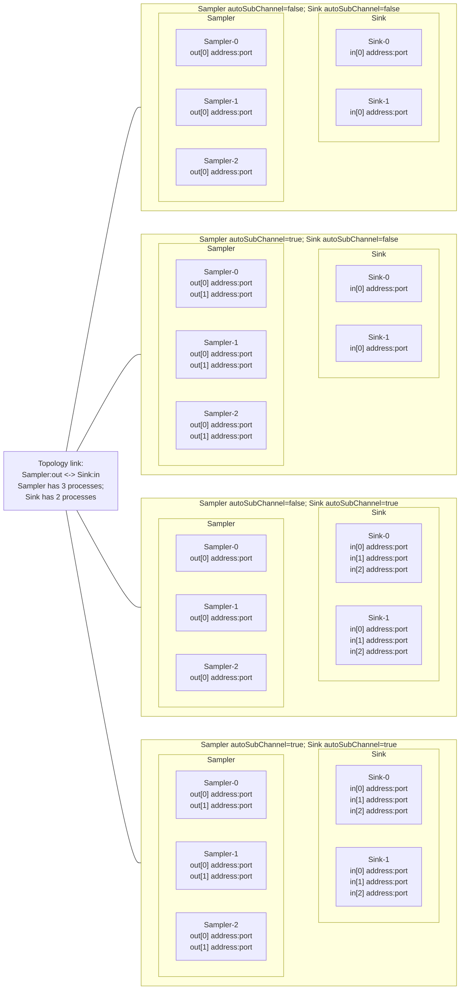
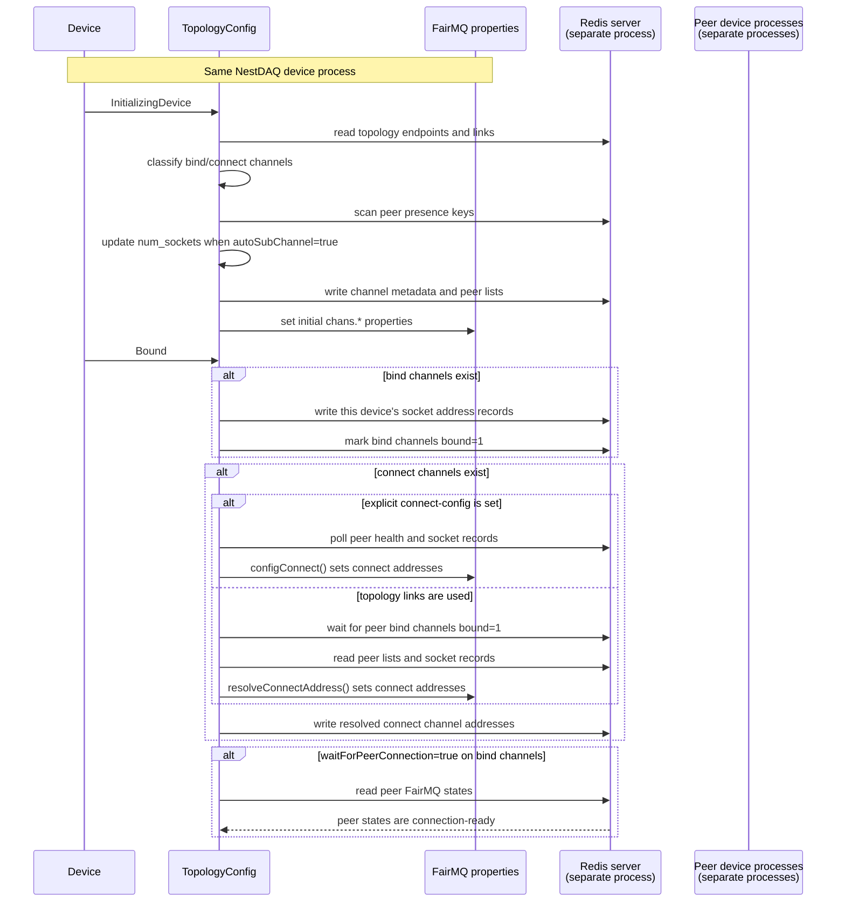
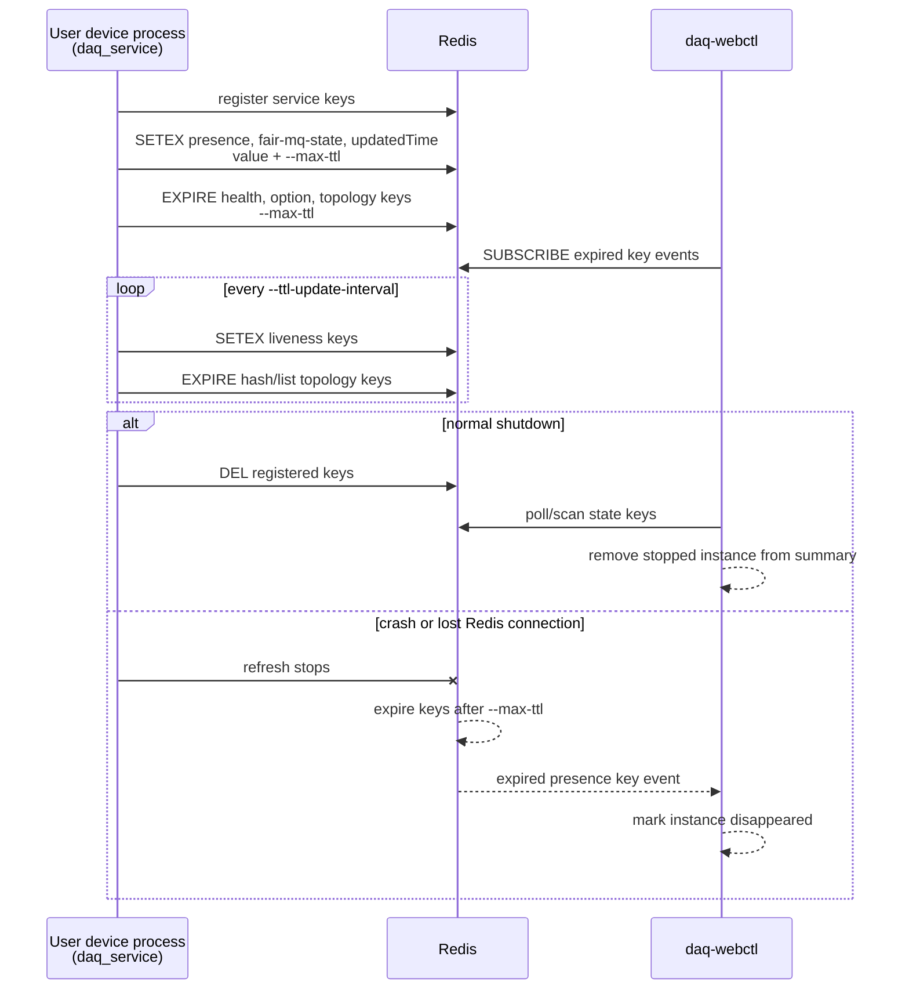

# NestDAQ FairMQ Plugins

[English](README.md) | [日本語](README.ja.md)

[Top: NestDAQ](../README.md) | [Previous: Scripts](../scripts/README.md) | [Next: Web controller](../controller/README.md)

NestDAQ installs three FairMQ plugins as shared libraries:

| Plugin name        | Library                               | Purpose |
|--------------------|----------------------------------------|---------|
| `daq_service`      | `libFairMQPlugin_daq_service.so`       | Registers the FairMQ device in Redis, writes health/state and topology/channel data, and handles data acquisition (DAQ) commands. |
| `metrics`          | `libFairMQPlugin_metrics.so`           | Writes process metrics and FairMQ channel throughput metrics to Redis and RedisTimeSeries. |
| `parameter_config` | `libFairMQPlugin_parameter_config.so`  | Reads parameters from Redis and mirrors them into FairMQ program properties. |

Each loaded plugin requires access to a Redis server for its intended operation.
RedisTimeSeries is required only when the `metrics` plugin is loaded because that plugin creates and updates time-series keys.
The `daq_service` and `parameter_config` plugins use core Redis commands and do not require RedisTimeSeries.

FairMQ and the executable that uses it define the exact option for loading plugins.
Use the plugin names above when enabling these libraries.

In the key patterns below, `{sep}` represents the configured separator.
The default separator is `:`.
The other placeholders are `{service}`, `{id}`, `{channel}`, and `{subindex}`.

## 1. Time To Live (TTL) Behavior

TTL handling is different for each plugin:

- `daq_service` manages Redis key expiration.
  It refreshes registry keys while the device is alive and uses expiration as a fallback cleanup mechanism when a device terminates unexpectedly.
- `metrics` does not generally set Redis key TTLs for metric hashes.
  Instead, `--metrics-max-ttl` specifies how long fields may remain after an instance's last metrics update before the plugin removes them from the metric hashes.
  `--retention` controls RedisTimeSeries retention separately.
- `parameter_config` does not set TTLs on parameter keys.
  The producer or operator that writes those Redis keys controls their lifetime.

## 2. daq_service

`daq_service` is a Redis service-registry plugin.
It registers a device instance, refreshes TTLs, writes FairMQ state, health, topology, and channel data, and subscribes to DAQ commands.

<a id="21-runtime-options"></a>
### 2.1. Command-Line Options

All command-line options in this document are optional.
When an option is omitted, the plugin uses the default shown in its table.

| Option                           | Default                    | Description |
|----------------------------------|----------------------------|-------------|
| `--service-name`                 | executable basename when empty | Service name of this NestDAQ device process, used in Redis key paths and the health `serviceName` field. |
| `--uuid`                         | generated                  | UUID of this NestDAQ device process. This value supplies the default telemetry `service.instance.id` unless `--otel-service-instance-id` is set. When `--uuid` is omitted, the standard FairMQ device wrapper copies its generated telemetry UUID to this property; if the property is absent, the plugin generates a UUID. |
| `--host-ip`                      | detected/configured value  | Address of this NestDAQ device process, stored in the health `hostIp` field. A resolvable hostname is accepted. If omitted, the plugin uses the configured network interface or the default-route interface. |
| `--hostname`                     | detected/configured value  | Host name stored in the health `hostName` field. If omitted, the plugin uses the operating system hostname. |
| `--registry-uri`                 | `tcp://127.0.0.1:6379/0`   | Redis uniform resource identifier (URI) for the DAQ service registry. |
| `--separator`                    | `:`                        | Separator used when composing Redis keys. |
| `--max-ttl`                      | `5`                        | TTL in seconds for transient registry keys. |
| `--ttl-update-interval`          | `3`                        | TTL refresh interval in seconds. |
| `--startup-state`                | `idle`                     | FairMQ state to which the plugin automatically advances the device from `Idle` during startup: `idle`, `initializing-device`, `initialized`, `bound`, `device-ready`, `ready`, or `running`. |
| `--enable-uds`                   | `true`                     | Adds Unix domain socket (UDS) addresses only to ZeroMQ bind channels whose peers all have the same `hostIp` as this process. `true` and `1` enable it. |
| `--connect-config`               | none                       | JavaScript Object Notation (JSON) string describing temporary message queue (MQ) channel connection parameters. Section 2.5.2 describes its structure and peer syntax. |
| `--max-retry-to-resolve-address` | `10`                       | Maximum retry count for resolving connect addresses. |

### 2.2. DAQ Service Identity Defaults

`daq_service` uses `--service-name` as this NestDAQ device process's service name in Redis key paths, the health `serviceName` field, and controller displays.
When `--service-name` is not set or is empty, the plugin uses the final path component of the executable name.

When set, the FairMQ `--id` option supplies the NestDAQ service instance id.
When `--id` is not set or is empty, `daq_service` allocates a numeric index in `daq_service{sep}service-instance-index{sep}{service}` and sets the instance id to `{service-name}-{index}`, such as `Sampler-0`.
The `--uuid` value is separate from the instance id and identifies the process for presence, health, and index reuse.
It also supplies the default telemetry `service.instance.id` unless `--otel-service-instance-id` is set explicitly.
When `--uuid` is omitted, the standard FairMQ device wrapper copies its generated telemetry UUID to the `uuid` property; if no `uuid` property exists, the plugin generates one.

<a id="23-redis-keys-written-or-read"></a>
### 2.3. Redis Keys Used by `daq_service`

Health data is a Redis hash containing device identity, host details, FairMQ state, and lifecycle timestamps.
`TopologyConfig` uses its `hostIp` field for connection resolution, and monitoring clients can read the other fields to report device status.

The `Writer / reader` column describes the operations performed by the `daq_service` plugin loaded in a NestDAQ device process.
Redis operations performed by `daq-webctl` are documented in [`controller/README.md`](../controller/README.md#6-redis-command-interface).

`createdTime`, `updated_time`, `updatedTime`, `start_time`, and `stop_time` are local-time strings in `YYYY-MM-DDTHH:MM:SS` format, with second precision and no time-zone offset.
`uptime` is the number of elapsed milliseconds since the `daq_service` plugin was created.
`start_time_ns` and `stop_time_ns` are elapsed nanoseconds from the same starting point, not Unix epoch timestamps.

| Key pattern | Redis type | Fields / value | Writer / reader | Purpose |
|-------------|------------|----------------|-----------------|---------|
| `daq_service{sep}{service}{sep}{id}{sep}presence` | string | UUID string, refreshed with TTL | Written/read by `daq_service` | Presence marker for one device instance. |
| `daq_service{sep}{service}{sep}{id}{sep}health` | hash | `instanceID`, `uuid`, `hostName`, `hostIp`, `serviceName`, `fair:mq:state`, `createdTime`, `updated_time`, `uptime`; also `start_time`, `start_time_ns`, `stop_time`, `stop_time_ns` when run timing is recorded | Written/read by `daq_service` | Health and lifecycle metadata for one device instance. |
| `daq_service{sep}{service}{sep}{id}{sep}fair-mq-state` | string | FairMQ state name | Written/read by `daq_service`; read by `daq-webctl` | Current FairMQ state with TTL. |
| `daq_service{sep}{service}{sep}{id}{sep}updatedTime` | string | Last update timestamp | Written by `daq_service`; read by `daq-webctl` | Lightweight last-update key with TTL. |
| `daq_service{sep}{service}{sep}{id}{sep}option` | hash | Selected FairMQ program options such as `severity`, `file-severity`, `verbosity`, `color`, `log-to-file`, `id`, `io-threads`, `transport`, `network-interface`, `init-timeout`, shared-memory options, `rate`, and `session` | Written by `daq_service` | Current option values for monitoring and debugging. |
| `daq_service{sep}service-instance-index{sep}{service}` | hash | Field: numeric instance index; value: UUID | Read/write by `daq_service` | Allocates and reuses `{service}-{index}` instance IDs when `--id` is not given. |
| `run_info{sep}run_number` | string integer | Current or next run number | Read by `daq_service`; read/written by `daq-webctl` | Supplies the run number stored in run metadata. |
| `daqctl` | pub/sub channel | JSON DAQ command messages | Published by `daq-webctl` or another Redis client; subscribed by `daq_service` | Receives DAQ state-transition requests. |

### 2.4. DAQ Command Publish/Subscribe (Pub/Sub)

Redis Pub/Sub delivers each `daqctl` message to every user device process subscribed to the channel.
Redis does not filter messages by service or instance.
The fully qualified instance ID joins the `service-name`, configured separator, and instance ID.
For example, the default separator produces `Sampler:Sampler-0` from the service name `Sampler` and instance ID `Sampler-0`.
Each subscribing device's `daq_service` plugin compares the message's `services` and `instances` arrays with that device's service name and fully qualified instance ID.
The plugin ignores the message when those arrays do not select that device instance.

Messages published to `daqctl` have this shape:

```json
{
  "command": "change_state",
  "value": "RUN",
  "services": ["Sampler", "Sink"],
  "instances": ["Sampler:Sampler-0", "Sink:Sink-0"]
}
```

The `services` array selects service names, and the `instances` array selects instance ids.
Both arrays must be present and non-empty, and each can contain multiple entries.
The plugin stores the entries as sets, so their order and duplicates do not affect target matching.
The `daq_service` plugin currently handles only the exact, case-sensitive value `"change_state"` in the `command` field.
It ignores messages with any other `command` value.
The `value` field accepts one of the following FairMQ or NestDAQ command strings handled by the plugin:

```text
BIND, COMPLETE INIT, CONNECT, END, INIT DEVICE, INIT TASK, RESET DEVICE,
RESET TASK, RUN, STOP, exit, quit, reset, start
```

Any Redis client can publish a correctly formed message to `daqctl`; using `daq-webctl` is not required.
For example, the following `redis-cli` command publishes `RUN` to the `Sampler-0` device instance through a local Redis server:

```sh
# Publish a RUN request directly to the daqctl channel.
redis-cli -u redis://127.0.0.1:6379 PUBLISH daqctl \
  '{"command":"change_state","value":"RUN","services":["Sampler"],"instances":["Sampler:Sampler-0"]}'
```

Redis Pub/Sub channels are not scoped by Redis database number.
Adjust the Redis endpoint, channel name, and configured separator for the target environment.

Target selection supports the special lowercase string `"all"`:

- `services: ["all"]` targets every device, regardless of `instances`.
- `services: ["Sampler"]` with `instances: ["all"]` targets every instance of
  the `Sampler` service.
- `services: ["Sampler"]` with `instances: ["Sampler:Sampler-0"]` targets only
  the `Sampler-0` instance.
- Other devices ignore the message.

The implementation compares the literal string `"all"` without case conversion.
Use lowercase `"all"`, not `"ALL"` or `"All"`.

Examples:

```json
{
  "command": "change_state",
  "value": "STOP",
  "services": ["all"],
  "instances": ["all"]
}
```

```json
{
  "command": "change_state",
  "value": "RUN",
  "services": ["Sampler"],
  "instances": ["all"]
}
```

```json
{
  "command": "change_state",
  "value": "RUN",
  "services": ["Sampler"],
  "instances": ["Sampler:Sampler-0"]
}
```

Target multiple services and every instance under those services:

```json
{
  "command": "change_state",
  "value": "CONNECT",
  "services": ["Sampler", "Sink"],
  "instances": ["all"]
}
```

Target selected instances across services:

```json
{
  "command": "change_state",
  "value": "RUN",
  "services": ["Sampler", "Sink"],
  "instances": ["Sampler:Sampler-0", "Sampler:Sampler-1", "Sink:Sink-0"]
}
```

The last message is still delivered to every `daqctl` subscriber.
For example, `Sampler-2` and `Sink-1` receive the message but ignore it because their fully qualified instance IDs, `Sampler:Sampler-2` and `Sink:Sink-1`, are not listed in `instances`.

### 2.5. Topology and Channel Keys

The `TopologyConfig` object in each `daq_service` plugin reads the topology definition and publishes metadata for that device's channels and sockets.
The bind side publishes addresses first, and the connect side reads those addresses to configure its FairMQ sockets.

| Key pattern | Redis type | Fields / value | Writer / reader | Purpose |
|-------------|------------|----------------|-----------------|---------|
| `daq_service{sep}{service}{sep}{id}{sep}channel{sep}{channel}` | hash | `name`, `type`, `method`, `address`, `transport`, buffer sizes, kernel sizes, `linger`, `rateLogging`, port range, `autoBind`, `num_sockets`, `autoSubChannel`, `bound`, `waitForPeerConnection` | Written by the `TopologyConfig` of the device instance identified by `{service}` and `{id}` for both bind and connect channels. During topology-link resolution, the connect side reads peer bind-channel metadata and its `bound` field. | Stored channel endpoint metadata. |
| `daq_service{sep}{service}{sep}{id}{sep}channel{sep}{channel}{sep}peer` | list | Peer channel key strings | Written by each device's `TopologyConfig`. During topology-link resolution, the connect side reads its own channel's peer list and the corresponding peer lists. | Peer list for the channel. |
| `daq_service{sep}{service}{sep}{id}{sep}socket{sep}chans.{channel}.{subindex}` | hash | Subchannel/socket parameters for the device instance plus `num_sockets` and `autoSubChannel` | The bind side's `TopologyConfig` writes bound socket addresses. The connect side reads those records, resolves its addresses, and writes its own socket records. | Per-subchannel connection metadata. |
| `daq_service{sep}topology{sep}endpoint...` | hash | Topology endpoint configuration | Written by `scripts/topology-*.sh` or another Redis client. Scanned and read by `TopologyConfig` in each device of the matching service. | External topology configuration used to define bind and connect channels. |
| `daq_service{sep}topology{sep}link...` | string | Topology link configuration | Written by `scripts/topology-*.sh` or another Redis client. Scanned and read by `TopologyConfig` in devices on both sides of the link. | External topology configuration used to link services and channels. |

The topology shell scripts write the `topology{sep}endpoint` and `topology{sep}link` keys through `redis-cli` before the devices start.
The supplied scripts use Redis database `0` and the `:` separator; edit their Redis URI and key construction when the deployment uses different values.
`scripts/mq-param.sh` writes parameter-configuration keys instead and does not write these topology keys.

#### 2.5.1. `autoSubChannel`

FairMQ stores each named channel as a `std::vector<fair::mq::Channel>`.
Each `fair::mq::Channel` wraps one FairMQ Socket, and the vector index identifies
a subchannel.
Device code selects one of the channel's subchannels with the index argument of `Send()` or
`Receive()`; omitting that argument selects index `0`.

For topology endpoint and link configuration, `autoSubChannel` controls whether `TopologyConfig` creates additional subchannels for that device's channel from peer device instances discovered through Redis presence keys.
Its default is `false`.

- `autoSubChannel=false` keeps the fixed subchannel count from the channel configuration.
  This setting is suitable for 1:1 or other fixed connections.
- `autoSubChannel=true` increases `num_sockets` from the discovered peer device instances on both bind and connect endpoints.
  This setting is suitable for n:m topologies in which the process discovers the number of peers or sockets while running.

The following diagram shows how each side's `autoSubChannel` setting changes the number of address-bearing channel sockets when a topology connects two services with different process counts.
The diagram illustrates socket and subchannel counts, not fixed port assignments or message direction.
Invisible layout links keep `Sampler` on the left and `Sink` on the right; they are not data paths.



The plugin normally calculates `num_sockets` from the topology.
For channels with `autoSubChannel=true`, `num_sockets` grows with the discovered peer device instances so that each FairMQ sub-socket can receive a distinct `address:port` and subchannel index.

#### 2.5.2. `--connect-config`

`--connect-config` defines connect channels on the device process and their peers directly in a JSON string.
`TopologyConfig` sets `method=connect` for every top-level channel in this JSON.
When this option is not empty, `TopologyConfig` resolves connect addresses from these peer references instead of using topology-link peer resolution.

The following example defines a pull channel named `in` on the device receiving the option and connects it to subchannel `0` of the bind channel `out` owned by the `Sampler-0` instance of the `Sampler` service:

```json
{
  "in": {
    "type": "pull",
    "peer": "Sampler:Sampler-0:out[0]"
  }
}
```

The top-level key `in` names the channel configured on the device receiving the option, `type` is its FairMQ socket type, and `peer` identifies the remote channel.
With the default separator `:`, a fully qualified peer reference has the form `{service}:{instance-id}:{channel}[{subindex}]`.
The `[0]` suffix selects remote subchannel `0`; it is JSON data parsed by `TopologyConfig`, not C++ syntax or syntax used by a topology shell script's `link` command.
The `{subindex}` text in the Redis key table is a placeholder, whereas `[0]` is an actual suffix in the peer reference.
`peer` accepts either one string or an array of strings.

An explicit suffix such as `[0]` selects only that subchannel regardless of `autoSubChannel`.
If the suffix is omitted and `autoSubChannel=false`, `TopologyConfig` selects subchannel `0`.
The current unindexed `autoSubChannel=true` path does not match the stored `chans.{channel}.{subindex}` key pattern reliably; use explicit `[N]` suffixes or topology endpoint/link configuration instead.

#### 2.5.3. Bind/Connect Sequence

`TopologyConfig` synchronizes bind and connect endpoints through Redis during FairMQ state transitions.
`Device`, `TopologyConfig`, and `FairMQ properties` in the following diagram belong to the same NestDAQ device process.
The Redis server and each peer device run in separate processes.



Bind channels write their own addresses to Redis first.
Connect channels wait for the peer bind channel to become `bound=1`, resolve the peer socket addresses from Redis, and write the resulting FairMQ `chans.*` properties.
A bind channel with `waitForPeerConnection=false` skips the final wait for the peer to become ready.
A reset or cancellation interrupts these waiting steps.

### 2.6. TTL Details (daq_service)

`daq_service` uses `--max-ttl` in seconds.
The default is `5` seconds.
`--ttl-update-interval` controls how often the plugin refreshes TTLs, with a default interval of `3` seconds.

The plugin refreshes Redis keys in two ways:

- `presence`, `fair-mq-state`, and `updatedTime` are updated with `SETEX`, which refreshes both the value and the TTL.
- `health`, `option`, topology channel keys, topology socket keys, and peer list keys are refreshed with `EXPIRE`.



On normal shutdown, the plugin deletes its registered keys.
If the process crashes or loses its Redis connection, TTL expiration removes transient registry keys after the refreshes stop.

Redis keyspace notifications are not required for TTL expiration itself.
However, `daq-webctl` needs expired-key events to detect disappeared instances without waiting for its next polling cycle.
The `metrics` plugin uses `--metrics-max-ttl` to remove fields for instances that have stopped updating their metrics, not as a Redis key TTL.
The `parameter_config` plugin does not set TTLs on parameter keys.

## 3. metrics

`metrics` records process-level metrics and FairMQ channel throughput metrics in Redis.
Process central processing unit (CPU) usage follows the top/htop convention: one fully used CPU core is approximately `100`, and two fully used cores are approximately `200`.
Memory usage is the current resident set size (RSS) in mebibytes (MiB).

<a id="31-runtime-options"></a>
### 3.1. Command-Line Options

| Option                        | Default | Description |
|-------------------------------|---------|-------------|
| `--proc-stat-update-interval` | `1000`  | Update interval in milliseconds for process CPU and memory metrics. |
| `--metrics-uri`               | none    | Redis URI for metrics. If empty, `--registry-uri` is used. |
| `--retention`                 | `0`     | RedisTimeSeries retention in milliseconds. `0` means no trimming. |
| `--recreate-ts`               | `true`  | Recreate RedisTimeSeries keys on transition to `Running`. |
| `--metrics-max-ttl`           | `3000`  | Maximum age in milliseconds since an instance's last metrics update. The plugin removes older instance fields from metric hashes. A value of zero or less disables this cleanup. |

### 3.2. Redis Keys Written or Read

| Key pattern | Redis type | Fields / value | Writer / reader | Purpose |
|-------------|------------|----------------|-----------------|---------|
| `metrics{sep}created-time` | hash | Field: `{id}`; value: creation timestamp | Written | Device creation time. |
| `metrics{sep}hostname` | hash | Field: `{id}`; value: hostname | Written | Host metadata. |
| `metrics{sep}host-ip` | hash | Field: `{id}`; value: host IP address | Written | Host metadata. |
| `metrics{sep}state` | hash | Field: `{id}`; value: FairMQ state name | Written | Current state as a string. |
| `metrics{sep}state-id` | hash | Field: `{id}`; value: numeric FairMQ state ID | Written | Current state as a numeric value. |
| `metrics{sep}last-update` | hash | Field: `{id}`; value: timestamp | Written | Last metrics update time. |
| `metrics{sep}last-update-ns` | hash | Field: `{id}`; value: timestamp in nanoseconds | Written/read | Used to identify stale metric fields. |
| `metrics{sep}cpu-stat` | hash | Field: `{id}`; value: CPU percent | Written | Process CPU usage. |
| `metrics{sep}ram-stat` | hash | Field: `{id}`; value: current RSS MiB | Written | Process memory usage. |
| `metrics{sep}msg-in`, `metrics{sep}msg-out` | hash | Field: `{id}{sep}{channel}[{subindex}]`; value: messages per second | Written | Current channel message rate. |
| `metrics{sep}mb-in`, `metrics{sep}mb-out` | hash | Field: `{id}{sep}{channel}[{subindex}]`; value: MiB per second | Written | Current channel throughput. |
| `metrics{sep}msg-in-sum`, `metrics{sep}msg-out-sum` | hash | Field: `{id}{sep}{channel}[{subindex}]`; value: cumulative rounded message count | Written | Accumulated message counts. |
| `metrics{sep}mb-in-sum`, `metrics{sep}mb-out-sum` | hash | Field: `{id}{sep}{channel}[{subindex}]`; value: cumulative MiB | Written | Accumulated throughput. |
| `metrics{sep}num-msg`, `metrics{sep}mb` | hash | Field: `{id}{sep}{channel}[{subindex}].in` or `.out`; value: current rate | Written | Direction-qualified current rates. |
| `metrics{sep}num-msg-sum`, `metrics{sep}mb-sum` | hash | Field: `{id}{sep}{channel}[{subindex}].in` or `.out`; value: cumulative value | Written | Direction-qualified cumulative values. |
| `ts{sep}{id}{sep}cpu-stat`, `ts{sep}{id}{sep}ram-stat`, `ts{sep}{id}{sep}state-id` | RedisTimeSeries | Samples added with `TS.ADD`; labels include `service`, `id`, and data type | Written | Process and state time series. |
| `ts{sep}{id}{sep}{channel}[{subindex}]{sep}...` | RedisTimeSeries | Channel rate and cumulative samples with labels such as `name`, `socket`, and `transport` | Written | Channel time series. |

The plugin listens for FairLogger throughput lines from FairMQ and parses records such as:

```text
data[0]: in: 123 (4.5 MB) out: 67 (8.9 MB)
```

Only indexed subchannel records are used for channel throughput metrics.

### 3.3. TTL and Retention Details (metrics)

`--metrics-max-ttl` is not a Redis key TTL.
It is the maximum allowed age in milliseconds of an instance's timestamp in `metrics{sep}last-update-ns`.
The plugin removes fields belonging to older instances from registered metric hashes with `HDEL`.
If `--metrics-max-ttl` is zero or negative, this cleanup is disabled.

`--retention` applies only to RedisTimeSeries keys created by the plugin.
The value is passed to `TS.CREATE ... RETENTION` in milliseconds.
A value of `0` means that RedisTimeSeries does not trim samples by retention time.

## 4. parameter_config

`parameter_config` reads Redis parameter keys and mirrors their values into FairMQ program properties.
Instance-specific parameters override group parameters when both are present.

<a id="41-runtime-options"></a>
### 4.1. Command-Line Options

| Option                   | Default | Description |
|--------------------------|---------|-------------|
| `--parameter-config-uri` | none    | Redis URI for parameter configuration. If empty, `--registry-uri` is used. |

### 4.2. Redis Keys Read or Subscribed

| Key pattern | Redis type | Fields / value | Writer / reader | Purpose |
|-------------|------------|----------------|-----------------|---------|
| `parameters{sep}{id}` | hash | Field: option name; value: option value string | Read | Instance-specific parameter set. |
| `parameters{sep}{group}` | hash | Field: option name; value: option value string | Read | Group default parameter set. `{group}` is derived from `{id}` by removing a trailing numeric `-N` suffix. |
| `parameters{sep}{id}{sep}*` | string/list/hash/set/zset | Additional structured parameters below the instance key | Read/scanned | Per-instance structured parameter values. |
| `parameters{sep}{group}{sep}*` | string/list/hash/set/zset | Additional structured parameters below the group key | Read/scanned | Group-level structured parameter values. |
| `__keyspace@{db}__:{key}` | pub/sub channel | Redis keyspace notification events | Subscribed | Triggers live reload for the instance and group parameter keys. |

String keys use the last path component as the option name.
Hash values become map-like properties, list values become array-like properties, set values become sets, and sorted-set values become maps from members to scores.

Redis keyspace notifications must be enabled on the Redis server for live reloads.
Initial parameter loading does not require keyspace notifications.

### 4.3. TTL Details (parameter_config)

`parameter_config` does not call `EXPIRE`, `SETEX`, or `DEL` for parameter keys.
It reads parameter keys and subscribes to keyspace notifications for live reloads.
If parameter keys should expire, the writer must set their TTL.
