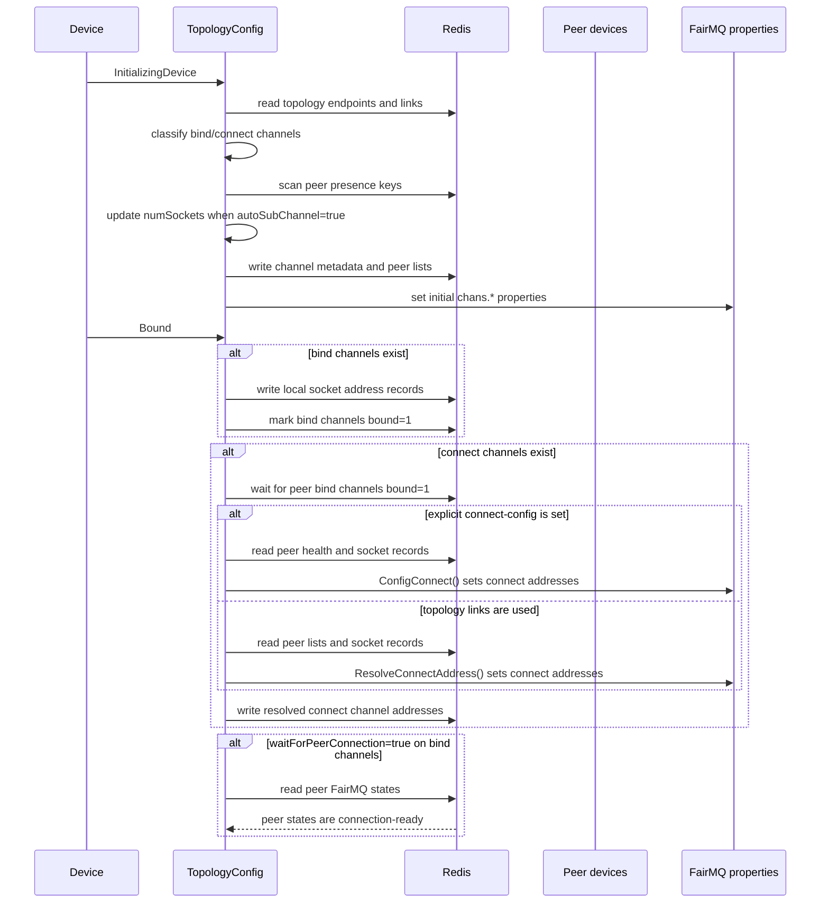

# NestDAQ FairMQ Plugins

NestDAQ installs FairMQ plugins that publish service information to Redis,
collect runtime metrics, and load FairMQ program options from Redis-backed
configuration keys.

The plugins are built as shared libraries:

| Plugin name        | Library                               | Purpose |
|--------------------|----------------------------------------|---------|
| `daq_service`      | `libFairMQPlugin_daq_service.so`       | Registers the FairMQ device in Redis, publishes health/state data, handles DAQ commands, and publishes topology/channel metadata. |
| `metrics`          | `libFairMQPlugin_metrics.so`           | Publishes process metrics and FairMQ channel throughput metrics to Redis and RedisTimeSeries. |
| `parameter_config` | `libFairMQPlugin_parameter_config.so`  | Reads parameters from Redis and mirrors them into FairMQ program properties. |

The exact plugin loading option is provided by FairMQ and the executable that
uses FairMQ. Use the plugin names above when enabling these libraries.

In the key patterns below, `{sep}` means the configured separator. The default
separator is `:`. Other placeholders are `{service}`, `{id}`, `{channel}`, and
`{subindex}`.

## TTL Behavior

TTL handling is different for each plugin:

- `daq_service` manages Redis key expiration. It refreshes registry keys while
  the device is alive, and expiration is used as a fallback cleanup mechanism
  when a device terminates unexpectedly.
- `metrics` does not generally set Redis key TTLs for metric hashes. Instead,
  `--metrics-max-ttl` is used as a stale-field cleanup threshold. RedisTimeSeries
  retention is controlled separately by `--retention`.
- `parameter_config` does not set TTLs on parameter keys. Parameter lifetime is
  controlled by the producer or operator that writes those Redis keys.

## daq_service

`daq_service` is the main Redis service-registry plugin. It registers a device
instance, refreshes TTLs, publishes FairMQ state and health data, subscribes to
DAQ commands, and writes topology/channel metadata used by other services.

### Runtime Options

| Option                           | Default                    | Required | Description |
|----------------------------------|----------------------------|----------|-------------|
| `--service-name`                 | none                       | No       | Service name used in Redis key paths. |
| `--uuid`                         | generated                  | No       | UUID of this service instance. FairMQ device wrappers reuse the telemetry-generated `service.instance.id` when available; otherwise the plugin generates one. |
| `--host-ip`                      | detected/configured value  | No       | IP address or hostname published as this service address. |
| `--hostname`                     | detected/configured value  | No       | Host name published in health data. |
| `--registry-uri`                 | `tcp://127.0.0.1:6379/0`   | No       | Redis URI for the DAQ service registry. |
| `--separator`                    | `:`                        | No       | Separator used when composing Redis keys. |
| `--max-ttl`                      | `5`                        | No       | TTL in seconds for transient registry keys. |
| `--ttl-update-interval`          | `3`                        | No       | TTL refresh interval in seconds. |
| `--startup-state`                | `idle`                     | No       | Startup state sequence target: `idle`, `initializing-device`, `initialized`, `bound`, `device-ready`, `ready`, or `running`. |
| `--enable-uds`                   | `true`                     | No       | Use Unix domain sockets for local IPC if available. |
| `--connect-config`               | none                       | No       | JSON string describing temporary MQ channel connection parameters. |
| `--max-retry-to-resolve-address` | `10`                       | No       | Maximum retry count for resolving connect addresses. |

### Redis Keys Written or Read

| Key pattern | Redis type | Fields / value | Writer / reader | Purpose |
|-------------|------------|----------------|-----------------|---------|
| `daq_service{sep}{service}{sep}{id}{sep}presence` | string | UUID string, refreshed with TTL | Written | Presence marker for one device instance. |
| `daq_service{sep}{service}{sep}{id}{sep}health` | hash | `instanceID`, `uuid`, `hostName`, `hostIp`, `serviceName`, `createdTime`, `updatedTime`, `uptime`; also `start_time`, `start_time_ns`, `stop_time`, `stop_time_ns` when run timing is recorded | Written | Health and lifecycle metadata for one device instance. |
| `daq_service{sep}{service}{sep}{id}{sep}fair-mq-state` | string | FairMQ state name | Written | Current FairMQ state with TTL. |
| `daq_service{sep}{service}{sep}{id}{sep}updatedTime` | string | Last update timestamp | Written | Lightweight last-update key with TTL. |
| `daq_service{sep}{service}{sep}{id}{sep}option` | hash | Selected FairMQ program options such as `severity`, `file-severity`, `verbosity`, `color`, `log-to-file`, `id`, `io-threads`, `transport`, `network-interface`, `init-timeout`, shared-memory options, `rate`, and `session` | Written | Runtime option snapshot for monitoring and debugging. |
| `daq_service{sep}service-instance-index{sep}{service}` | hash | Field: numeric instance index; value: UUID | Read/write | Allocates and reuses `{service}-{index}` instance IDs when `--id` is not given. |
| `run_info{sep}run_number` | string | Run number | Read | Source for run number metadata. |
| `daqctl` | pub/sub channel | DAQ command strings such as `start`, `stop`, `reset`, `quit`, `exit` | Subscribed | Receives controller commands. |

### Topology and Channel Keys

`daq_service` also writes channel metadata through `TopologyConfig`.

| Key pattern | Redis type | Fields / value | Writer / reader | Purpose |
|-------------|------------|----------------|-----------------|---------|
| `daq_service{sep}{service}{sep}{id}{sep}channel{sep}{channel}` | hash | `name`, `type`, `method`, `address`, `transport`, buffer sizes, kernel sizes, `linger`, `rateLogging`, port range, `autoBind`, `numSockets`, `autoSubChannel`, `bound`, `waitForPeerConnection` | Written/read | Published channel endpoint metadata. |
| `daq_service{sep}{service}{sep}{id}{sep}channel{sep}{channel}{sep}peer` | list | Peer channel key strings | Written/read | Peer list for the channel. |
| `daq_service{sep}{service}{sep}{id}{sep}socket{sep}chans.{channel}.{subindex}` | hash | Local subchannel/socket parameters plus `numSockets` and `autoSubChannel` | Written/read | Per-subchannel connection metadata. |
| `daq_service{sep}topology{sep}endpoint...` | string/hash keys | Topology endpoint configuration | Read/scanned | External topology configuration used to resolve endpoints. |
| `daq_service{sep}topology{sep}link...` | string/hash keys | Topology link configuration | Read/scanned | External topology configuration used to resolve links between services/channels. |

#### `autoSubChannel`

`autoSubChannel` controls how `TopologyConfig` expands FairMQ subchannels when
a topology peer is written without an explicit `[subindex]`.

- `autoSubChannel=false` resolves an unindexed peer to subchannel `0` only.
  This is useful for 1:1 or otherwise fixed connections.
- `autoSubChannel=true` scans the peer channel subchannel records already
  published in Redis and connects to all matching subchannels. This is useful
  for n:m topologies where the number of peers or sockets is discovered at
  runtime.
- When the peer string includes `[subindex]`, only that subchannel is resolved,
  regardless of `autoSubChannel`.

The plugin normally calculates `numSockets` from the topology. For channels
with `autoSubChannel=true`, `numSockets` grows with the discovered peer
instances/subchannels so each FairMQ sub-socket can receive a distinct
`address:port` and subchannel index.

#### Bind/Connect Sequence

`TopologyConfig` synchronizes bind and connect endpoints through Redis during
FairMQ state transitions.



Bind channels publish their local addresses first. Connect channels wait for
the peer bind channel to become `bound=1`, then resolve peer socket addresses
from Redis and write the resulting FairMQ `chans.*` properties. A bind channel
with `waitForPeerConnection=false` skips the final peer-ready wait. Reset or
cancellation interrupts the waiting steps.

### TTL Details

`daq_service` uses `--max-ttl` in seconds. The default is `5` seconds.
`--ttl-update-interval` controls how often the plugin refreshes TTLs. The
default refresh interval is `3` seconds.

The plugin refreshes Redis keys in two ways:

- `presence`, `fair-mq-state`, and `updatedTime` are updated with `SETEX`, so
  both the value and TTL are refreshed.
- `health`, `option`, topology channel keys, topology socket keys, and peer
  list keys are refreshed with `EXPIRE`.

On normal shutdown, registered keys are deleted. If the process crashes or loses
Redis connectivity, TTL expiration removes the transient registry keys after
they stop being refreshed.

## metrics

`metrics` publishes process-level metrics and FairMQ channel throughput metrics.
Process CPU usage is reported in top/htop style: one fully used CPU core is
approximately `100`, and two fully used CPU cores are approximately `200`.
Memory usage is current resident memory in MiB.

### Runtime Options

| Option                        | Default | Required | Description |
|-------------------------------|---------|----------|-------------|
| `--proc-stat-update-interval` | `1000`  | No       | Update interval in milliseconds for process CPU and memory metrics. |
| `--metrics-uri`               | none    | No       | Redis URI for metrics. If empty, `--registry-uri` is used. |
| `--retention`                 | `0`     | No       | RedisTimeSeries retention in milliseconds. `0` means no trimming. |
| `--recreate-ts`               | `true`  | No       | Recreate RedisTimeSeries keys on transition to `Running`. |
| `--metrics-max-ttl`           | `3000`  | No       | Maximum TTL in milliseconds for metrics fields. If zero or negative, no TTL cleanup is applied. |

### Redis Keys Written or Read

| Key pattern | Redis type | Fields / value | Writer / reader | Purpose |
|-------------|------------|----------------|-----------------|---------|
| `metrics{sep}created-time` | hash | Field: `{id}`; value: creation timestamp | Written | Device creation time. |
| `metrics{sep}hostname` | hash | Field: `{id}`; value: hostname | Written | Host metadata. |
| `metrics{sep}host-ip` | hash | Field: `{id}`; value: host IP address | Written | Host metadata. |
| `metrics{sep}state` | hash | Field: `{id}`; value: FairMQ state name | Written | Current state as a string. |
| `metrics{sep}state-id` | hash | Field: `{id}`; value: numeric FairMQ state ID | Written | Current state as a numeric value. |
| `metrics{sep}last-update` | hash | Field: `{id}`; value: timestamp | Written | Last metrics update time. |
| `metrics{sep}last-update-ns` | hash | Field: `{id}`; value: timestamp in nanoseconds | Written/read | Used to identify stale metric fields. |
| `metrics{sep}cpu-stat` | hash | Field: `{id}`; value: CPU percent | Written | Process CPU usage. |
| `metrics{sep}ram-stat` | hash | Field: `{id}`; value: current RSS MiB | Written | Process memory usage. |
| `metrics{sep}msg-in`, `metrics{sep}msg-out` | hash | Field: `{id}{sep}{channel}[{subindex}]`; value: messages per second | Written | Current channel message rate. |
| `metrics{sep}mb-in`, `metrics{sep}mb-out` | hash | Field: `{id}{sep}{channel}[{subindex}]`; value: MiB per second | Written | Current channel throughput. |
| `metrics{sep}msg-in-sum`, `metrics{sep}msg-out-sum` | hash | Field: `{id}{sep}{channel}[{subindex}]`; value: cumulative rounded message count | Written | Accumulated message counts. |
| `metrics{sep}mb-in-sum`, `metrics{sep}mb-out-sum` | hash | Field: `{id}{sep}{channel}[{subindex}]`; value: cumulative MiB | Written | Accumulated throughput. |
| `metrics{sep}num-msg`, `metrics{sep}mb` | hash | Field: `{id}{sep}{channel}[{subindex}].in` or `.out`; value: current rate | Written | Direction-qualified current rates. |
| `metrics{sep}num-msg-sum`, `metrics{sep}mb-sum` | hash | Field: `{id}{sep}{channel}[{subindex}].in` or `.out`; value: cumulative value | Written | Direction-qualified cumulative values. |
| `ts{sep}{id}{sep}cpu-stat`, `ts{sep}{id}{sep}ram-stat`, `ts{sep}{id}{sep}state-id` | RedisTimeSeries | Samples added with `TS.ADD`; labels include `service`, `id`, and data type | Written | Process and state time series. |
| `ts{sep}{id}{sep}{channel}[{subindex}]{sep}...` | RedisTimeSeries | Channel rate and cumulative samples with labels such as `name`, `socket`, and `transport` | Written | Channel time series. |

The plugin listens to FairLogger throughput lines from FairMQ and parses records
like:

```text
data[0]: in: 123 (4.5 MB) out: 67 (8.9 MB)
```

Only indexed subchannel records are used for channel throughput metrics.

### TTL and Retention Details

`--metrics-max-ttl` is not a Redis key TTL. It is a stale-field cleanup threshold
in milliseconds. The plugin reads `metrics{sep}last-update-ns`, finds instances
whose last update is older than this threshold, and removes their fields from
registered metric hashes with `HDEL`. If `--metrics-max-ttl` is zero or
negative, this cleanup is disabled.

`--retention` applies only to RedisTimeSeries keys created by the plugin. It is
passed to `TS.CREATE ... RETENTION` in milliseconds. A value of `0` means that
RedisTimeSeries samples are not trimmed by retention time.

## parameter_config

`parameter_config` reads Redis parameter keys and mirrors values into FairMQ
program properties. Instance-specific parameters override group parameters when
both are present.

### Runtime Options

| Option                   | Default | Required | Description |
|--------------------------|---------|----------|-------------|
| `--parameter-config-uri` | none    | No       | Redis URI for parameter configuration. If empty, `--registry-uri` is used. |

### Redis Keys Read or Subscribed

| Key pattern | Redis type | Fields / value | Writer / reader | Purpose |
|-------------|------------|----------------|-----------------|---------|
| `parameters{sep}{id}` | hash | Field: option name; value: option value string | Read | Instance-specific parameter set. |
| `parameters{sep}{group}` | hash | Field: option name; value: option value string | Read | Group default parameter set. `{group}` is derived from `{id}` by removing a trailing numeric `-N` suffix. |
| `parameters{sep}{id}{sep}*` | string/list/hash/set/zset | Additional structured parameters below the instance key | Read/scanned | Per-instance structured parameter values. |
| `parameters{sep}{group}{sep}*` | string/list/hash/set/zset | Additional structured parameters below the group key | Read/scanned | Group-level structured parameter values. |
| `__keyspace@{db}__:{key}` | pub/sub channel | Redis keyspace notification events | Subscribed | Triggers live reload for the instance and group parameter keys. |

String keys use the last path component as the option name. Hash values become
map-like properties, list values become array-like properties, set values become
sets, and sorted-set values become maps from member to score.

Redis keyspace notifications must be enabled on the Redis server for live
reloads to work. Initial parameter loading does not require keyspace
notifications.

### TTL Details

`parameter_config` does not call `EXPIRE`, `SETEX`, or `DEL` for parameter
keys. It only reads parameter keys and subscribes to keyspace notifications for
live reloads. If parameter keys should expire, the writer of those keys must set
the TTL.
