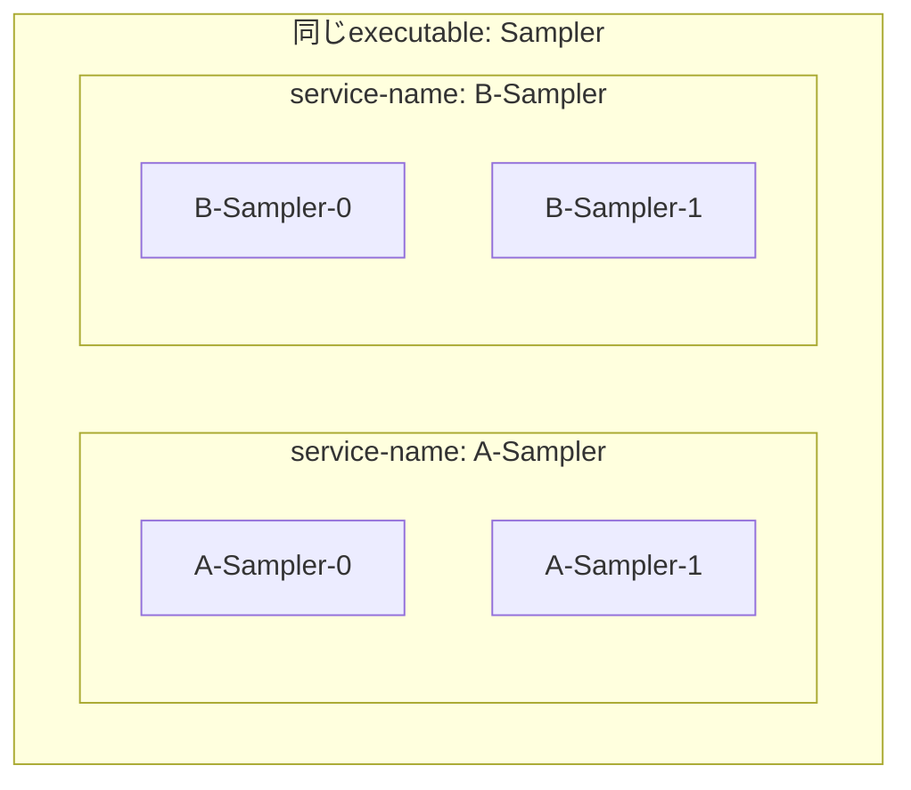
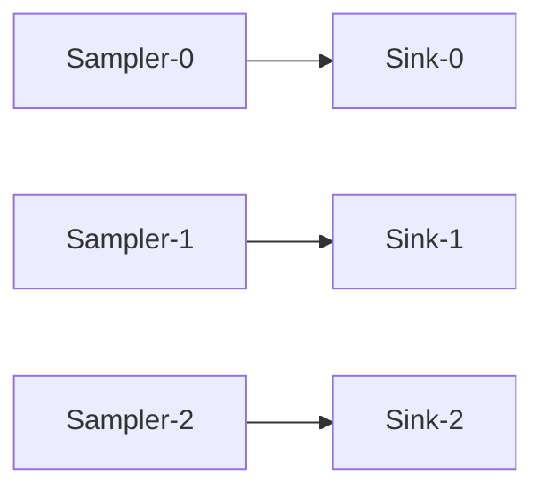
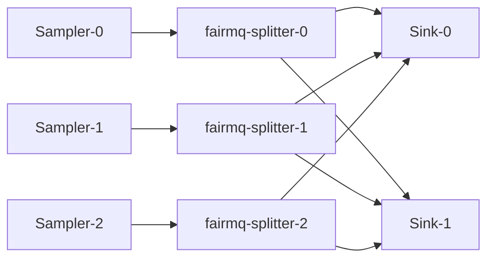
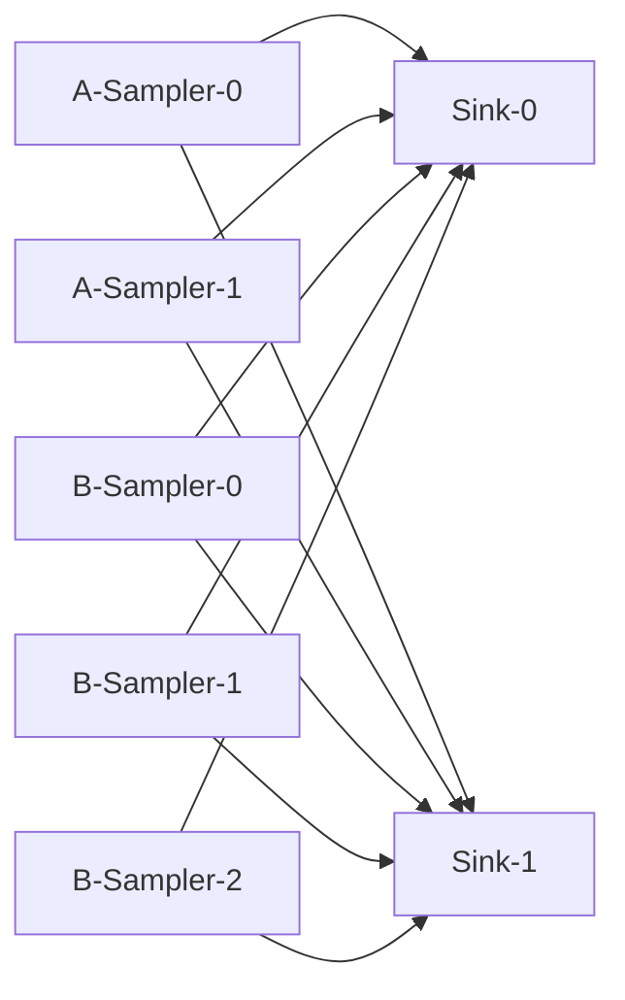

# スクリプト

[English](README.md) | [日本語](README.ja.md)

[トップ: NestDAQ](../README.ja.md) | [前へ: サンプル](../examples/README.ja.md) | [次へ: Plugin](../plugins/README.ja.md)

このディレクトリには、NestDAQ pluginの使用方法を示すscriptがあります。
scriptは別の作業directoryへcopyできます。
Redisへ設定を登録したり、Redisから設定を読み取ったりするscriptを実行する前に、
Redis serverを起動してください。

<a id="1-helper-script-to-launch-a-data-acquisition-daq-process"></a>
## 1. データ収集(DAQ)プロセス起動用ヘルパースクリプト

<a id="11-start_devicesh"></a>
### 1.1. start_device.sh

このscriptはNestDAQ pluginを使用してFairMQ deviceを起動します。
CMakeは`scripts/start_device.sh.in`から`start_device.sh`を生成し、
`<install-prefix>/scripts/`へインストールします。
このrepositoryが提供するdevice、またはpathに`fairmq-`を含むexecutableを指定してください。
device name以降のargumentはdeviceおよびFairMQへ渡されるため、`--service-name`などのplugin optionと`--max-iterations`などのdevice固有optionを同じcommand lineで指定できます。

NestDAQ exampleをローカル環境で実行する場合は、`start_device.sh`でdeviceを
起動する前に外部serviceを起動し、必要な設定を登録します。

- telemetry exportが必要な場合は、最初にOpenTelemetry Collectorとtelemetry
  storageを起動します。例えば、`share/otel-collector-compose/`配下のCompose
  setupを`docker compose`または`podman compose`で起動します。
- Redis serverを起動します。
- browser user interfaceからdeviceを制御する場合は`daq-webctl`を起動します。
- `topology-*.sh` scriptでtopology設定をRedisへ登録します。
- exampleが`parameter_config` pluginからparameterを読み取る場合は、`mq-param.sh`でparameter設定をRedisへ登録します。

localでの完全な起動sequenceは[`examples/README.ja.md`](../examples/README.ja.md)を参照してください。

`start_device.sh`は、すべてのNestDAQ Redis connectionに`NESTDAQ_REDIS_SERVER`を使用します。
defaultは`127.0.0.1:6379`です。
scriptはDAQ service registryをRedis database `0`、metricsをdatabase `1`、parameter configurationをdatabase `2`へ割り当てます。

scriptの該当部分は次のとおりです。

```bash
NESTDAQ_REDIS_SERVER=${NESTDAQ_REDIS_SERVER:-127.0.0.1:6379}

DAQSERVICE_URI=" --registry-uri tcp://${NESTDAQ_REDIS_SERVER}/0"
METRICS_URI=" --metrics-uri tcp://${NESTDAQ_REDIS_SERVER}/1"
CONFIG_URI=" --parameter-config-uri tcp://${NESTDAQ_REDIS_SERVER}/2"
```

`daq_service`はservice registry、DAQ command、topology metadataにDB 0を使用します。
`metrics` pluginはDB 1を使用します。
`parameter_config` pluginはDB 2からdevice option valueを読み取ります。

scriptはplugin search pathとplugin load orderも設定します。

```bash
PLUGIN_SEARCH_PATH=" -S '<$PLUGIN_LIBDIR'"
DAQSERVICE_PLUGIN=" -P daq_service"
METRICS_PLUGIN=" -P metrics"
CONFIG_PLUGIN=" -P parameter_config"

var+=$PLUGIN_SEARCH_PATH
var+=$DAQSERVICE_PLUGIN
var+=$METRICS_PLUGIN
var+=$CONFIG_PLUGIN
```

`-S`はFairMQ plugin search pathへdirectoryを追加します。
このscriptの`-S '<$PLUGIN_LIBDIR'`は、install済みNestDAQ plugin directoryをsearch pathの先頭へ追加します。
このoptionはplugin libraryを検索する場所だけを制御します。

`-P`はloadするpluginを選択します。
FairMQは最終command line上の`-P` optionの順序に従ってpluginをloadします。
`start_device.sh`は`daq_service`、`metrics`、`parameter_config`の順で渡します。
`-S`でdirectoryを追加するとsearch priorityは変わりますが、loadするpluginやload orderは変わりません。
loadするpluginとその順序は`-P` entryで制御されます。

`start_device.sh`はOpenTelemetry(OTel)logをOpenTelemetry Protocol(OTLP)gRPCでlocal OpenTelemetry Collectorへ送信します。
default endpointは`localhost:4317`です。
別のendpointを使用するには`NESTDAQ_OTLP_GRPC_ENDPOINT`を設定します。

scriptはOTel log optionを次のように構築します。

```bash
NESTDAQ_OTLP_GRPC_ENDPOINT=${NESTDAQ_OTLP_GRPC_ENDPOINT:-localhost:4317}
NESTDAQ_START_DEVICE_OTEL_LOG_SEVERITY=${NESTDAQ_START_DEVICE_OTEL_LOG_SEVERITY:-info}

var+=" --otel-log-protocol=otlp-grpc"
var+=" --otel-log-endpoint-grpc=${NESTDAQ_OTLP_GRPC_ENDPOINT}"
var+=" --otel-log-severity=${NESTDAQ_START_DEVICE_OTEL_LOG_SEVERITY}"
```

processの実行場所に応じてendpointを選択します。

- host processからComposeが公開したcollector portへ接続：`localhost:4317`。
- OpenSearchまたはVictoria Compose network内のNestDAQ device container/`daq-webctl` container：`otel-collector:4317`。
- ClickStack Compose network内のNestDAQ device container/`daq-webctl` container：`clickstack:4317`。
- Compose network外のcontainerからhost公開collector portへ接続：Dockerでは通常`host.docker.internal:4317`、Podmanでは通常`host.containers.internal:4317`。

以下のshell command例では、`#`で始まる行は読者向けのcommentであり、shellでは実行されません。

```bash
# Podmanのhost alias経由でcollectorへ接続する。
NESTDAQ_OTLP_GRPC_ENDPOINT=host.containers.internal:4317 ./start_device.sh Sampler
```

OTel metricsとtracesはdefaultで無効です。
OTLP gRPCでexportするかdebug用console exporterへ出力する場合は、`start_device.sh`内のmetric/trace exampleをuncommentします。

FairLogger console outputは`--severity nolog`によってdefaultで無効です。
有効にするには`NESTDAQ_FAIRLOGGER_CONSOLE_SEVERITY`を変更します。
OTel log exportは別の`NESTDAQ_START_DEVICE_OTEL_LOG_SEVERITY` thresholdを使用するため、FairLogger console outputが無効でもcollectorへlogを送信します。

```bash
NESTDAQ_FAIRLOGGER_CONSOLE_SEVERITY=${NESTDAQ_FAIRLOGGER_CONSOLE_SEVERITY:-nolog}

var+=" --severity ${NESTDAQ_FAIRLOGGER_CONSOLE_SEVERITY}"
```

```bash
# FairLoggerとOTel exportの両方でdebug levelのmessageを出力する。
NESTDAQ_FAIRLOGGER_CONSOLE_SEVERITY=debug4 NESTDAQ_START_DEVICE_OTEL_LOG_SEVERITY=debug4 ./start_device.sh Sampler
```

```bash
  # install済みSamplerをdefault optionで起動する。
  # ./start_device.sh [device-name] [options ...]
  ./start_device.sh Sampler
```

```bash
  # executable pathを指定してFairMQ deviceを起動する。
  ./start_device.sh /your-fairmq-install-path/bin/fairmq-splitter
```

次の例は、`Sampler`をservice name `A-Sampler`で起動し、`ConditionalRun()`の実行rateを1秒に1回へ制限します。

```bash
# rateを制限したSamplerを固有のservice nameで起動する。
./start_device.sh Sampler --service-name A-Sampler --rate 1
```

`start_device.sh`自身は`--service-name`を設定しません。
device name以降のoptionはFairMQおよびNestDAQ pluginへそのまま渡されます。
`--service-name`または`--id`が空の場合に使用する`daq_service`のdefaultについては、[`plugins/README.ja.md#22-daq-service-identity-defaults`](../plugins/README.ja.md#22-daq-service-identity-defaults)を参照してください。

```bash
# 2つのSampler processを別々のservice groupとして登録する。
./start_device.sh Sampler --service-name A-Sampler
./start_device.sh Sampler --service-name B-Sampler
```

これにより、同じexecutableを別のservice groupとして表示できます。
例えば同じ`Sampler` programを、Redis、`daq-webctl`、telemetry attribute上で`A-Sampler-*`と`B-Sampler-*`として表示できます。



<a id="2-topology-configuration"></a>
## 2. トポロジー設定

次の表にendpoint parameterのdefault valueを示します。

| field | default value |
| -- | -- |
| name | |
| type | |
| method | |
| address | |
| transport | zeromq |
| sndBufSize | 1000 |
| rcvBufSize | 1000 |
| sndKernelSize | 0 |
| linger | 500 |
| rateLogging | 1 |
| portRangeMin | 22000 |
| portRangeMax | 32000 |
| autoBind | true |
| numSockets | 0(pluginが自動計算) |
| autoSubChannel | false |
| bound | (userは設定しない) |
| waitForPeerConnection | true |

最後の3 parameterはNestDAQ固有で、その他はFairMQで定義されています。

`autoSubChannel`は、`[subindex]`なしで記述したpeerをsubchannel `0`だけとするか、peer channelに登録された全subchannelとするかを制御します。
`topology-1-1.sh`のような固定1:1 connectionには`autoSubChannel false`を使用します。
`topology-n-n-m.sh`や`topology-2samplers-n-m.sh`のようなn:m fan-out/fan-in topologyでは`autoSubChannel true`を使用し、pluginがpeer subchannelを検出して`numSockets`を更新します。
`[subindex]`を明示した場合は、そのsubchannelだけを使用します。
詳細は[`plugins/README.ja.md#251-autosubchannel`](../plugins/README.ja.md#251-autosubchannel)を参照してください。

topology scriptはendpointとlink definitionをRedis DB 0へ書き込みます。
helper functionは次の形式です。

```bash
server=redis://127.0.0.1:6379/0

function endpoint () {
  redis-cli -u $server hset daq_service:topology:endpoint:$1:$2 ${@:3}
}

function link () {
  redis-cli -u $server set daq_service:topology:link:$1:$2,$3:$4 none
}
```

`endpoint SERVICE CHANNEL ...`は`daq_service:topology:endpoint:SERVICE:CHANNEL`へhashを書き込みます。
残りのfieldは`type push`、`method bind`、`autoSubChannel false`などFairMQ socketを記述します。

`endpoint()` helperはRedis `HSET`を使用するため、topology scriptを再実行しても、そのscriptが書き込むfieldだけを更新します。
新しいscript contentで省略したfieldは削除されません。
例えば`autoSubChannel true`をRedisへ書き込んだ後、scriptから`autoSubChannel`を削除して再実行しても、Redis fieldは`true`のままです。
`false`へ戻すには、`autoSubChannel false`を明示してtopology scriptを再実行します。
topologyを最初から再構築する場合は、新しいtopologyを登録する前に`daq_service` / `TopologyConfig`が使用するRedis databaseをflushします。
同じ`HSET`規則は、`mq-param.sh`などのhelperが書き込むparameter hashにも適用されます。
scriptでfieldを省略しても、既存のRedis hash fieldは削除されません。

user deviceのchannel connection informationを変更した場合やuser deviceが正常終了しなかった場合、古い`daq_service` topology/channel metadataがRedisへ残ることがあります。
stale connection metadataにより、後でdeviceを起動したときに意図したtopologyと異なるsocket addressへ解決されることがあります。
local validation environmentでは、新しいtopologyを登録する前に`daq_service` / `TopologyConfig`が使用するRedis databaseをflushします。

```sh
# local Redis DB 0からstale topology/service dataを削除する。
redis-cli -u redis://127.0.0.1:6379/0 FLUSHDB
```

`FLUSHDB`は選択したRedis databaseの全keyを削除します。
local Redis instance全体をresetする場合は`FLUSHALL`を使用します。

```sh
# local Redis instanceの全databaseを消去する。
redis-cli -u redis://127.0.0.1:6379 FLUSHALL
```

`FLUSHALL`はそのRedis instanceの全databaseにある全keyを削除します。
data削除を意図している場合を除き、productionまたはshared Redis serverで`FLUSHDB`や`FLUSHALL`を使用しないでください。
例のRedis addressとdatabase numberはlocal defaultです。
実際に操作するRedis instance/databaseのaddressとdatabase numberへ置き換えてください。

<a id="21-bind-and-connect-endpoints"></a>
### 2.1. bindエンドポイントとconnectエンドポイント

topology endpoint設定の`method bind`と`method connect`は、どちらのsideがsocket addressを所有するかを示します。
ここでaddressとは、FairMQの接続に必要なendpoint connection information、つまりIP addressまたはhostnameとport numberです。
bind-side socketはlocal endpointを開き、各peer addressを知らなくても、接続してきたconnect-side socketと通信できます。
connect-side socketは、接続前にbind-side addressを知る必要があります。
そのaddressはRedis内のNestDAQ service discovery/topology metadataから解決するか、固定setupではparameterで直接設定できます。

`link SERVICE CHANNEL PEER_SERVICE PEER_CHANNEL`は2つのendpoint definition間のlogical connectionを書き込みます。
各device起動時にtopology pluginがdefinitionを読み、具体的なFairMQ channel propertyへ変換します。

<a id="22-topology-1-1sh"></a>
### 2.2. topology-1-1.sh

このscriptは、**Sampler**と**Sink**を接続する単純な**PUSH-PULL** topologyを定義します。
_N_個のSamplerと_N_個のSinkを起動すると、_N_組のSampler/Sink pairを形成します。
各Samplerは、同じinstance indexを持つ1つのSinkへdataを送信します。

```bash
  # 1対1のSampler/Sink topologyをRedisへ登録する。
  ./topology-1-1.sh
```

主要部分は次のとおりです。

```bash
endpoint Sampler data type push method bind autoSubChannel false
endpoint Sink    in   type pull method connect autoSubChannel false

link Sampler data Sink in
```

`Sampler:data`はPUSH socketをbindし、`Sink:in`はPULL socketへconnectします。
linkは`Sampler-0`と`Sink-0`のようにinstance indexが一致するdeviceをpairにします。



<a id="23-topology-n-n-msh"></a>
### 2.3. topology-n-n-m.sh

このscriptは、_N_個の**Sampler**、_N_個の**fairmq-splitter**、_M_個の**Sink**を接続する単純な**PUSH-PULL** topologyを定義します。
各Samplerは同じinstance indexのfairmq-splitterへdataを送り、fairmq-splitterがSinkへdataを送ります。
`autoSubChannel true` flagは、各sub-socketに異なる`address:port`を設定し、indexで区別できるようにします。
fairmq-splitterは送信済みmessage数を用いたround-robinで送信先を決定します。

```bash
  # sampler/splitter/sinkのfan-out topologyをRedisへ登録する。
  ./topology-n-n-m.sh
```

splitter topologyは`fairmq-splitter`上で2 channelを使用します。

```bash
endpoint Sampler          data     type push method bind    autoSubChannel false
endpoint fairmq-splitter  data-in  type pull method connect autoSubChannel false
endpoint fairmq-splitter  data-out type push method bind    autoSubChannel true
endpoint Sink             in       type pull method connect autoSubChannel true

link Sampler         data     fairmq-splitter data-in
link fairmq-splitter data-out Sink            in
```

最初のlinkは各samplerを同じindexのsplitter instanceとpairにします。
2番目のlinkは`autoSubChannel true`を使用し、splitter output subchannelから複数sink instanceへfan-outできるようにします。



<a id="24-topology-2samplers-n-msh"></a>
### 2.4. topology-2samplers-n-m.sh

2つのsampler serviceから1つのsink serviceへdataを送信します。
このscriptは前述のservice-name groupingを示します。
一部の`Sampler` processを`A-Sampler`、その他を`B-Sampler`として起動することを想定します。

```bash
endpoint A-Sampler data type push method bind autoSubChannel true
endpoint B-Sampler data type push method bind autoSubChannel true
endpoint Sink      in   type pull method connect autoSubChannel true

link A-Sampler data Sink in
link B-Sampler data Sink in
```



<a id="3-parameter-configuration"></a>
## 3. パラメーター設定

<a id="31-mq-paramsh"></a>
### 3.1. mq-param.sh

Redisを通じてdevice parameterを設定する例です。
device parameterは、NestDAQ device processが`parameter_config` pluginを通じて
取得し、使用するparameterです。

```bash
  # example NestDAQ device processが使用するparameterをRedis DB 2へ登録する。
  ./mq-param.sh
```

`mq-param.sh`は、`parameter_config` pluginが使用するRedis DB 2へparameter hashを書き込みます。

```bash
server=redis://127.0.0.1:6379/2

function param () {
  redis-cli -u $server hset parameters:$1 ${@:2}
}
```

第1 argumentはparameter groupまたはinstance idです。
残りはFairMQ/device optionになるfield/value pairです。

```bash
param Sampler rate 2 max-iterations 0
param Sampler-0 text Hello
param Sampler-1 text world

param Sink multipart true
```

例えば`param Sampler rate 2 max-iterations 0`は`parameters:Sampler`というhashへ`Sampler-0`、`Sampler-1`などの共通defaultを書き込みます。
`param Sampler-0 text Hello`はinstance固有hash `parameters:Sampler-0`を書き込みます。

`parameter_config` pluginが`Sampler-0`用に起動すると、instance id末尾の数値`-N` suffixを削除してgroup keyを生成します。
`parameters:Sampler`、`parameters:Sampler-0`の順に読み取るため、instance固有valueがgroup defaultをoverrideします。
この例では`Sampler-0`は`rate=2`、`max-iterations=0`、`text=Hello`を受け取り、`Sampler-1`は同じ共通valueと`text=world`を受け取ります。

structured group/instance parameter keyを含む全Redis key patternは、[`plugins/README.ja.md#42-redis-keys-read-or-subscribed`](../plugins/README.ja.md#42-redis-keys-read-or-subscribed)を参照してください。

<a id="4-device-skeleton-generation"></a>
## 4. デバイススケルトン生成

`generate-device-skeleton.py`はscriptに組み込まれたtemplateから最小構成のNestDAQ FairMQ device projectを作成します。
defaultではinput、output、Data Quality Monitoring (DQM; データ品質監視) channel
codeを生成し、各channel nameに`in`、`out`、`dqm`を使用します。

```bash
# MyDevice projectを専用のoutput directoryへ生成する。
./generate-device-skeleton.py MyDevice --output ./MyDevice
```

optionでhelper fileを除外しない限り、生成projectには`MyDevice.hpp`、`MyDevice.cpp`、`CMakeLists.txt`、`README.md`が含まれます。
`--force`未指定時は既存fileを上書きしません。
fileを書き込まずoutput pathを確認するには`--dry-run`を使用します。
既存build systemへdeviceを追加し`CMakeLists.txt`を生成しない場合は`--no-cmake`、生成device固有の`README.md`が不要な場合は`--no-readme`を使用します。

generator optionには2つのcommand-line形式があります。

- `--output DIR`、`--processing-mode MODE`、`--no-poll LIST`のようにplaceholderを表示するoptionは、`--key value`形式でvalueが必要です。
- `--force`、`--single-output`、`--no-dqm-channel`のようにplaceholderのないoptionはpresence-only flagです。
  表の動作を適用するにはflagだけを指定し、defaultを維持するには省略します。

presence-only flagはBoolean valueを受け取りません。
例えば`--no-dqm-channel true`ではなく`--no-dqm-channel`を使用し、`--no-dqm-channel false`と書く代わりにflagを省略します。
flagを繰り返してもstateは再度toggleされません。
表の`off`はflag未指定を意味します。
`--no-*` flagが`off`の場合、対象機能はdefaultで有効です。

```bash
# DQM channelを持たずsingle-message outputを持つconditional-run deviceを生成する。
./generate-device-skeleton.py MyDevice \
  --output ./MyDevice \
  --processing-mode conditional-run \
  --no-dqm-channel \
  --single-output
```

generator option：

| Option | デフォルト | 説明 |
| :-- | :-- | :-- |
| `--output DIR`, `-o DIR` | `./CLASS_NAME/` | 生成fileを`DIR`配下へ書き込み。 |
| `--force` | off | 既存の生成fileを上書き。 |
| `--dry-run` | off | 書き込まず生成予定fileを表示。 |
| `--interactive` | off | command lineですべて指定する代わりにgeneration choiceを対話入力。 |
| `--no-cmake` | off | `CMakeLists.txt`を生成しない。既存build systemへ統合するときに使用。 |
| `--no-readme` | off | `README.md`を生成しない。生成deviceを別の場所で文書化するときに使用。 |
| `--no-namespace` | off | device classを`namespace nestdaq`ではなくglobal namespaceへ生成。 |
| `--processing-mode MODE` | `conditional-run` | 生成processing entry pointを`conditional-run`、`run`、`on-data`から選択。 |
| `--input-channel SPEC` | `in-chan-name:in` | 生成input channelをoverride。`SPEC`は`KEY:DEFAULT_NAME`、`:DEFAULT_NAME`、`DEFAULT_NAME`。 |
| `--no-input-channel` | off | input-channel codeを生成しない。 |
| `--output-channel SPEC` | `out-chan-name:out` | 生成output channelをoverride。`SPEC`は`--input-channel`と同形式。 |
| `--no-output-channel` | off | output-channel codeを生成しない。 |
| `--dqm-channel SPEC` | `dqm-chan-name:dqm` | 生成DQM channelをoverride。`SPEC`は`--input-channel`と同形式。 |
| `--no-dqm-channel` | off | DQM-channel codeを生成しない。 |
| `--multipart-input` | off | input channel用multipart receive/`OnData()` exampleを生成。`--no-input-channel`と同時指定不可。 |
| `--single-output` | off | single-message output exampleを生成。default outputはmultipart。 |
| `--single-dqm` | off | single-message DQM exampleを生成。default DQMはmultipart。 |
| `--no-drain-input` | off | `PostRun()` input drain codeを生成しない。 |
| `--no-poll LIST` | none | FairMQ pollingから除外するchannel kindのcomma区切りlist：`input`、`output`、`dqm`。 |

processing mode：

| Mode | 生成される動作 |
| :-- | :-- |
| `conditional-run` | 単純なpoll/receive/send exampleを持つ`ConditionalRun()`を生成。 |
| `run` | 空の`Run()`を生成。 |
| `on-data` | `InitTask()`へ`OnData()` callback登録を生成。input-channel codeが必要。 |

`OnData()`、`ConditionalRun()`、`Run()`の選び方は[`examples/README.ja.md#44-choosing-ondata-conditionalrun-or-run`](../examples/README.ja.md#44-choosing-ondata-conditionalrun-or-run)を参照してください。

generatorへ渡すchannel optionは、生成deviceのcommand-line optionではありません。
generatorはdefaultで3 channelすべてを作成し、これらのoptionに従って、対応するdevice command-line optionをC++へ生成します。

```bash
# input、output、DQM channel optionを明示したprocessorを生成する。
./generate-device-skeleton.py MyProcessor \
  --input-channel in-chan-name:in \
  --output-channel out-chan-name:out \
  --dqm-channel dqm-chan-name:dqm
```

例えば`--input-channel in-chan-name:in`を指定すると、生成C++はdefault valueが`in`の`in-chan-name` command-line optionを追加し、`InitTask()`でそのoptionを`fInputChannelName`へ読み取ります。
short formの`--input-channel :in`と`--input-channel in`はいずれもdefault option key `in-chan-name`を使用します。
outputとDQMも同様に`out-chan-name`と`dqm-chan-name`を使用します。
default channel nameがなくなるため、`KEY:`と`:`は拒否されます。

channelが不要なdeviceでは`--no-input-channel`、`--no-output-channel`、`--no-dqm-channel`を使用します。
生成後に対応option、member、initialization、polling、processing codeを削除しても同じ結果になりますが、生成時に除外する方がerrorを避けやすくなります。
`--*-channel`と対応する`--no-*-channel`は相互排他です。
interactive modeでは各channel promptのdefaultは`yes`で、除外するには`no`と回答します。

生成device classはdefaultで`namespace nestdaq`に置かれます。
global namespaceへ生成するには`--no-namespace`を使用します。

便利なvariant：

```bash
# output channelだけを持つsourceを生成する。
./generate-device-skeleton.py MySource \
  --no-input-channel \
  --no-dqm-channel

# 短縮channel specificationとdefault option keyを使用する。
./generate-device-skeleton.py MyShortFormProcessor \
  --input-channel :in \
  --output-channel data \
  --dqm-channel dqm

# single-message output/DQM helperを生成する。
./generate-device-skeleton.py MySingleMessageProcessor \
  --input-channel :in \
  --output-channel data \
  --dqm-channel dqm \
  --single-output \
  --single-dqm

# output/DQM channelを持たないOnData sinkを生成する。
./generate-device-skeleton.py MySink \
  --processing-mode on-data \
  --no-output-channel \
  --no-dqm-channel

# multipart input処理を持つsinkを生成する。
./generate-device-skeleton.py MyMultipartSink \
  --processing-mode on-data \
  --no-output-channel \
  --no-dqm-channel \
  --multipart-input

# output/DQM channelをpoll対象から外し、input drainを省略する。
./generate-device-skeleton.py MyDevice \
  --input-channel in-chan-name:in \
  --output-channel out-chan-name:out \
  --no-poll output,dqm \
  --no-drain-input

# 生成classをglobal namespaceへ配置する。
./generate-device-skeleton.py MyGlobalDevice \
  --no-namespace

# 既存buildへ統合するためCMake fileを省略する。
./generate-device-skeleton.py MyIntegratedDevice \
  --no-cmake

# 生成projectのREADMEを省略する。
./generate-device-skeleton.py MyNoReadmeDevice \
  --no-readme

# generation settingを対話形式で選択する。
./generate-device-skeleton.py --interactive
```

input pollingを生成する場合、skeletonは`Receive()`前にFairMQ pollerを使用します。
output/DQM pollingを生成する場合は`Send()`前に`Poller::CheckOutput()`を使用します。
outputは送信可能になるかstate transitionがpendingになるまでpoll-timeout単位で待ちます。
DQMは即時送信できない場合sampleを破棄します。
output/DQM exampleはdefaultでmultipart messageとして生成されます。
single-message exampleにはgenerator option `--single-output`または`--single-dqm`を使用します。
`SendOutputMessage()`と`SendDQMMessage()`は、生成された`fair::mq::Parts&`または`fair::mq::MessagePtr&` payloadを受け取り、channel readiness、`Send()`、成功/失敗確認だけを処理します。

上表のoptionはgeneratorを制御するものであり、生成deviceのcommand-line optionではありません。
生成C++ codeはcustom optionをstringとして登録します。
`InitTask()`はstringを変換してから数値memberへ代入します。

| 生成device command-line option | デフォルト | 説明 |
| :-- | :-- | :-- |
| `poll-timeout-ms` | `100` | FairMQ poll timeout(milliseconds)。 |
| `drain-timeout-ms` | `100` | input drainで使用するreceive timeout。負値は`0`として扱う。 |
| `drain-max-timeout-count` | `20` | 最後にdrainしたmessage以降、この回数だけ連続でreceive timeoutしたらinput drainを停止。正値必須。 |

input channelがある場合、defaultで`PostRun()`へinput drain codeを生成します。
無効化には`--no-drain-input`を使用します。

generatorは組み込みtemplateを読み、device固有placeholderを置換し、生成fileをoutput directoryへ書き込みます。
主要な置換には`@CLASS_NAME@`、`@HEADER_FILE@`、`@SOURCE_FILE@`と、member、option、processing method、send helper、drain code用の生成C++ blockがあります。

| Template | `MyDevice`用生成file |
| :-- | :-- |
| `Device.hpp.in` | `MyDevice.hpp` |
| `Device.cpp.in` | `MyDevice.cpp` |
| `CMakeLists.txt.in` | `CMakeLists.txt` |
| `README.md.in` | `README.md` |

`--no-cmake`指定時は`CMakeLists.txt`、`--no-readme`指定時は`README.md`を省略します。

`CMakeLists.txt`を生成した場合、生成deviceをstandalone CMake projectとしてbuildします。
`CMAKE_PREFIX_PATH`をNestDAQ install prefix、`CMAKE_INSTALL_PREFIX`を生成deviceのinstall prefixへ設定します。
両prefixは同じdirectoryでも構いません。
生成CMake projectはdefaultでC++17を使用し、C++17未満を拒否します。

```bash
# NestDAQ installationを参照するout-of-source buildをconfigureする。
cmake -S ./MyDevice -B ./build-MyDevice \
  -DCMAKE_PREFIX_PATH=<nestdaq-install-prefix> \
  -DCMAKE_INSTALL_PREFIX=<device-install-prefix>
# 生成deviceをparallel buildする。
cmake --build ./build-MyDevice --parallel
# 選択したprefixへ生成deviceをinstallする。
cmake --install ./build-MyDevice
```

install済みexecutableは`<device-install-prefix>/bin/MyDevice`へ配置されます。

skeletonは意図的に最小限の構成にしています。
data-channel処理とtelemetry instrumentationについては、`Sampler`と`Sink` exampleを参照してください。
