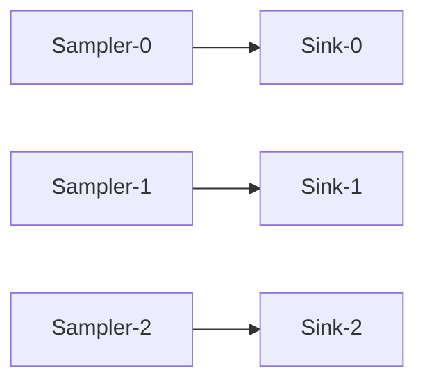
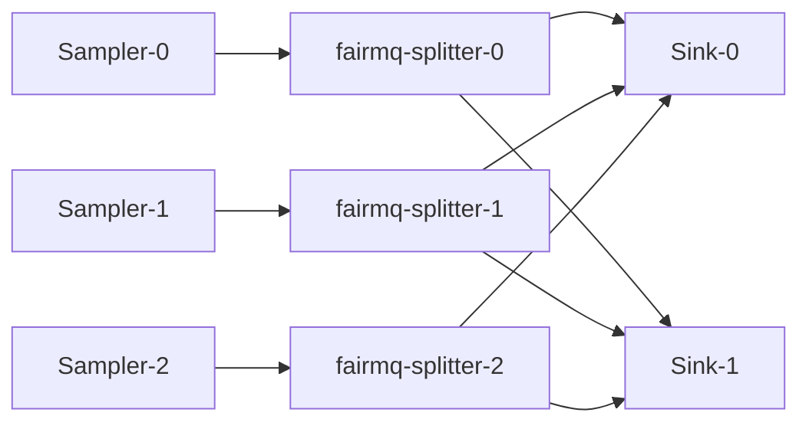
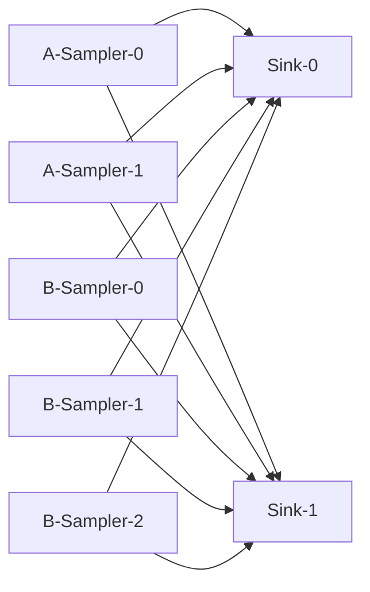

# Scripts

Set of examples of how to use the plugins.
The scripts can be copied to your favorite directory. 
Redis server must be started before executing the scripts. 

## Helper script to launch a data acquisition (DAQ) process

### start_device.sh 
This example shows how to start FairMQDevice with the custom plugins. 
The device must be those provided by the present repository or those which contains `fairmq-` in the path. 
Arguments after the device name are passed through to the device and FairMQ, so
plugin options such as `--service-name` and device-specific options such as
`--max-iterations` can be specified on the same command line.

For a typical local validation run, prepare the runtime environment before
starting devices with `start_device.sh`:

- Start a Redis server.
- Start an OpenTelemetry Collector backend, for example the Compose setup under
  `share/otel-collector-compose`.
- Start `daq-webctl` if you want to control devices from the browser user
  interface.
- Register topology settings in Redis with a `topology-*.sh` script.
- Register parameter settings in Redis with `mq-param.sh` when the examples
  should read parameters from the `parameter_config` plugin.

See [`examples/README.md`](../examples/README.md) for the full local run
sequence.

The generated script uses `NESTDAQ_REDIS_SERVER` for all NestDAQ Redis
connections. The default is `127.0.0.1:6379`. It maps the DAQ service registry
to Redis database `0`, metrics to database `1`, and parameter configuration to
database `2`.

The generated script sends OpenTelemetry (OTel) logs to a local OpenTelemetry
Collector with OpenTelemetry Protocol (OTLP) gRPC. The default endpoint is
`localhost:4317` and can be changed with `NESTDAQ_OTLP_GRPC_ENDPOINT`.

Choose the endpoint according to where the process runs:

- Host process to a compose-published collector port: `localhost:4317`.
- NestDAQ device container or `daq-webctl` container in the same OpenSearch or
  Victoria compose network: `otel-collector:4317`.
- NestDAQ device container or `daq-webctl` container in the same ClickStack
  compose network: `clickstack:4317`.
- Container outside the compose network to the host-published collector port:
  Docker commonly uses `host.docker.internal:4317`; Podman commonly uses
  `host.containers.internal:4317`.

```bash
NESTDAQ_OTLP_GRPC_ENDPOINT=host.containers.internal:4317 ./start_device.sh Sampler
```

OTel metrics and traces are disabled by default. Uncomment the metric and trace
examples in `start_device.sh` to export them by OTLP gRPC or to print them to
the console exporter for debugging.

FairLogger console output is disabled by default with `--severity nolog`.
Change `NESTDAQ_FAIRLOGGER_CONSOLE_SEVERITY` to enable it. OTel log export uses
the separate `NESTDAQ_START_DEVICE_OTEL_LOG_SEVERITY` threshold and still sends
logs to the collector when FairLogger console output is disabled.

```bash
NESTDAQ_FAIRLOGGER_CONSOLE_SEVERITY=debug4 NESTDAQ_START_DEVICE_OTEL_LOG_SEVERITY=debug4 ./start_device.sh Sampler
```

```bash
  # ./start_device.sh [device-name] [options ...]
  ./start_device.sh Sampler
```

```bash
  ./start_device.sh /your-fairmq-install-path/bin/fairmq-splitter
```

An example of launching a `Sampler` with a different service name (`A-Sampler`) and limiting the execution rate of `ConditionalRun()` to once per second. 
```bash
./start_device.sh Sampler --service-name A-Sampler --rate 1
```

## Topology configuration

Default value for endpoint parameter

| field                 | default value                              | 
| --                    | --                                         | 
| name                  |                                            | 
| type                  |                                            | 
| method                |                                            | 
| address               |                                            | 
| transport             | zeromq                                     |
| sndBufSize            | 1000                                       | 
| rcvBufSize            | 1000                                       | 
| sndKernelSize         | 0                                          |
| linger                | 500                                        |
| rateLogging           | 1                                          |
| portRangeMin          | 22000                                      |
| portRangeMax          | 32000                                      |
| autoBind              | true                                       |
| numSockets            | 0 (Automatically calculated by the plugin) |
| autoSubChannel        | false                                      |
| bound                 | (Do not set by the user)                   |
| waitForPeerConnection | true                                       | 

The last three parameters are specific to nestdaq.
The rest are defined in FairMQ.

`autoSubChannel` controls whether a peer written without `[subindex]` means
only subchannel `0` or all subchannels registered for that peer channel.
Use `autoSubChannel false` for fixed 1:1-style connections such as
`topology-1-1.sh`. Use `autoSubChannel true` for n:m-style fan-out or fan-in
topologies such as `topology-n-n-m.sh` and `topology-2samplers-n-m.sh`, where
the plugin discovers peer subchannels and updates `numSockets` accordingly.
When `[subindex]` is written explicitly, only that subchannel is used.

### topology-1-1.sh
A simple topology of **Sampler** and **Sink** with the **PUSH-PULL** pattern. 
If _N_ Sasmplers and _N_ Sinks are started, they forms _N_ pairs of Sampler and Sink.  
Each Sampler sends data to one Sink with the same instance index. 

```bash
  ./topology-1-1.sh
```



### topology-n-n-m.sh
A simple topology of _N_-**Sampler**s, _N_-**fairmq-splitter**s, and _M_-**Sink**s with the **PUSH-PULL** pattern. 
Each Sampler sends data to one fairmq-splitter with the same instance index. 
Then, the fairmq-splitter sends the data to Sinks. 
The `autoSubChannel true` flag is used to give each sub-socket a different `address:port` and to distinguish them by index.
The fairmq-splitter determines the destination by the number of messages sent in a round-robin fashion.

```bash
  ./topology-n-n-m.sh
```



### topology-2samplers-n-m.sh
Two sampler services send data to one sink service. 



## Parameter configuration

### mq-param.sh
This example shows how to configure parameters via Redis. 

```bash
  ./mq-param.sh
```

## Device skeleton generation

`generate-device-skeleton.py` creates a minimal NestDAQ FairMQ device project
from templates built into the script.

```bash
./generate-device-skeleton.py MyDevice --output ./MyDevice
```

The generated project contains `MyDevice.h`, `MyDevice.cxx`,
`CMakeLists.txt`, and `README.md`. Existing files are not overwritten unless
`--force` is specified. Use `--dry-run` to inspect the output paths without
writing files. Use `--no-cmake` when the device will be added to an existing
build system and `CMakeLists.txt` should not be generated.

Generator options:

| Option | Default | Description |
| :-- | :-- | :-- |
| `--output DIR`, `-o DIR` | `./CLASS_NAME` | Write generated files under `DIR`. |
| `--force` | off | Overwrite existing generated files. |
| `--dry-run` | off | Print the files that would be generated without writing them. |
| `--interactive` | off | Prompt for generation choices instead of specifying all options on the command line. |
| `--no-cmake` | off | Do not generate `CMakeLists.txt`; use this when integrating the device into an existing build system. |
| `--no-namespace` | off | Generate the device class in the global namespace instead of `namespace nestdaq`. |
| `--processing-mode MODE` | `conditional-run` | Select the generated processing entry point: `conditional-run`, `run`, or `on-data`. |
| `--input-channel SPEC` | none | Generate input-channel code. `SPEC` is `KEY:DEFAULT_NAME`, `:DEFAULT_NAME`, or `DEFAULT_NAME`. |
| `--output-channel SPEC` | none | Generate output-channel code. `SPEC` uses the same format as `--input-channel`. |
| `--dqm-channel SPEC` | none | Generate data quality monitor (DQM) channel code. `SPEC` uses the same format as `--input-channel`. |
| `--multipart-input` | off | Generate multipart receive/`OnData()` examples for the input channel. Requires `--input-channel`. |
| `--single-output` | off | Generate single-message output examples. Output is multipart by default. |
| `--single-dqm` | off | Generate single-message DQM examples. DQM is multipart by default. |
| `--no-drain-input` | off | Do not generate `PostRun()` input drain code. |
| `--no-poll LIST` | none | Comma-separated channel kinds to exclude from FairMQ polling: `input`, `output`, `dqm`. |

Processing modes:

| Mode | Generated behavior |
| :-- | :-- |
| `conditional-run` | Generates `ConditionalRun()` with simple poll/receive/send examples. |
| `run` | Generates an empty `Run()`. |
| `on-data` | Generates an `OnData()` callback registration in `InitTask()`; requires `--input-channel`. |

Channel options passed to the generator are not the final device command-line
options. They describe how to generate those options in C++:

```bash
./generate-device-skeleton.py MyProcessor \
  --input-channel in-chan-name:in \
  --output-channel out-chan-name:data \
  --dqm-channel dqm-chan-name:dqm
```

For example, `--input-channel in-chan-name:in` makes the generated C++ add an
`in-chan-name` command-line option whose default value is `in`, then read that
option into `fInputChannelName` in `InitTask()`. The short forms
`--input-channel :in` and `--input-channel in` both use the default option key
`in-chan-name`; output and DQM use `out-chan-name` and `dqm-chan-name` in the
same way. `KEY:` and `:` are rejected because the generated option would have
no default channel name.

The generated device class is placed in `namespace nestdaq` by default.
Use `--no-namespace` to generate the class in the global namespace.

Useful variants:

```bash
./generate-device-skeleton.py MySource \
  --output-channel out-chan-name:data

./generate-device-skeleton.py MyShortFormProcessor \
  --input-channel :in \
  --output-channel data \
  --dqm-channel dqm

./generate-device-skeleton.py MySingleMessageProcessor \
  --input-channel :in \
  --output-channel data \
  --dqm-channel dqm \
  --single-output \
  --single-dqm

./generate-device-skeleton.py MySink \
  --processing-mode on-data \
  --input-channel in-chan-name:in

./generate-device-skeleton.py MyMultipartSink \
  --processing-mode on-data \
  --input-channel in-chan-name:in \
  --multipart-input

./generate-device-skeleton.py MyDevice \
  --input-channel in-chan-name:in \
  --output-channel out-chan-name:data \
  --no-poll output,dqm \
  --no-drain-input

./generate-device-skeleton.py MyGlobalDevice \
  --no-namespace

./generate-device-skeleton.py MyIntegratedDevice \
  --no-cmake

./generate-device-skeleton.py --interactive
```

When input polling is generated, the skeleton uses a FairMQ poller before
`Receive()`. When output or DQM polling is generated, it uses
`Poller::CheckOutput()` before `Send()`. Output waits in poll-timeout steps
until it can send or a state transition is pending. DQM drops the sample if it
cannot send immediately. Output and DQM examples are generated as multipart
messages by default. Use generator options `--single-output` or `--single-dqm`
to generate single-message examples instead. `SendOutputMessage()` and
`SendDQMMessage()` take the generated `fair::mq::Parts&` or `fair::mq::MessagePtr&`
payload and only handle channel readiness, `Send()`, and success/failure
checks.

The options in the table above are generator options, not runtime command-line
options of the generated device. The generated C++ custom options are
registered as strings. Numeric members are assigned in `InitTask()` by
converting those strings:

| Generated runtime option | Default | Description |
| :-- | :-- | :-- |
| `poll-timeout-ms` | `100` | FairMQ poll timeout in milliseconds. |
| `drain-timeout-ms` | `100` | Receive timeout used by input drain. Negative values are treated as `0`. |
| `drain-max-timeout-count` | `20` | Stop input drain after this many consecutive receive timeouts since the last drained message; must be positive. |

Input drain code is generated in `PostRun()` by default when an input channel
is present; disable it with `--no-drain-input`.

The generator reads built-in templates, substitutes the device-specific
placeholders, and writes the resulting files to the output directory. The main
substitutions include `@CLASS_NAME@`,
`@HEADER_FILE@`, `@SOURCE_FILE@`, and generated C++ blocks for members,
options, processing methods, send helpers, and drain code.

| Template | Generated file for `MyDevice` |
| :-- | :-- |
| `Device.h.in` | `MyDevice.h` |
| `Device.cxx.in` | `MyDevice.cxx` |
| `CMakeLists.txt.in` | `CMakeLists.txt` |
| `README.md.in` | `README.md` |

`CMakeLists.txt` is omitted when `--no-cmake` is specified.

When `CMakeLists.txt` is generated, build the generated device as a standalone
CMake project. Set
`CMAKE_PREFIX_PATH` to the NestDAQ install prefix, and set
`CMAKE_INSTALL_PREFIX` to the install prefix for the generated device. These
prefixes may be the same directory. The generated CMake project uses C++17 by
default and rejects standards older than C++17.

```bash
cmake -S ./MyDevice -B ./build-MyDevice \
  -DCMAKE_PREFIX_PATH=<nestdaq-install-prefix> \
  -DCMAKE_INSTALL_PREFIX=<device-install-prefix>
cmake --build ./build-MyDevice --parallel
cmake --install ./build-MyDevice
```

The installed executable is placed under `<device-install-prefix>/bin/MyDevice`.

The skeleton is intentionally minimal. Use the `Sampler` and `Sink` examples
for data-channel handling and telemetry instrumentation examples.
