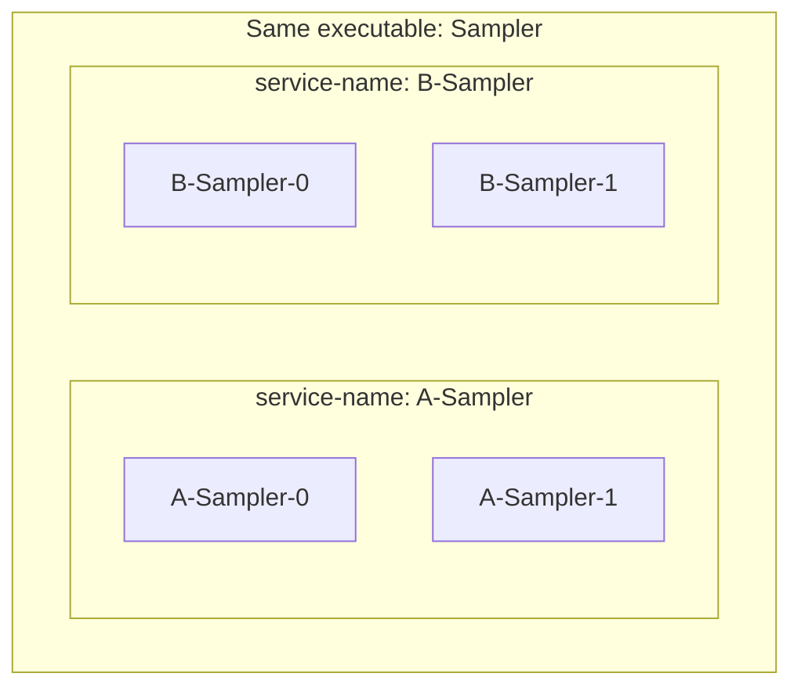
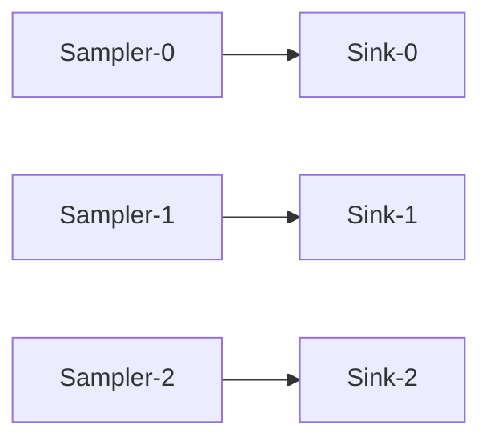
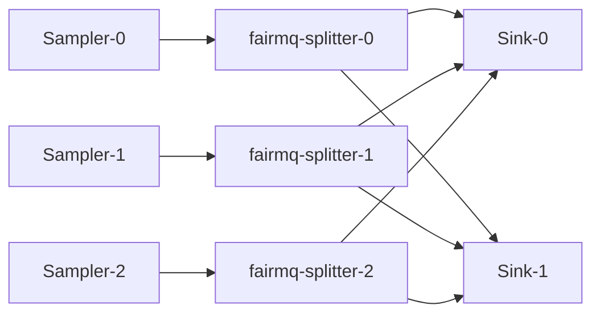
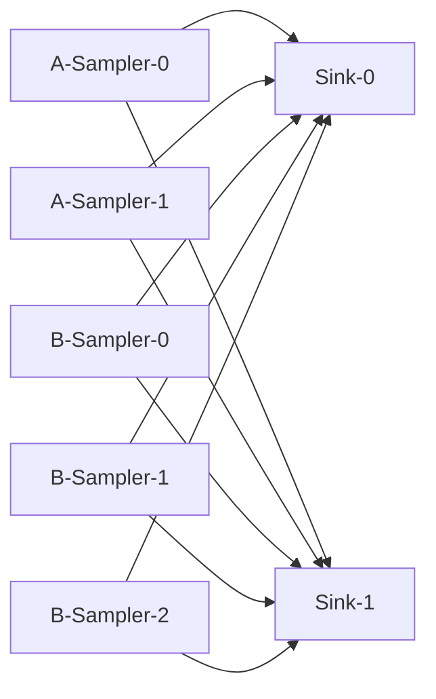

# Scripts

[English](README.md) | [日本語](README.ja.md)

[Top: NestDAQ](../README.md) | [Previous: Examples](../examples/README.md) | [Next: Plugins](../plugins/README.md)

This directory contains scripts that demonstrate how to use the NestDAQ plugins.
You can copy the scripts to another working directory.
Start a Redis server before running scripts that register or read configuration.

## 1. Helper script to launch a data acquisition (DAQ) process

### 1.1. start_device.sh
This script starts a FairMQ device with the NestDAQ plugins.
Specify either a device provided by this repository or an executable whose path contains `fairmq-`.
Arguments after the device name are passed to the device and FairMQ, so plugin options such as `--service-name` and device-specific options such as `--max-iterations` can appear on the same command line.

For a typical local validation run, start the supporting services and register
the required configuration before starting devices with `start_device.sh`:

- Start a Redis server.
- Start an OpenTelemetry Collector backend, for example the Compose setup run
  with `docker compose` or `podman compose` under `share/otel-collector-compose`.
- Start `daq-webctl` if you want to control devices from the browser user
  interface.
- Register topology settings in Redis with a `topology-*.sh` script.
- Register parameter settings in Redis with `mq-param.sh` when the examples
  should read parameters from the `parameter_config` plugin.

See [`examples/README.md`](../examples/README.md) for the complete local run sequence.

The generated script uses `NESTDAQ_REDIS_SERVER` for all NestDAQ Redis connections.
The default is `127.0.0.1:6379`.
The script maps the DAQ service registry to Redis database `0`, metrics to database `1`, and parameter configuration to database `2`.

The relevant part of the script is:

```bash
NESTDAQ_REDIS_SERVER=${NESTDAQ_REDIS_SERVER:-127.0.0.1:6379}

DAQSERVICE_URI=" --registry-uri tcp://${NESTDAQ_REDIS_SERVER}/0"
METRICS_URI=" --metrics-uri tcp://${NESTDAQ_REDIS_SERVER}/1"
CONFIG_URI=" --parameter-config-uri tcp://${NESTDAQ_REDIS_SERVER}/2"
```

`daq_service` uses DB 0 for the service registry, DAQ commands, and topology metadata.
The `metrics` plugin uses DB 1.
The `parameter_config` plugin reads device option values from DB 2.

The script also sets the plugin search path and the plugin load order:

```bash
PLUGIN_SEARCH_PATH=" -S '<$PLUGIN_LIBDIR'"
DAQSERVICE_PLUGIN=" -P daq_service"
METRICS_PLUGIN=" -P metrics"
CONFIG_PLUGIN=" -P parameter_config"

var+=$PLUGIN_SEARCH_PATH
var+=$DAQSERVICE_PLUGIN
var+=$METRICS_PLUGIN
var+=$CONFIG_PLUGIN
```

`-S` adds a directory to the FairMQ plugin search path.
In this script, `-S '<$PLUGIN_LIBDIR'` prepends the installed NestDAQ plugin directory to that search path.
This option controls only where FairMQ searches for plugin libraries.

`-P` selects a plugin to load.
FairMQ loads the plugins in the order of the `-P` options on the final command line.
The generated `start_device.sh` passes them as `daq_service`, then `metrics`, then `parameter_config`.
Adding directories with `-S` changes search priority but does not change which plugins FairMQ loads or their order; the `-P` entries control those decisions.

The generated script sends OpenTelemetry (OTel) logs to a local OpenTelemetry Collector with OpenTelemetry Protocol (OTLP) gRPC.
The default endpoint is `localhost:4317`; set `NESTDAQ_OTLP_GRPC_ENDPOINT` to use another endpoint.

The script builds the OTel log options like this:

```bash
NESTDAQ_OTLP_GRPC_ENDPOINT=${NESTDAQ_OTLP_GRPC_ENDPOINT:-localhost:4317}
NESTDAQ_START_DEVICE_OTEL_LOG_SEVERITY=${NESTDAQ_START_DEVICE_OTEL_LOG_SEVERITY:-info}

var+=" --otel-log-protocol=otlp-grpc"
var+=" --otel-log-endpoint-grpc=${NESTDAQ_OTLP_GRPC_ENDPOINT}"
var+=" --otel-log-severity=${NESTDAQ_START_DEVICE_OTEL_LOG_SEVERITY}"
```

Choose the endpoint according to where the process runs:

- Host process to a compose-published collector port: `localhost:4317`.
- NestDAQ device container or `daq-webctl` container in the same OpenSearch or
  Victoria compose network: `otel-collector:4317`.
- NestDAQ device container or `daq-webctl` container in the same ClickStack
  compose network: `clickstack:4317`.
- Container outside the compose network to the host-published collector port:
  Docker commonly uses `host.docker.internal:4317`; Podman commonly uses
  `host.containers.internal:4317`.

In the shell command examples below, lines beginning with `#` are comments for
the reader and are not executed by the shell.

```bash
# Reach the collector through the Podman host alias.
NESTDAQ_OTLP_GRPC_ENDPOINT=host.containers.internal:4317 ./start_device.sh Sampler
```

OTel metrics and traces are disabled by default.
Uncomment the metric and trace examples in `start_device.sh` to export them by OTLP gRPC or print them through the console exporter for debugging.

FairLogger console output is disabled by default with `--severity nolog`.
Set `NESTDAQ_FAIRLOGGER_CONSOLE_SEVERITY` to enable it.
OTel log export uses the separate `NESTDAQ_START_DEVICE_OTEL_LOG_SEVERITY` threshold, so it continues to send logs to the collector when FairLogger console output is disabled.

```bash
NESTDAQ_FAIRLOGGER_CONSOLE_SEVERITY=${NESTDAQ_FAIRLOGGER_CONSOLE_SEVERITY:-nolog}

var+=" --severity ${NESTDAQ_FAIRLOGGER_CONSOLE_SEVERITY}"
```

```bash
# Show debug-level messages in both FairLogger and the OTel export.
NESTDAQ_FAIRLOGGER_CONSOLE_SEVERITY=debug4 NESTDAQ_START_DEVICE_OTEL_LOG_SEVERITY=debug4 ./start_device.sh Sampler
```

```bash
  # Start the installed Sampler with its default options.
  # ./start_device.sh [device-name] [options ...]
  ./start_device.sh Sampler
```

```bash
  # Start a FairMQ device by its executable path.
  ./start_device.sh /your-fairmq-install-path/bin/fairmq-splitter
```

The following example starts a `Sampler` with the service name `A-Sampler` and limits the execution rate of `ConditionalRun()` to once per second.
```bash
# Start a rate-limited Sampler under a distinct service name.
./start_device.sh Sampler --service-name A-Sampler --rate 1
```

`start_device.sh` does not set `--service-name` by itself. Options after the
device name are passed through to FairMQ and the NestDAQ plugins. See
[`plugins/README.md#22-daq-service-identity-defaults`](../plugins/README.md#22-daq-service-identity-defaults)
for the `daq_service` defaults used when `--service-name` or `--id` is empty.

```bash
# Register two Sampler processes as separate service groups.
./start_device.sh Sampler --service-name A-Sampler
./start_device.sh Sampler --service-name B-Sampler
```

This lets the same executable appear as separate service groups. For example,
the same `Sampler` program can appear as `A-Sampler-*` and `B-Sampler-*` in
Redis, `daq-webctl`, and telemetry attributes.



## 2. Topology configuration

The following table lists the default endpoint parameters.

| field                 | default value                              | 
| --                    | --                                         | 
| name                  |                                            | 
| type                  |                                            | 
| method                |                                            | 
| address               |                                            | 
| transport             | zeromq                                     |
| sndBufSize            | 1000                                       | 
| rcvBufSize            | 1000                                       | 
| sndKernelSize         | 0                                          |
| linger                | 500                                        |
| rateLogging           | 1                                          |
| portRangeMin          | 22000                                      |
| portRangeMax          | 32000                                      |
| autoBind              | true                                       |
| numSockets            | 0 (Automatically calculated by the plugin) |
| autoSubChannel        | false                                      |
| bound                 | (Do not set by the user)                   |
| waitForPeerConnection | true                                       | 

The last three parameters are specific to NestDAQ.
The rest are defined in FairMQ.

`autoSubChannel` controls whether a peer written without `[subindex]` means
only subchannel `0` or all subchannels registered for that peer channel.
Use `autoSubChannel false` for fixed 1:1-style connections such as
`topology-1-1.sh`. Use `autoSubChannel true` for n:m-style fan-out or fan-in
topologies such as `topology-n-n-m.sh` and `topology-2samplers-n-m.sh`, where
the plugin discovers peer subchannels and updates `numSockets` accordingly.
When `[subindex]` is written explicitly, only that subchannel is used.
See [`plugins/README.md#251-autosubchannel`](../plugins/README.md#251-autosubchannel)
for the detailed topology plugin behavior.

Topology scripts write endpoint and link definitions to Redis DB 0. Their
helper functions have this shape:

```bash
server=redis://127.0.0.1:6379/0

function endpoint () {
  redis-cli -u $server hset daq_service:topology:endpoint:$1:$2 ${@:3}
}

function link () {
  redis-cli -u $server set daq_service:topology:link:$1:$2,$3:$4 none
}
```

`endpoint SERVICE CHANNEL ...` writes a hash at
`daq_service:topology:endpoint:SERVICE:CHANNEL`. The remaining fields describe
the FairMQ socket, for example `type push`, `method bind`, and
`autoSubChannel false`.

The `endpoint()` helper uses Redis `HSET`, so rerunning a topology script only
updates the fields written by that script. It does not delete fields that are
omitted from the new script content. For example, if `autoSubChannel true` has
already been written to Redis, removing `autoSubChannel` from the script and
running it again leaves the Redis field set to `true`. To change it back, write
`autoSubChannel false` explicitly and run the topology script again. If the
topology should be rebuilt from scratch, flush the Redis database used by
`daq_service` / `TopologyConfig` before registering the new topology again.
The same `HSET` rule applies to parameter hashes written by helpers such as
`mq-param.sh`: omitting a field from the script does not remove an existing
Redis hash field.

If user device channel connection information is changed, or if a user device
does not exit cleanly, old `daq_service` topology/channel metadata can remain
in Redis. Stale connection metadata can occasionally make later device starts
resolve socket addresses differently from the intended topology. In a local
validation environment, flush the Redis database used by `daq_service` /
`TopologyConfig` before registering the new topology again:

```sh
# Clear stale topology and service data from local Redis DB 0.
redis-cli -u redis://127.0.0.1:6379/0 FLUSHDB
```

`FLUSHDB` deletes all keys in the selected Redis database. If the entire local
Redis instance should be reset, use `FLUSHALL` instead:

```sh
# Clear every database in the local Redis instance.
redis-cli -u redis://127.0.0.1:6379 FLUSHALL
```

`FLUSHALL` deletes all keys in all databases of that Redis instance. Do not use
`FLUSHDB` or `FLUSHALL` on a production or shared Redis server unless deleting
that data is intentional. The Redis address and database number in these
examples are local defaults; replace them with the address and database number
of the Redis instance/database you intend to operate on.

### 2.1. Bind and connect endpoints

In topology endpoint settings, `method bind` and `method connect` describe
which side owns the socket address. Here, an address means the endpoint
connection information needed by FairMQ: an IP address or hostname plus a port
number. A bind-side socket opens its local endpoint and can communicate with
connect-side sockets that connect to it without knowing each peer address. A
connect-side socket must know the bind-side address before it can connect. That
address can be resolved from NestDAQ service discovery and topology metadata in
Redis, or it can be set directly through parameters for a fixed setup.

`link SERVICE CHANNEL PEER_SERVICE PEER_CHANNEL` writes a logical connection
between two endpoint definitions. The topology plugin reads these definitions
when each device starts and turns them into concrete FairMQ channel properties.

### 2.2. topology-1-1.sh
This script defines a simple **PUSH-PULL** topology between **Sampler** and **Sink**.
When _N_ Samplers and _N_ Sinks start, they form _N_ Sampler/Sink pairs.
Each Sampler sends data to the Sink with the same instance index.

```bash
  # Register the one-to-one Sampler/Sink topology in Redis.
  ./topology-1-1.sh
```

The key lines are:

```bash
endpoint Sampler data type push method bind autoSubChannel false
endpoint Sink    in   type pull method connect autoSubChannel false

link Sampler data Sink in
```

`Sampler:data` binds a PUSH socket, `Sink:in` connects a PULL socket, and the
link pairs devices with matching instance indexes such as `Sampler-0` to
`Sink-0`.



### 2.3. topology-n-n-m.sh
This script defines a **PUSH-PULL** topology with _N_ **Sampler** processes, _N_ **fairmq-splitter** processes, and _M_ **Sink** processes.
Each Sampler sends data to the fairmq-splitter with the same instance index, and the fairmq-splitter forwards the data to the Sinks.
The `autoSubChannel true` flag gives each sub-socket a different `address:port` and distinguishes the sub-sockets by index.
The fairmq-splitter selects destinations in round-robin order according to the number of messages sent.

```bash
  # Register the sampler/splitter/sink fan-out topology in Redis.
  ./topology-n-n-m.sh
```

The splitter topology uses two channels on `fairmq-splitter`:

```bash
endpoint Sampler          data     type push method bind    autoSubChannel false
endpoint fairmq-splitter  data-in  type pull method connect autoSubChannel false
endpoint fairmq-splitter  data-out type push method bind    autoSubChannel true
endpoint Sink             in       type pull method connect autoSubChannel true

link Sampler         data     fairmq-splitter data-in
link fairmq-splitter data-out Sink            in
```

The first link keeps each sampler paired with the splitter instance of the same
index. The second link uses `autoSubChannel true` so splitter output
subchannels can fan out to multiple sink instances.



### 2.4. topology-2samplers-n-m.sh
Two sampler services send data to one sink service. 

This script demonstrates the service-name grouping described above. It expects
some `Sampler` processes to be started as `A-Sampler` and others as
`B-Sampler`:

```bash
endpoint A-Sampler data type push method bind autoSubChannel true
endpoint B-Sampler data type push method bind autoSubChannel true
endpoint Sink      in   type pull method connect autoSubChannel true

link A-Sampler data Sink in
link B-Sampler data Sink in
```



## 3. Parameter configuration

### 3.1. mq-param.sh
This example configures device parameters through Redis.
Device parameters are parameters that NestDAQ device processes obtain through
the `parameter_config` plugin.

```bash
  # Register parameters used by the example NestDAQ device processes in Redis DB 2.
  ./mq-param.sh
```

`mq-param.sh` writes parameter hashes to Redis DB 2, which is the database used
by the `parameter_config` plugin:

```bash
server=redis://127.0.0.1:6379/2

function param () {
  redis-cli -u $server hset parameters:$1 ${@:2}
}
```

The first argument is the parameter group or instance id. The rest are
field/value pairs that become FairMQ or device options:

```bash
param Sampler rate 2 max-iterations 0
param Sampler-0 text Hello
param Sampler-1 text world

param Sink multipart true
```

For example, `param Sampler rate 2 max-iterations 0` writes a hash named
`parameters:Sampler` with common defaults for instances such as `Sampler-0` and
`Sampler-1`. `param Sampler-0 text Hello` writes an instance-specific hash named
`parameters:Sampler-0`.

When the `parameter_config` plugin starts for `Sampler-0`, it derives the group
key by removing the trailing numeric `-N` suffix from the instance id. It reads
`parameters:Sampler` first and then `parameters:Sampler-0`, so instance-specific
values override group defaults. In the example above, `Sampler-0` receives
`rate=2`, `max-iterations=0`, and `text=Hello`, while `Sampler-1` receives the
same common values and `text=world`.

See
[`plugins/README.md#42-redis-keys-read-or-subscribed`](../plugins/README.md#42-redis-keys-read-or-subscribed)
for the full Redis key patterns, including structured group and instance
parameter keys.

## 4. Device skeleton generation

`generate-device-skeleton.py` creates a minimal NestDAQ FairMQ device project
from templates built into the script. By default, it generates input, output,
and data quality monitor (DQM) channel code using `in`, `out`, and `dqm` as the
respective channel names.

```bash
# Generate a MyDevice project in its own output directory.
./generate-device-skeleton.py MyDevice --output ./MyDevice
```

The generated project contains `MyDevice.h`, `MyDevice.cxx`,
`CMakeLists.txt`, and `README.md` unless those helper files are omitted by
options. Existing files are not overwritten unless `--force` is specified. Use
`--dry-run` to inspect the output paths without writing files. Use
`--no-cmake` when the device will be added to an existing build system and
`CMakeLists.txt` should not be generated. Use `--no-readme` when the generated
device does not need its own `README.md`.

Generator options have two command-line forms:

- Options shown with a placeholder, such as `--output DIR`,
  `--processing-mode MODE`, or `--no-poll LIST`, require a value in
  `--key value` form.
- Options shown without a placeholder, such as `--force`, `--single-output`,
  or `--no-dqm-channel`, are presence-only flags. Specify the flag by itself
  to apply the behavior described in the table; omit it to keep the default.

Presence-only flags do not accept Boolean values. For example, use
`--no-dqm-channel`, not `--no-dqm-channel true`, and omit the flag instead of
writing `--no-dqm-channel false`. Repeating a flag does not toggle its state
back. In the table, `off` means that the flag is not specified. For a `--no-*`
flag, `off` means that the named feature remains enabled by default.

```bash
# Generate a conditional-run device with one single-message output and no DQM channel.
./generate-device-skeleton.py MyDevice \
  --output ./MyDevice \
  --processing-mode conditional-run \
  --no-dqm-channel \
  --single-output
```

Generator options:

| Option | Default | Description |
| :-- | :-- | :-- |
| `--output DIR`, `-o DIR` | `./CLASS_NAME` | Write generated files under `DIR`. |
| `--force` | off | Overwrite existing generated files. |
| `--dry-run` | off | Print the files that would be generated without writing them. |
| `--interactive` | off | Prompt for generation choices instead of specifying all options on the command line. |
| `--no-cmake` | off | Do not generate `CMakeLists.txt`; use this when integrating the device into an existing build system. |
| `--no-readme` | off | Do not generate `README.md`; use this when the generated device will be documented elsewhere. |
| `--no-namespace` | off | Generate the device class in the global namespace instead of `namespace nestdaq`. |
| `--processing-mode MODE` | `conditional-run` | Select the generated processing entry point: `conditional-run`, `run`, or `on-data`. |
| `--input-channel SPEC` | `in-chan-name:in` | Override the generated input channel. `SPEC` is `KEY:DEFAULT_NAME`, `:DEFAULT_NAME`, or `DEFAULT_NAME`. |
| `--no-input-channel` | off | Do not generate input-channel code. |
| `--output-channel SPEC` | `out-chan-name:out` | Override the generated output channel. `SPEC` uses the same format as `--input-channel`. |
| `--no-output-channel` | off | Do not generate output-channel code. |
| `--dqm-channel SPEC` | `dqm-chan-name:dqm` | Override the generated data quality monitor (DQM) channel. `SPEC` uses the same format as `--input-channel`. |
| `--no-dqm-channel` | off | Do not generate DQM-channel code. |
| `--multipart-input` | off | Generate multipart receive/`OnData()` examples for the input channel. Cannot be combined with `--no-input-channel`. |
| `--single-output` | off | Generate single-message output examples. Output is multipart by default. |
| `--single-dqm` | off | Generate single-message DQM examples. DQM is multipart by default. |
| `--no-drain-input` | off | Do not generate `PostRun()` input drain code. |
| `--no-poll LIST` | none | Comma-separated channel kinds to exclude from FairMQ polling: `input`, `output`, `dqm`. |

Processing modes:

| Mode | Generated behavior |
| :-- | :-- |
| `conditional-run` | Generates `ConditionalRun()` with simple poll/receive/send examples. |
| `run` | Generates an empty `Run()`. |
| `on-data` | Generates an `OnData()` callback registration in `InitTask()`; requires generated input-channel code. |

For how to choose between `OnData()`, `ConditionalRun()`, and `Run()`, see
[`examples/README.md#44-choosing-ondata-conditionalrun-or-run`](../examples/README.md#44-choosing-ondata-conditionalrun-or-run).

Channel options passed to the generator are not command-line options for the generated device.
The generator creates all three channels by default; these options change how it generates the corresponding device command-line options in C++:

```bash
# Generate a processor with explicit input, output, and DQM channel options.
./generate-device-skeleton.py MyProcessor \
  --input-channel in-chan-name:in \
  --output-channel out-chan-name:out \
  --dqm-channel dqm-chan-name:dqm
```

For example, `--input-channel in-chan-name:in` makes the generated C++ add an
`in-chan-name` command-line option whose default value is `in`, then read that
option into `fInputChannelName` in `InitTask()`. The short forms
`--input-channel :in` and `--input-channel in` both use the default option key
`in-chan-name`; output and DQM use `out-chan-name` and `dqm-chan-name` in the
same way. `KEY:` and `:` are rejected because the generated option would have
no default channel name.

Use `--no-input-channel`, `--no-output-channel`, or `--no-dqm-channel` when a
device does not need that channel. The same result can be obtained by deleting
the corresponding option, member, initialization, polling, and processing code
after generation, but excluding it at generation time is less error-prone. A
`--*-channel` option and its corresponding `--no-*-channel` option are mutually
exclusive. In interactive mode, each channel prompt defaults to `yes`; answer
`no` to omit it.

The generated device class is placed in `namespace nestdaq` by default.
Use `--no-namespace` to generate the class in the global namespace.

Useful variants:

```bash
# Generate a source with only an output channel.
./generate-device-skeleton.py MySource \
  --no-input-channel \
  --no-dqm-channel

# Use short channel specifications and their default option keys.
./generate-device-skeleton.py MyShortFormProcessor \
  --input-channel :in \
  --output-channel data \
  --dqm-channel dqm

# Generate single-message output and DQM helpers.
./generate-device-skeleton.py MySingleMessageProcessor \
  --input-channel :in \
  --output-channel data \
  --dqm-channel dqm \
  --single-output \
  --single-dqm

# Generate an OnData sink without output or DQM channels.
./generate-device-skeleton.py MySink \
  --processing-mode on-data \
  --no-output-channel \
  --no-dqm-channel

# Generate the sink with multipart input handling.
./generate-device-skeleton.py MyMultipartSink \
  --processing-mode on-data \
  --no-output-channel \
  --no-dqm-channel \
  --multipart-input

# Exclude output and DQM channels from polling and omit input draining.
./generate-device-skeleton.py MyDevice \
  --input-channel in-chan-name:in \
  --output-channel out-chan-name:out \
  --no-poll output,dqm \
  --no-drain-input

# Place the generated class in the global namespace.
./generate-device-skeleton.py MyGlobalDevice \
  --no-namespace

# Omit CMake files for integration into an existing build.
./generate-device-skeleton.py MyIntegratedDevice \
  --no-cmake

# Omit the generated project README.
./generate-device-skeleton.py MyNoReadmeDevice \
  --no-readme

# Choose generation settings interactively.
./generate-device-skeleton.py --interactive
```

When input polling is generated, the skeleton uses a FairMQ poller before
`Receive()`. When output or DQM polling is generated, it uses
`Poller::CheckOutput()` before `Send()`. Output waits in poll-timeout steps
until it can send or a state transition is pending. DQM drops the sample if it
cannot send immediately. Output and DQM examples are generated as multipart
messages by default. Use generator options `--single-output` or `--single-dqm`
to generate single-message examples instead. `SendOutputMessage()` and
`SendDQMMessage()` take the generated `fair::mq::Parts&` or `fair::mq::MessagePtr&`
payload and only handle channel readiness, `Send()`, and success/failure
checks.

The options in the table above control the generator; they are not command-line options for the generated device.
The generated C++ code registers custom options as strings.
`InitTask()` converts the strings before assigning numeric members.

| Generated device command-line option | Default | Description |
| :-- | :-- | :-- |
| `poll-timeout-ms` | `100` | FairMQ poll timeout in milliseconds. |
| `drain-timeout-ms` | `100` | Receive timeout used by input drain. Negative values are treated as `0`. |
| `drain-max-timeout-count` | `20` | Stop input drain after this many consecutive receive timeouts since the last drained message; must be positive. |

Input drain code is generated in `PostRun()` by default when an input channel
is present; disable it with `--no-drain-input`.

The generator reads built-in templates, substitutes the device-specific
placeholders, and writes the resulting files to the output directory. The main
substitutions include `@CLASS_NAME@`,
`@HEADER_FILE@`, `@SOURCE_FILE@`, and generated C++ blocks for members,
options, processing methods, send helpers, and drain code.

| Template | Generated file for `MyDevice` |
| :-- | :-- |
| `Device.h.in` | `MyDevice.h` |
| `Device.cxx.in` | `MyDevice.cxx` |
| `CMakeLists.txt.in` | `CMakeLists.txt` |
| `README.md.in` | `README.md` |

`CMakeLists.txt` is omitted when `--no-cmake` is specified. `README.md` is
omitted when `--no-readme` is specified.

When `CMakeLists.txt` is generated, build the generated device as a standalone
CMake project. Set
`CMAKE_PREFIX_PATH` to the NestDAQ install prefix, and set
`CMAKE_INSTALL_PREFIX` to the install prefix for the generated device. These
prefixes may be the same directory. The generated CMake project uses C++17 by
default and rejects standards older than C++17.

```bash
# Configure an out-of-source build against the NestDAQ installation.
cmake -S ./MyDevice -B ./build-MyDevice \
  -DCMAKE_PREFIX_PATH=<nestdaq-install-prefix> \
  -DCMAKE_INSTALL_PREFIX=<device-install-prefix>
# Compile the generated device in parallel.
cmake --build ./build-MyDevice --parallel
# Install the generated device under the selected prefix.
cmake --install ./build-MyDevice
```

The installed executable is placed under `<device-install-prefix>/bin/MyDevice`.

The skeleton is intentionally minimal.
Use the `Sampler` and `Sink` examples for data-channel handling and telemetry instrumentation.
